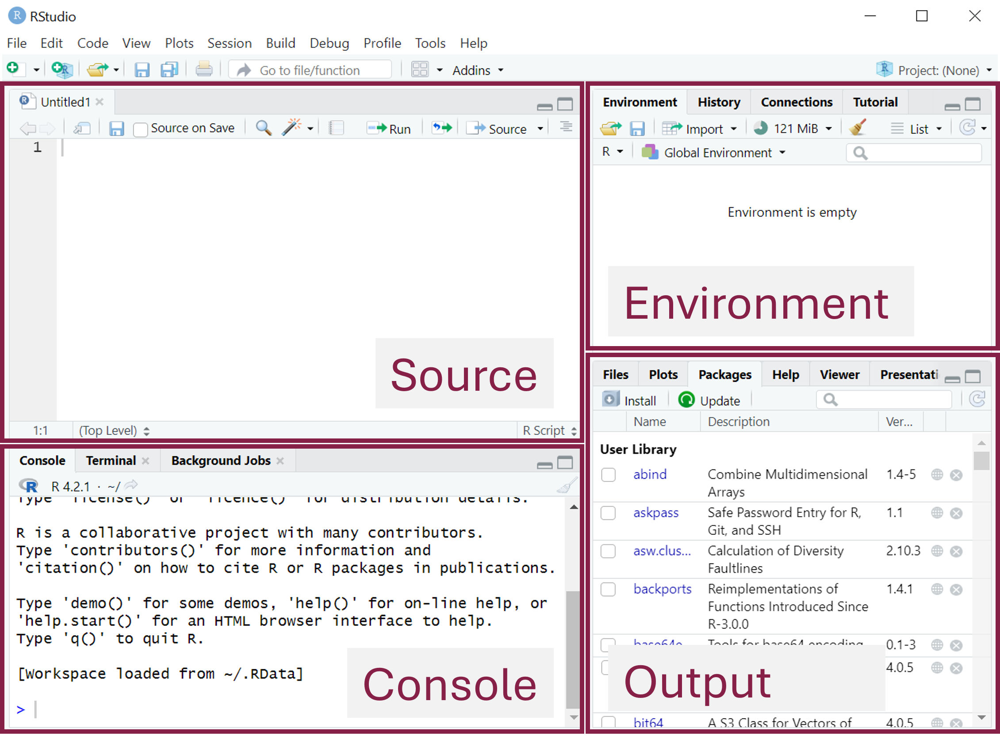
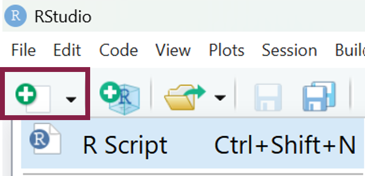
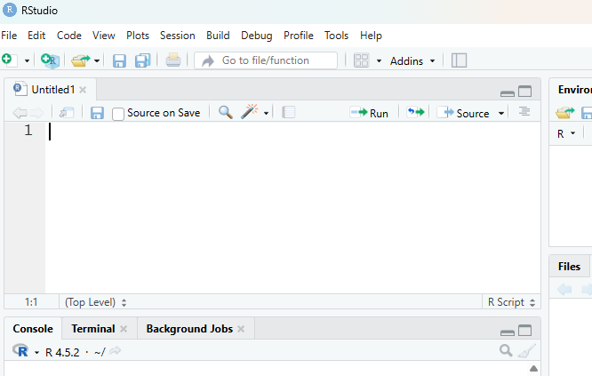

# R workshop 1: Getting started in R and data handling

## Overview

Over three workshops this semester, you'll be learning the basics of R...

### Why R?

### What are R and RStudio?


## Workshop 1 overview

::: {.callout-tip icon="false"}
### []{style="color: #872046;"}  Learning outcomes

By the end of this session, you should be able to:

[line these up to the section titles]

- Navigate the RStudio interface
- Use R as a calculator 
- [[Make the next one more specific]]
- Install and load R packages
- Troubleshoot some common coding errors
:::


## Set-up

### R & RStudio

Make sure you have downloaded and installed both R and RStudio.

**Windows**

Download and install these using default options:

- <a href="https://cran.r-project.org/bin/windows/base/release.html" target="_blank" rel="noopener">R</a>
- <a href="https://docs.posit.co/ide/user/#rstudio-ide-oss-downloads" target="_blank" rel="noopener">RStudio</a>

**Mac OS**

Download and install these using default options:

- <a href="https://cran.r-project.org/bin/macosx/" target="_blank" rel="noopener">R</a>
- <a href="https://docs.posit.co/ide/user/#rstudio-ide-oss-downloads" target="_blank" rel="noopener">RStudio</a>

**Laptop does not support R/RStudio**

If your laptop/device does not support the use of R/Studio (e.g. ...) or you are having difficulty downloading the program(s), there are couple of other options:

- https://posit.cloud/spaces/701987
- ^ sign up to account, limited # projects/hours

Users need to create an account, but it's then possible to use RStudio essentially as it would appear in the actual app:


[For work outside class/coursework.... library laptop or library computers - FIND OUT]


## MASA

The Maths and Statistics Advice (MASA) service can support with...


## How the workshops work

**Template code**

Sometimes code is shown in blue panels like the one below. This code cannot be directly copied and run in R, but shows the structure of using a particular function. There are blanks spaces with information on what to fill in there.

::: {.panel-tabset .panel-blue group="language"}
## R

Template code is shown in blue panels like this one
:::


**Exercises**

Exercises in these materials are labelled according to their level of difficulty:

:::: dplyr-table
| Level | Description |
|----------------------|--------------------------------------------------|
|    | Level 1 exercises are similar to the workshop examples. |
|    | Level 2 exercises extend the workshop examples, for example by using a different function. |
|    | Level 3 exercises go beyond the workshop examples, for example by combining multiple ideas or extending the syntax covered. |

::: {#levels-table}
:::
::::


### Structure of the session


::: {.callout-tip icon="false"}
### []{style="color: #872046;"}  Key point

xxx
:::


## User interface: pane layout

[To do: open R Studio]

When you open RStudio, it looks like this:

{width="550" style="display:block; margin: 2em auto;"}

RStudio has four panes:

- Source pane
  - This is where we...
- Console
  - This is where...
- Environment pane
  - This is where...
- Output pane
  - This is where...
  
[Screenshot]

Don't worry if you don't see the Source pane yet - this will appear when you open a new R Script, which we'll do in the next section.


## Creating and saving a script

**What is a script?**

A script in R is a file where you can write, save, and organise your code. It is similar to a document in Microsoft Word, but instead of containing text, it contains R code.

**Creating a new script**

There are several ways to create a new script in RStudio. The quickest method is to click the white page icon with the green plus sign below the menu bar, then click "R Script":

{width="250" style="display:block; margin: 2em auto;"}

A new blank script will then open in the source pane:

{width="500" style="display:block; margin: 2em auto;"}

**Saving a script**

Saving a script is similar to saving a Microsoft Word document. To save your script, go to <strong>File &gt; Save As...</strong> and choose a location and filename.

You can also save your script using the keyboard shortcut <strong>Ctrl + S</strong> (or <strong>Cmd + S</strong> on a Mac).

::: {.callout-caution icon="false"}
### []{style="color: #2E6B4E;"}  Task
Create a new script and save it in a dedicated folder for the R work on this module.
(This folder will be used to store all of your R scripts and data files for these workshops.)

::: {.callout-caution icon="false"}
### []{style="color: #2E6B4E;"}  Task
:::

## Writing and running code

[could this be combined with using R as a calculator]

## Using R as a calculator


## Adding comments to a script

In R, a comment is a line of text that begins with a hash symbol (#).

```{r}
# This is a comment
```

In RStudio, comments are displayed in green, making them easy to distinguish from your code.

Comments are ignored when the code is executed and do not produce any output. They are used to add notes to your code, such as section headers, explanations of what the code does, or annotations about results and decisions.

Comments can be placed on their own line or after code on the same line.

```{r}
#| eval: false
# Addition
3 + 6   # the answer is 9
```

As your scripts become longer and more complex, comments become increasingly important. Get in the habit of using them to help explain what different sections of the code are doing, making it easier for both you and others to read, understand, and modify the code in the future.

::: {.callout-caution icon="false"}
### []{style="color: #2E6B4E;"}  Task
Add a couple of comments to your script e.g. a title / section heading / note about the calculations.
:::

::: {.callout-tip icon="false"}
### []{style="color: #872046;"}  Key point

[Save for the end and turn into a complete summary?] In R, comments begin with a hash symbol (#) and are used to document your code, making it easier to read, understand, and maintain.
:::


## Expressions vs. assignments


## Objects: Definition and Scalars <-- [maybe change this name]
e.g. "assigning objects to variables"


## Performing operations using named variables <-- [I think something simpler e.g. "using" saved variables]


## Functions

A function in R... [I don't think starting with "a block of code" is the most helpful]


[!! I think move installing and loading packages to next workshop, as this is where we actually use it?]


