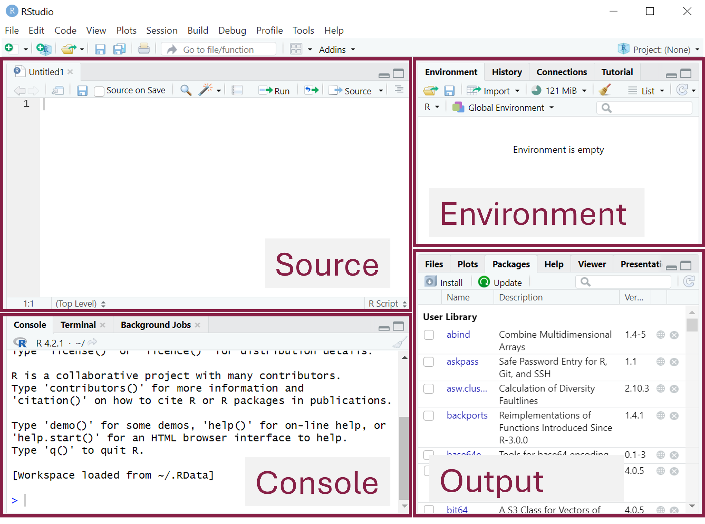
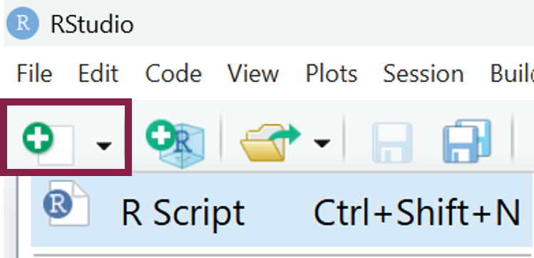
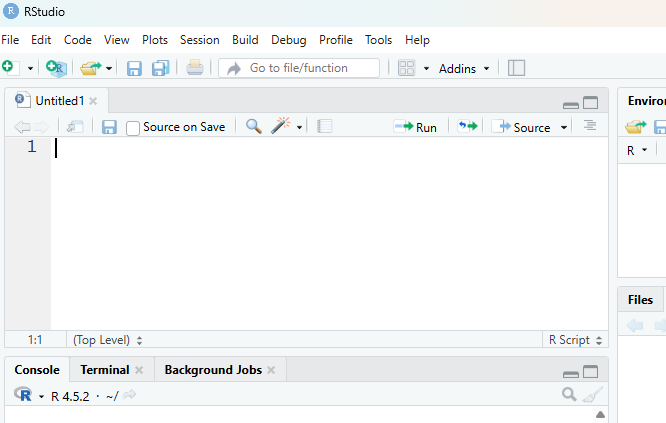

# R workshop 1: Getting started in R and data handling

## Overview

Over three workshops this semester, you'll be learning the basics of R...

### Why R?

### What are R and RStudio?


## Workshop 1 overview

::: {.callout-tip icon="false"}
### []{style="color: #872046;"}  Learning outcomes

By the end of this session, you should be able to:

[line these up to the section titles]

- Navigate the RStudio interface
- Use R as a calculator 
- [[Make the next one more specific]]
- Install and load R packages!!!!!!!! < may move to workshop 2
- Troubleshoot some common coding errors
[update to match the individual LOs as we go]

:::


## Set-up

### R & RStudio

Make sure you have downloaded and installed both R and RStudio.

**Windows**

Download and install these using default options:

- <a href="https://cran.r-project.org/bin/windows/base/release.html" target="_blank" rel="noopener">R</a>
- <a href="https://docs.posit.co/ide/user/#rstudio-ide-oss-downloads" target="_blank" rel="noopener">RStudio</a>

**Mac OS**

Download and install these using default options:

- <a href="https://cran.r-project.org/bin/macosx/" target="_blank" rel="noopener">R</a>
- <a href="https://docs.posit.co/ide/user/#rstudio-ide-oss-downloads" target="_blank" rel="noopener">RStudio</a>

**Laptop does not support R/RStudio**

If your laptop/device does not support the use of R/Studio (e.g. ...) or you are having difficulty downloading the program(s), there are couple of other options:

- https://posit.cloud/spaces/701987
- ^ sign up to account, limited # projects/hours

Users need to create an account, but it's then possible to use RStudio essentially as it would appear in the actual app:


[For work outside class/coursework.... library laptop or library computers - FIND OUT]


## MASA

The Maths and Statistics Advice (MASA) service can support with...


## How the workshops work

**Template code**

Sometimes code is shown in blue panels like the one below. This code cannot be directly copied and run in R, but shows the structure of using a particular function. There are blanks spaces with information on what to fill in there.

[we might not need this until workshop 2]

::: {.panel-tabset .panel-blue group="language"}
## R

Template code is shown in blue panels like this one
:::


**Exercises**

Exercises in these materials are labelled according to their level of difficulty:

:::: dplyr-table
| Level | Description |
|----------------------|--------------------------------------------------|
|    | Level 1 exercises are similar to the workshop examples. |
|    | Level 2 exercises extend the workshop examples, for example by using a different function. |
|    | Level 3 exercises go beyond the workshop examples, for example by combining multiple ideas or extending the syntax covered. |

::: {#levels-table}
:::
::::


### Structure of the session


## User interface: pane layout

::: {.callout-tip icon="false"}
### []{style="color: #872046;"}  Learning outcome
- Navigate the RStudio interface
:::

RStudio has 4 panes or 'areas' on the screen, each serving a different purpose for working with R code. The image below shows how these panes are laid out within RStudio:

{width="550" style="display:block; margin: 2em auto;"}
The table below explains what each pane is used for:

::: {#geomxxx-table}
| Pane | What it's used for |
|---------------------|---------------------------------------------------|
| Source | The source pane is mainly used for writing and editing R scripts (documents containing code). |
| Console | The Console is where your R code runs and where you can see the results. |
| Environment | The Environment pane has 4 tabs: Environment, History, Connections, and Tutorial. You will mostly use the Environment tab, which displays information about the data and variables you have created. |
| Output | The output pane has several tabs (Files, Plots, Packages etc.). In these workshops we'll use the packages tab, which lists the R packages installed on your computer (more on packages later), and the plots tab, which displays graphs that you create. |
:::


::: {.callout-caution icon="false"}
### []{style="color: #2E6B4E;"}  Task
Open RStudio.

(Don't worry if you don't see the Source pane yet - this will appear when you open a new R Script, which we'll do in the next section.)
:::

***Video***

The video below demonstrates how to create and save an R script, and how to open an existing script.

<div style="text-align: center;">
  <iframe
    width="80%"
    style="aspect-ratio: 16 / 9;"
    src="https://www.youtube.com/embed/Nbn6tma7gKw"
    title="YouTube video player"
    allowfullscreen>
  </iframe>
</div>

::: {.callout-note icon="false" collapse="true"}
### []{style="color: #9e9e9e;"}  Video timestamps
- 0:00 – Introduction
- 0:25 – The console
- 0:32 – The environment pane
- 0:58 – The output pane
- 1:26 – Customising the pane layout
:::

## Creating and saving a script

::: {.callout-tip icon="false"}
### []{style="color: #872046;"}  Learning outcome
- Understand the purpose of a script and how to create and save one
:::

**What is a script?**

A script in R is a file where you can write, save, and organise your code. It is similar to a document in Microsoft Word, but instead of containing text, it contains R code.

**Creating a new script**

There are several ways to create a new script in RStudio. The quickest method is to click the white page icon with the green plus sign below the menu bar, then click "R Script":

{width="250" style="display:block; margin: 2em auto;"}

A new blank script will open in the source pane:

{width="500" style="display:block; margin: 2em auto;"}

**Saving a script**

Saving a script is similar to saving a Microsoft Word document. To save your script, go to <strong>File &gt; Save As...</strong> and choose a location and filename.

You can also save your script using the keyboard shortcut <strong>Ctrl + S</strong> (or <strong>Cmd + S</strong> on a Mac).

***Video***

The video below demonstrates how to create and save an R script, and how to open an existing script.

<div style="text-align: center;">
  <iframe
    width="80%"
    style="aspect-ratio: 16 / 9;"
    src="https://www.youtube.com/embed/2JWNffzWS2Y"
    title="YouTube video player"
    allowfullscreen>
  </iframe>
</div>

::: {.callout-note icon="false" collapse="true"}
### []{style="color: #9e9e9e;"}  Video timestamps
- 0:00 – What is an R Script?
- 0:09 – How to create a script
- 0:43 – How to save a script
- 1:13 – How to open an existing script
- 1:45 – TASK: Creating and saving a script?
:::

::: {.callout-caution icon="false"}
### []{style="color: #2E6B4E;"}  Task
- Create a new script and save it in a **dedicated folder** for the R work on this module.
(This folder will be used to store all of your R scripts and data files for these workshops.)
:::

## Writing and running code

::: {.callout-tip icon="false"}
### []{style="color: #872046;"}  Learning outcome
- Write and run R code
:::

There are two places where you can write code in R: in a script or in the console. This is demonstrated below using a very simple R command: `2 + 3`.

**Writing and running code from a script**

It is generally recommended to write your code in scripts because it can be edited and saved, allowing you to reopen it and run the code again later.

To **run a line of code from your script** (i.e. ask R to execute it):

1. Make sure your cursor is clicked somewhere on that line
2. Either:
    - Click the "Run" button within the Source pane
    - Press Ctrl + Enter (or Cmd + Enter on a Mac)
    
The code will execute in the console, where you'll see both the code that was run and the result:

[screenshot of 2+3 with run button circled]

::: {.callout-note icon="false" collapse="true"}
### []{style="color: #9e9e9e;"}  Running multiple lines of code from a script

To run multiple lines of code from a script, highlight all of the lines you want to run, rather than placing your cursor on a single line. Then run the code as usual, either by clicking the Run button or by pressing Ctrl + Enter.

[image]

:::

**Writing and running code in the console**

The second way to write and run R code is directly in the Console. This is generally not recommended, except for quick calculations, trying out a line of code, or testing something before adding it to your script.

Unlike code written in a script, code entered directly into the Console is not saved automatically, so it can be difficult to find and reuse later.

To do write and run code in the console, type your code next to the command prompt (the `>` symbol) and press Enter on your keyboard. The code will run immediately, and any output will be displayed in the Console.

[screenshot]


::: {.callout-note icon="false" collapse="true"}
### []{style="color: #9e9e9e;"}  The command prompt

Whichever method you use to run code, R needs to be ready to accept a command. You can tell that it is ready when the command prompt (`>`) is displayed in the Console:

[image]

If you see something else instead (such as a `+` prompt or a partially entered command), R is waiting for additional input and won't run new code. To return to the normal command prompt, click in the Console and press Esc on your keyboard.

You should then see the `>` prompt again:

[image]

:::

***Video***

The video below below summarises and demonstrates writing and running code in R.

<div style="text-align: center;">
  <iframe
    width="80%"
    style="aspect-ratio: 16 / 9;"
    src="https://www.youtube.com/embed/2zXg0Pxapjs"
    title="YouTube video player"
    allowfullscreen>
  </iframe>
</div>

::: {.callout-note icon="false" collapse="true"}
### []{style="color: #9e9e9e;"}  Video timestamps
- 0:00 – Introduction
- 0:16 – Writing and running code from a script
- 1:22 – Writing and running code in the console
- 1:55 – Is it better to write code in a script or in the console?
:::

## Using R as a calculator

::: {.callout-tip icon="false"}
### []{style="color: #872046;"}  Learning outcome
- Write R commands to perform simple arithmetic calculations
:::

In the previous section, we ran the simple command `2 + 3`.

Although R is a powerful tool for data analysis and statistics, at its most basic it can be used as a calculator. Performing simple calculations is a useful way to start practising writing and running code.

To carry out calculations and other tasks, R uses operators.

An operator is a symbol that tells R to perform a particular action. 

One type of operator is an arithmetic operator. These are the operators we are most familiar with from everyday mathematics, such as addition, subtraction, multiplication, and division:

::: {#geomxxx-table}
| Action | Operator (symbol in R) |
|---------------------|---------------------------------------------------|
| Addition | `+` |
| Subtraction | `-` |
| Multiplication | `*` |
| Division | `/` |
:::

::: {.callout-caution icon="false"}
### []{style="color: #2E6B4E;"}  Task
Practise running some more simple calculations, both from your script and directly in the console. For example:

- 4 + 5
- 8 ÷ 2
:::

***Video***

The video below demonstrates using R for some simple calculations:

<div style="text-align: center;">
  <iframe
    width="80%"
    style="aspect-ratio: 16 / 9;"
    src="https://www.youtube.com/embed/bCvUkkl3Wa4"
    title="YouTube video player"
    allowfullscreen>
  </iframe>
</div>

::: {.callout-note icon="false" collapse="true"}
### []{style="color: #9e9e9e;"}  Video timestamps
- 0:00 – Introduction
- 0:18 – Calculations using arithmetic operators (+ - * /)
- 0:46 – TASK: Running simple calculations
:::


## Adding comments to a script

::: {.callout-tip icon="false"}
### []{style="color: #872046;"}  Learning outcome
- Understand the purpose of comments and how to write them in R
:::

In R, a comment is a line of text that begins with a hash symbol (#).

```{r}
# This is a comment
```

In RStudio, comments are displayed in green, making them easy to distinguish from your code.

Comments are ignored when the code is executed and do not produce any output. They are used to add notes to your code, such as section headers, explanations of what the code does, or annotations about results and decisions.

Comments can be placed on their own line or after code on the same line.

```{r}
#| eval: false
# Addition
3 + 6   # the answer is 9
```

As your scripts become longer and more complex, comments become increasingly important. It's a good idea to get in the habit of using them to help explain what different sections of the code are doing, making it easier for both you and others to read, understand, and modify the code in the future.

::: {.callout-caution icon="false"}
### []{style="color: #2E6B4E;"}  Task
Add a couple of comments to your script e.g. a title / section heading / note about the calculations.
:::

***Video***

The video below demonstrates adding comments to an R script:

<div style="text-align: center;">
  <iframe
    width="80%"
    style="aspect-ratio: 16 / 9;"
    src="https://www.youtube.com/embed/Gtr35DsDjTc"
    title="YouTube video player"
    allowfullscreen>
  </iframe>
</div>

::: {.callout-note icon="false" collapse="true"}
### []{style="color: #9e9e9e;"}  Video timestamps
- 0:00 – Introduction
- 0:09 – How to add comments to a script & why they are important
- 1:09 – Best practice for writing comments
- TASK: Adding comments to your script
:::


## Expressions vs. assignments

::: {.callout-tip icon="false"}
### []{style="color: #872046;"}  Learning outcome
- Distinguish between expressions and assignments
:::

**Expressions**

An expression is code that R evaluates to produce a result. For example, earlier we ran the following code:

```{r}
2 + 3    # this is an expression, which returns the value 5
```

`2 + 3` is an expression because, when R evaluates it, it produces a result (`5`), which is displayed in the console, but not saved for later use. 

[remove?] An expression could also be much more complicated than a simple sum, for example a complex function or model.

[could be a single value, but will usally involve an operator, function or both]

[remove?] The key idea is that R runs the code, produces a result, and displays it. If the result is not stored in an [object] for later use, the code is an expression.

**Assignments**

Assignments *store* the result of an expression so that it can be used later.

Assignments follow the structure:

```{r}
#| eval: false
_______________ <- ______________
 variable name      expression
```

Let's break this down:

- Fill in the `expression` blank with an expression (the piece of code you want R to run)
- `<-` is called the assignment operator. This operator takes the result of the expression to its right, and assigns the result to the name on its left.
- Fill in the `variable name` blank with the name you want to give to the result

For example:

```{r}
x <- 2 + 3    # this is an assignment, which stores the value 5 in a variable called x 
```

The code above is an assignment which stores the result of the expression `2+3` in a variable called `x`.

[often assign single values?]

**Assigned variables**

Whenever you assign something to a variable name, it will appear in the Environment tab of the Environment pane:

[Image]

**Why are assignments useful?**

At the moment this might seem a bit pointless. Why do we want to save `2 + 3` in a variable called `x`?

However, assignments become much more useful when we are working with larger calculations, datasets, and statistical analyses. By assigning a result to a name, we can refer to it again later without having to retype or recalculate it.

You'll see the assignment operator (`<-`) used throughout these sessions, as it is one of the main ways that we store and work with information in R.

::: {.callout-caution icon="false"}
### []{style="color: #2E6B4E;"}  Task
- Calculate 3 - 2 and store the result in a variable named `y`.
:::

***Video***

The video below explains expressions and assignments:

<div style="text-align: center;">
  <iframe
    width="80%"
    style="aspect-ratio: 16 / 9;"
    src="https://www.youtube.com/embed/wf__WxPF-uU&quot"
    title="YouTube video player"
    allowfullscreen>
  </iframe>
</div>

::: {.callout-note icon="false" collapse="true"}
### []{style="color: #9e9e9e;"}  Video timestamps
- 0:00 – What is an expression?
- 0:33 – What is an assignment? – and how to assign things to variable names using the assignment operator
- 1:55 – Viewing variables in the environment pane
- 2:08 – TASK: Using the assignment operator to assign variable names
- 2:23 – Rules for variable names
:::

## Assigning and using variables

::: {.callout-tip icon="false"}
### []{style="color: #872046;"}  Learning outcome
- 
:::

Before we assigned numeric

Different for character (OG data) - use quotes

once saved can just refer to them by name

e.g. calcs

=== existing stuff from before:


[Let's now suppose we have 3 penguins]
[Scroll up in "complete this github table" copilot chat - gave scaffolding for working up from values to data frames ]


** ... **

An object in R is a piece of information stored in memory.

A variable name is a name that refers to an object.

For example, when we run:

```{r}
x <- 2 + 3
```

R first evaluates the expression `2 + 3`, producing the value `5`. It then stores this value as an object and associates it with the variable name `x`.

After this assignment has been run, we can use `x` elsewhere in our code:

```{r}
x
```

```{r}
x * 10
```

Whenever R sees the variable name `x`, it retrieves the object associated with that name.


## Functions

::: {.callout-tip icon="false"}
### []{style="color: #872046;"}  Learning outcome
- 
:::

A function is a block of code that carries out a specific task. This could be something simple, like finding the average of a set of numbers, or something more complex, like creating a graph.

R contains lots of built-in functions that are ready to use. Although each function is made up of code, you do not need to see or understand that code to use it. Instead, you simply use the function's name and provide any information it needs to complete the task.

**Simple example**

We saw earlier that we can type and run the name of a variable to see what is stored in it.

[example]

[is print actually helpful?]


We could alternatively use the `print` function, a function which tells R to display a value in the console.

If you type `print()` and place the name of a variable inside the brackets, R will display the value stored in that variable. This is another way of viewing a variable's contents, and gives the same result as typing the variable name by itself.

[example]

This is a simple example of a function. R provides many other functions that can be used to perform a wide range of tasks.

::: {.callout-caution icon="false"}
### []{style="color: #2E6B4E;"}  Task
- 
-
-
:::


## Function syntax

::: {.callout-tip icon="false"}
### []{style="color: #872046;"}  Learning outcome
- 
:::

The general structure for using a function is the name of the function, followed by the inputs (called "arguments") that the function needs in brackets.

Arguments are the inputs that we provide to a function. R uses these inputs to carry out a task and produce a result.

Different functions require different arguments. Some functions work with a single argument, while others require multiple arguments. When a function has more than one argument, the arguments are separated by commas.

What you provide as the arguments depends on the function you are using and the task you want it to perform.

```{r}
#| eval: false
# Single argument:
  
________________(______________)
 function_name     argument

# Multiple arguments:
 
 ________________(________________, ________________, ________________)
 function_name     first argument    second argument   third argument


```

- The `function_name` blank should be filled in with the name of the function you want to use.
- The `argument` blank(s) should be filled in with the information that you want the function to work with. If there are multiple arguments, they are separated by commas.

Examples:
```{r}
#| eval: false
print(mass_1)                 # prints the value stored within the mass_1 variable
class(mass_1)                 # displays the type (class) of data stored in mass_1
sum(mass_1, mass_2, mass_3)   # adds the mass values together and returns the total
```

::: {.callout-caution icon="false"}
### []{style="color: #2E6B4E;"}  Task
- 
-
-
:::


## Vectors

::: {.callout-tip icon="false"}
### []{style="color: #872046;"}  Learning outcome
- 
:::

[So far we've been working with/storing single values...]

Vectors are [another type] of object in R. A vector stores an ordered collection of values of the same type.

To create a vector, we use the `c()` function. The `c` stands for "combine" because it combines several values into one vector.

This is an example of a function with multiple arguments: each value that we want to include in the vector is supplied as an argument, with the arguments separated by commas.

So far, we have stored the body mass of each penguin in a separate variable. This works for a small number of penguins, but it quickly becomes impractical as the number of measurements grows.

A vector provides a more convenient approach by allowing us to store all of the body masses together in a single object.

For example:

[example]

Now we have a numeric vector called `body_mass` which....

We use assignment again!


Summary 
- `c()` combines values together.
- A vector stores multiple values of the same type.
- Here, we have a numeric vector containing three values.

::: {.callout-caution icon="false"}
### []{style="color: #2E6B4E;"}  Task
- 
-
-
:::


## Data frames

::: {.callout-tip icon="false"}
### []{style="color: #872046;"}  Learning outcome
- 
:::


## Data frames - accessing columns

::: {.callout-tip icon="false"}
### []{style="color: #872046;"}  Learning outcome
- 
:::


[Why do data frames from scratch? - wrote this down somewhere]
E.g.

- Show how data frames work: columns containing same types of data
- Practise using function with multiple arguments (c, data.frame)
- c() function is useful!


[!! I think move installing and loading packages to next workshop, as this is where we actually use it?]


## Summary

::: {.callout-tip icon="false"}
### []{style="color: #872046;"}  Key point

- In R, comments begin with a hash symbol (#) and are used to document your code, making it easier to read, understand, and maintain.

- Use an expression if you want to execute the code and display the result in the console.
- Use an assignment (with <-) if you want to save the result of the expression for future use.

- The `c()` function combines values of the same type (e.g. numeric or character) together into a vector
- The `data.frame()` function combines multiple vectors together to form the columns of a data frame


:::


Exploring a data frame should come in somewhere - like Will Kay


===============================================================

[[coursework data]]

```{r}
#| eval: FALSE

weight_change <- c(10,15,12,18,13,6,29,21,24,20,28,30,25,21,15,21,23,22)
group <- c(rep("control",9),rep("treated",9)) # note the boxplot stills works if it's not a factor

cw <- data.frame(group,weight_change) 
# note if you apply the factor function here it actually names the variable factor.group!

# This is not by group currently

library(ggplot2)
hist(weight_change)
ggplot(cw, aes(x=weight_change)) + geom_histogram(bins=3)
qqnorm(cw$weight_change)
qqline(cw$weight_change)

ggplot(cw, aes(x = weight_change)) +
  geom_histogram(bins=3) +
  facet_wrap(~ group)

ggplot(cw, aes(x = group, y = weight_change)) +
  geom_boxplot() +
  geom_point()
```


