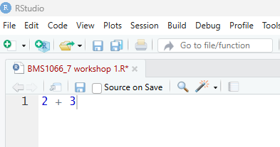
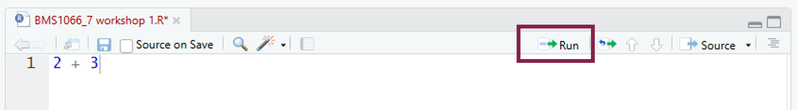
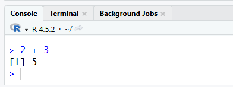
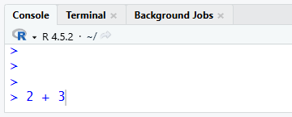
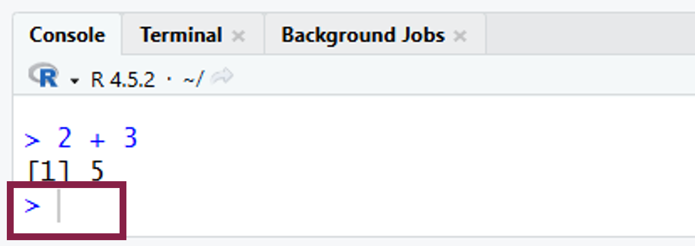
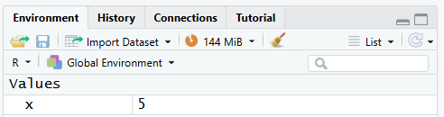
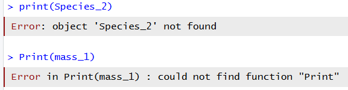
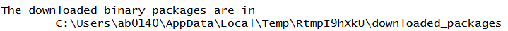

# R workshop 1: Getting started in R and data handling

## Introduction: R workshops overview

Over three workshops this semester, you'll be learning the basics of R and RStudio.

### What are R and RStudio?

R is the name of the programming language, while RStudio is an environment for working with R - essentially RStudio provides a user-friendly interface that makes writing, running, and managing R code much easier.

### Why R?

- Built specifically for data analysis and statistics
- Free and open-source
- Powerful tools for handling and analysing data
- Produces publication-quality graphs
- Widely used across scientific research disciplines
- A valuable skill for both further study and future careers

While many of the tasks covered in these workshops could be completed in other software such as Excel, the coding skills you develop will form the basis for conducting more advanced analyses in R and other statistical software.

### Using these course materials

These course materials contain the same content as the workshops and workshop slides. They are designed to complement the workshops and provide a convenient way to access all the material in one place.

**Example code**

Example code will appear in grey code blocks, like the one below. You can copy the code by hovering over it and clicking the clipboard icon that appears in the top-right corner of the code block and then paste it into R.

```{r}
#| eval: false
# This is a code chunk. You can copy it it by clicking the clipboard

print("Welcome to R")
```

**Template code**

Sometimes you will see code displayed in blue panels, such as the one below. These examples are designed to show the general structure of a particular function or piece of code and cannot be copied directly into R and run as they are. Instead, they contain blank spaces or placeholders that indicate the information you need to add.

::: {.panel-tabset .panel-blue group="language"}
## R

Template code is shown in blue panels like this one

```{r}
#| eval: false
# This code can't be copied and run as it is
# It shows the structure of the code and the blanks you need to fill in

print(_____________)
```

- Fill in the blank with the name of the object you want to print

:::

**Tasks**

Workshop activities and exercises will appear in green boxes like the one below.

::: {.callout-caution icon="false"}
### []{style="color: #2E6B4E;"}  Task

As you work through the materials, have a go at all the tasks.
:::


### Getting help from MASA

MASA is the Maths and Statistics Advice service at the university. They can support with mathematical and statistical topics relating to your course, including the use of statistical software.

For help with R outside of these sessions, you can attend a drop-in session or book a 1:1 appointment with MASA. <a href="https://surreylearn.surrey.ac.uk/d2l/le/lessons/215610/lessons/1856863" target="_blank" rel="noopener noreferrer">More information can be found here</a>.

## Workshop 1 overview

In the first workshop, you will learn how to navigate the RStudio interface, create and edit scripts, and run basic R code.

::: {.callout-tip icon="false"}
### []{style="color: #872046;"}  Learning outcomes

By the end of this session, you should be able to:

- Navigate the RStudio interface
- Understand the purpose of a script and how to create and save one
- Write and run R code from a script
- Write R commands to perform simple arithmetic calculations
- Understand the purpose of comments and how to write them in R
- Distinguish between expressions and assignments
- Use the correct syntax to assign numeric vs. character values to objects
- Refer to stored values using object names
- Use built-in R functions with the correct basic syntax
- Use the combine function (c()) to group multiple numeric or character values into a single vector
- Describe the structure of a data frame and create one by combining vectors.

- Install and load R packages
- Troubleshoot some common coding errors
[update to match the individual LOs as we go]

:::

**Structure of the session**

Set-up, followed by explanations, demos and short tasks to address each learning outcome. 


## Set-up

### R & RStudio

Make sure you have downloaded and installed both R and RStudio.

**Windows**

Download and install these using default options:

- <a href="https://cran.r-project.org/bin/windows/base/release.html" target="_blank" rel="noopener">R</a>
- <a href="https://docs.posit.co/ide/user/#rstudio-ide-oss-downloads" target="_blank" rel="noopener">RStudio</a>

**Mac OS**

Download and install these using default options:

- <a href="https://cran.r-project.org/bin/macosx/" target="_blank" rel="noopener">R</a>
- <a href="https://docs.posit.co/ide/user/#rstudio-ide-oss-downloads" target="_blank" rel="noopener">RStudio</a>

**Other options**

If your laptop or device does not support the use of R/RStudio (e.g. tablets and some Chromebooks), or you are having difficulty downloading the program(s), there are couple of other options:

- Online use of R/RStudio via Posit Cloud: https://posit.cloud/spaces/701987. This website allows you to use RStudio online through your web browser. A free account is required, and usage is limited under the free plan, but the platform functions much like the desktop version of RStudio.
- Library laptops: https://my.surrey.ac.uk/it/laptop-loans. The library has laptops which can be borrowed for seven days. All library laptops have R & RStudio installed on them.

For work outside the workshops, R and RStudio can also be accessed on all Library computers and in the AP (Austin Pearce) computer labs.

::: {style="margin-top: 2em;"}
:::

::: {.callout-caution icon="false"}
### []{style="color: #2E6B4E;"}  Task
Open RStudio (you do not need to open R separately).
:::

::: {style="margin-top: 2em;"}
:::

## User interface: pane layout

::: {.callout-tip icon="false"}
### []{style="color: #872046;"}  Learning outcome
- Navigate the RStudio interface
:::

RStudio has 4 panes or 'areas' on the screen, each serving a different purpose for working with R code. The image below shows how these panes are laid out within RStudio:

{width="550" style="display:block; margin: 2em auto;"}
The table below explains what each pane is used for:

::: {#geomxxx-table}
| Pane | What it's used for |
|---------------------|---------------------------------------------------|
| Source | The source pane is mainly used for writing and editing R scripts (documents containing code). |
| Console | The Console is where your R code runs and where you can see the results. |
| Environment | The Environment pane has 4 tabs: Environment, History, Connections, and Tutorial. You will mostly use the Environment tab, which displays information about the data and variables you have created. |
| Output | The output pane has several tabs (Files, Plots, Packages etc.). In these workshops we'll use the packages tab, which lists the R packages installed on your computer (more on packages later), and the plots tab, which displays graphs that you create. |
:::

::: {.callout-note icon="false" collapse="false"}
### []{style="color: #9e9e9e;"}  You might not see the source pane to begin with

Don't worry if you don't see the Source pane yet - this will appear when you open a new R Script, which we'll do in the next section.
:::


***Video***

If you would prefer a visual introduction to the RStudio interface, the video below provides a tour of the different panes and their main functions.

<div style="text-align: center;">
  <iframe
    width="80%"
    style="aspect-ratio: 16 / 9;"
    src="https://www.youtube.com/embed/Nbn6tma7gKw"
    title="YouTube video player"
    allowfullscreen>
  </iframe>
</div>

::: {.callout-note icon="false" collapse="true"}
### []{style="color: #9e9e9e;"}  Video timestamps
- 0:00 – Introduction
- 0:25 – The console
- 0:32 – The environment pane
- 0:58 – The output pane
- 1:26 – Customising the pane layout
:::

## Creating and saving a script

::: {.callout-tip icon="false"}
### []{style="color: #872046;"}  Learning outcome
- Understand the purpose of a script and how to create and save one
:::

**What is a script?**

A script in R is a file where you can write, save, and organise your code. It is similar to a document in Microsoft Word, but instead of containing text, it contains R code.

**Creating a new script**

There are several ways to create a new script in RStudio. The quickest method is to click the white page icon with the green plus sign below the menu bar, then click "R Script":

{width="250" style="display:block; margin: 2em auto;"}

A new blank script will open in the source pane:

{width="500" style="display:block; margin: 2em auto;"}

**Saving a script**

Saving a script is similar to saving a Microsoft Word document. To save your script, go to <strong>File &gt; Save As...</strong> and choose a location and filename.

You can also save your script using the keyboard shortcut <strong>Ctrl + S</strong> (or <strong>Cmd + S</strong> on a Mac).

::: {.callout-caution icon="false"}
### []{style="color: #2E6B4E;"}  Task
- Create a new script and save it in a **dedicated folder** for the R work on this module.
(This folder will be used to store all of your R scripts and data files for these workshops.)
:::

***Video***

If you would prefer to see the process demonstrated, the video below shows how to create and save an R script, and how to open an existing script.

<div style="text-align: center;">
  <iframe
    width="80%"
    style="aspect-ratio: 16 / 9;"
    src="https://www.youtube.com/embed/2JWNffzWS2Y"
    title="YouTube video player"
    allowfullscreen>
  </iframe>
</div>

::: {.callout-note icon="false" collapse="true"}
### []{style="color: #9e9e9e;"}  Video timestamps
- 0:00 – What is an R Script?
- 0:09 – How to create a script
- 0:43 – How to save a script
- 1:13 – How to open an existing script
- 1:45 – TASK: Creating and saving a script?
:::

## Writing and running code

::: {.callout-tip icon="false"}
### []{style="color: #872046;"}  Learning outcome
- Write and run R code from a script
:::

There are two places where you can write code in R: in a script or in the console. This is demonstrated below using a very simple piece of code: `2 + 3`.

**Writing and running code from a script**

It is generally recommended to write your code in scripts because it can be edited and saved, allowing you to reopen it and run the code again later.

Code can be written directly in the script:

{width="400" style="display:block; margin: 2em auto;"}

Then to **run a line of code from your script** (i.e. ask R to execute it):

1. Make sure your cursor is clicked somewhere on that line
2. Either:
    - Click the "Run" button within the Source pane (show below)
    - Press Ctrl + Enter (or Cmd + Enter on a Mac)
    
{width="600" style="display:block; margin: 2em auto;"} 
    
The code will execute in the console, where you'll see both the code that was run and the result:

{width="400" style="display:block; margin: 2em auto;"}

::: {.callout-note icon="false" collapse="true"}
### []{style="color: #9e9e9e;"}  Running multiple lines of code from a script

To run multiple lines of code from a script, highlight all of the lines you want to run, rather than placing your cursor on a single line. Then run the code as usual, either by clicking the Run button or by pressing Ctrl + Enter.
:::

**Writing and running code in the console**

The second way to write and run R code is directly in the Console. This is generally not recommended, except for quick calculations, trying out a line of code, or testing something before adding it to your script.

Unlike code written in a script, code entered directly into the Console is not saved automatically, so it can be difficult to find and reuse later.

To do write and run code in the console, type your code next to the command prompt (the `>` symbol) and press Enter on your keyboard. The code will run immediately, and any output will be displayed in the Console.

{width="400" style="display:block; margin: 2em auto;"}


::: {.callout-note icon="false" collapse="true"}
### []{style="color: #9e9e9e;"}  The command prompt

Whichever method you use to run code, R needs to be ready to accept a command. You can tell that it is ready when the command prompt (`>`) is displayed in the Console:

{width="400" style="display:block; margin: 2em auto;"}

If you see something else instead (such as a `+` prompt or a partially entered command), R is waiting for additional input and won't run new code. To return to the normal command prompt, click in the Console and press Esc on your keyboard.

You should then see the `>` prompt again. 
:::

***Video***

The video below below summarises and demonstrates writing and running code in R.

<div style="text-align: center;">
  <iframe
    width="80%"
    style="aspect-ratio: 16 / 9;"
    src="https://www.youtube.com/embed/2zXg0Pxapjs"
    title="YouTube video player"
    allowfullscreen>
  </iframe>
</div>

::: {.callout-note icon="false" collapse="true"}
### []{style="color: #9e9e9e;"}  Video timestamps
- 0:00 – Introduction
- 0:16 – Writing and running code from a script
- 1:22 – Writing and running code in the console
- 1:55 – Is it better to write code in a script or in the console?
:::

## Workshop 1 data: Three penguins

We will base most of the remaining workshop examples and tasks around some data on penguins.

Suppose we have three penguins. For each penguin, we have recorded its species and body mass in grams.

:::: {.columns}
::: {.column width="33%" .peng-col}
<div class="img-wrap">
{width="90%"}
</div>

**Penguin 1**  
Species: Adelie  
Body mass (g): 3750
:::

::: {.column width="33%" .peng-col}
<div class="img-wrap">
{width="100%"}
</div>

**Penguin 2**  
Species: Gentoo  
Body mass (g): 4500
:::

::: {.column width="33%" .peng-col}
<div class="img-wrap">
{width="100%"}
</div>

**Penguin 3**  
Species: Chinstrap  
Body mass (g): 3500
:::
::::

## Using R as a calculator

::: {.callout-tip icon="false"}
### []{style="color: #872046;"}  Learning outcome
- Write R commands to perform simple arithmetic calculations
:::

Although R is a powerful tool for data analysis and statistics, at its most basic it can be used like a normal calculator. Performing simple calculations is a useful way to start practising writing and running code.

In the previous section, we ran the simple command `2 + 3`. The + symbol is an example of an **operator**. Operators tell R to perform a particular action.

One type of operator is the arithmetic operator. These are the operators used for everyday mathematical calculations, such as addition, subtraction, multiplication, and division:

::: {#geomxxx-table}
| Action | Operator |
|---------------------|---------------------------------------------------|
| Addition | `+` |
| Subtraction | `-` |
| Multiplication | `*` |
| Division | `/` |
:::

We'll come across some other operators through the workshops.

::: {style="margin-top: 2em;"}
:::

:::: {.callout-caution icon="false"}
### []{style="color: #2E6B4E;"}  Task
Practise running some more simple calculations based on our three penguins:

- Add together the body masses of penguin 1 (3750) and penguin 2 (4500)
- Use a division to find penguin 1's body mass (3750g) in kg

::: {.callout-caution icon="false" collapse="true"}
### []{style="color: #872046;"} Answer

[To be added]

```{r}
# 

```
:::
::::

***Video***

The video below demonstrates using R for some simple calculations:

<div style="text-align: center;">
  <iframe
    width="80%"
    style="aspect-ratio: 16 / 9;"
    src="https://www.youtube.com/embed/bCvUkkl3Wa4"
    title="YouTube video player"
    allowfullscreen>
  </iframe>
</div>

::: {.callout-note icon="false" collapse="true"}
### []{style="color: #9e9e9e;"}  Video timestamps
- 0:00 – Introduction
- 0:18 – Calculations using arithmetic operators (+ - * /)
- 0:46 – TASK: Running simple calculations
:::


## Adding comments to a script

::: {.callout-tip icon="false"}
### []{style="color: #872046;"}  Learning outcome
- Understand the purpose of comments and how to write them in R
:::

In R, a comment is a line of text that begins with a hash symbol (#).

```{r}
# This is a comment
```

In RStudio, comments are displayed in green, making them easy to distinguish from your code.

{width="400" style="display:block; margin: 2em auto;"}

Comments are ignored when the code is executed and do not produce any output. They are used to add notes to your code, such as section headers, explanations of what the code does, make a note of results or add annotations about decisions.

Comments can be placed on their own line or after code on the same line:

```{r}
#| eval: false
# Addition
3 + 6   # the answer is 9
```

As your scripts become longer and more complex, comments become increasingly important. It's a good idea to get in the habit of using them to help explain what different sections of the code are doing, making it easier for both you and others to read, understand, and modify the code in the future.

::: {style="margin-top: 2em;"}
:::

::: {.callout-caution icon="false"}
### []{style="color: #2E6B4E;"}  Task
Add a couple of comments to your script e.g. a title / section heading / note about the calculations.
:::

::: {style="margin-top: 2em;"}
:::

***Video***

The video below demonstrates adding comments to an R script:

<div style="text-align: center;">
  <iframe
    width="80%"
    style="aspect-ratio: 16 / 9;"
    src="https://www.youtube.com/embed/Gtr35DsDjTc"
    title="YouTube video player"
    allowfullscreen>
  </iframe>
</div>

::: {.callout-note icon="false" collapse="true"}
### []{style="color: #9e9e9e;"}  Video timestamps
- 0:00 – Introduction
- 0:09 – How to add comments to a script & why they are important
- 1:09 – Best practice for writing comments
- TASK: Adding comments to your script
:::


## Expressions vs. assignments

::: {.callout-tip icon="false"}
### []{style="color: #872046;"}  Learning outcome
- Distinguish between expressions and assignments
:::

**Expressions**

An expression is code that R evaluates to produce a result. For example, earlier we ran the following code:

```{r}
2 + 3    # this is an expression, which returns the value 5
```

The expression produces a result (`5`), which is displayed in the console, but not saved for later use. 

**Assignments**

Assignments *store* the result of an expression so that it can be used later.

We do this using the assignment operator - a symbol (`<-`) which takes the result of the expression to its right, and assigns the result to the name on its left.

::: {.panel-tabset .panel-blue group="language"}
## Template code - assignment

```{r}
#| eval: false
_______________ <- ______________
 variable name      expression
```

Let's break this down:

- Fill in the `expression` blank with an expression (the piece of code you want R to run)
- `<-` is called the assignment operator. This operator takes the result of the expression to its right, and assigns the result to the name on its left.
- Fill in the `variable name` blank with the name you want to give to the result
:::

For example:

```{r}
x <- 2 + 3  # assigns the result of 2 + 3 to an object called x 
```

::: {.callout-note icon="false" collapse="true"}
### []{style="color: #9e9e9e;"}  Can I use `=` instead of `<-` for assignments?

In R, both `<-` and `=` can be used to assign values to objects. However, we recommend using `<-` for assignments.

Using `<-` makes your code easier to read because it clearly distinguishes assignment from the use of `=` inside functions.
:::

::: {style="margin-top: 2em;"}
:::

**Assigned variables**

Whenever you assign something to a variable name, it will appear in the Environment tab of the Environment pane:

{width="400" style="display:block; margin: 2em auto;"}
You can also view an object by simply running its name. For example, typing and running the code `x` will print whatever is stored in it (in our case, `5`).

```{r}
x
```

**Why are assignments useful?**

At the moment this might seem a bit pointless. Why do we want to save `2 + 3` in a variable called `x`?

However, assignments become much more useful when we are working with larger calculations, datasets, and statistical analyses. By assigning a result to a name, we can refer to it again later without having to retype or recalculate it.

You'll see the assignment operator (`<-`) used throughout these sessions, as it is one of the main ways that we store and work with information in R.

::: {.callout-caution icon="false"}
### []{style="color: #2E6B4E;"}  Task
- Calculate `3 - 2` and store the result in a variable named `y`.
:::

***Video***

The video below explains expressions and assignments:

<div style="text-align: center;">
  <iframe
    width="80%"
    style="aspect-ratio: 16 / 9;"
    src="https://www.youtube.com/embed/wf__WxPF-uU&quot"
    title="YouTube video player"
    allowfullscreen>
  </iframe>
</div>

::: {.callout-note icon="false" collapse="true"}
### []{style="color: #9e9e9e;"}  Video timestamps
- 0:00 – What is an expression?
- 0:33 – What is an assignment? – and how to assign things to variable names using the assignment operator
- 1:55 – Viewing variables in the environment pane
- 2:08 – TASK: Using the assignment operator to assign variable names
- 2:23 – Rules for variable names
:::


## Assigning numeric vs. character values

::: {.callout-tip icon="false"}
### []{style="color: #872046;"}  Learning outcome
- Use the correct syntax to assign numeric vs. character values to objects
:::

In the previous section, the expressions that we assigned involved calculations:

```{r}
x <- 2 + 3
```

However, expressions do not have to be calculations. Sometimes we simply want to store a value so that we can refer to it later.

Let's explore this using our penguin data. 

**Assigning numeric values**

When assigning numeric values, we simply type the numbers we want to store.

For example, let's create 3 variables called `mass_1`, `mass_2` and `mass_3` to store our pengiuns' respective body masses.

```{r}
mass_1 <- 3750
mass_2 <- 4500
mass_3 <- 3500
```

**Assigning character values**

When assigning character values (i.e. text), we need to use quotes around the values.

For example, let's create 3 variables called `species_1`, `species_2` and `species_3` to store our penguins' respective body masses.

```{r}
species_1 <- "Adelie"
species_2 <- "Gentoo"
species_3 <- "Chinstrap"
```

::: {.callout-caution icon="false"}
### []{style="color: #2E6B4E;"}  Task
- Create the mass_1, mass_2 and mass_3 objects as shown above
- Create the species_1, species_2 and species_3 objects as shown above
- Check all of these objects appear in the Envorinment pane
:::

## Using stored objects

::: {.callout-tip icon="false"}
### []{style="color: #872046;"}  Learning outcome
- Refer to stored values using object names
:::

We have said that assigning values to objects allows you to use them later. Now let's see what that means in practice. Once a value has been stored in a named object, you can refer to it simply by using the object's name. Whenever R sees an object name, it retrieves and uses whatever has been stored in that object.

For example, let's say we want to add the three penguin body masses.

Instead of using the raw values:

```{r}
3750 + 4500 + 3500
```

we can write the same expression using the names of the objects that store those values, to produce the same result:

```{r}
mass_1 + mass_2 + mass_3
```

As with any expression, we can store its result in a new object. For example, we could store the total of the three masses as total_mass:

```{r}
total_mass <- mass_1 + mass_2 + mass_3
total_mass
```

The benefit may not be obvious in such a small example, but storing values in named objects becomes increasingly useful as datasets and calculations become more complex.

::: {.callout-caution icon="false"}
### []{style="color: #2E6B4E;"}  Task
- Use your `mass_1` object to calculate the mass of penguin 1 in kilograms
:::

## Functions

::: {.callout-tip icon="false"}
### []{style="color: #872046;"}  Learning outcome
- Use built-in R functions with the correct basic syntax
:::

If you've worked with Excel, you'll be familiar with the idea of functions. For example, to add cells values in Excel, you can use the SUM() function.

A function is a block of code that carries out a specific task. This could be something simple, like finding the average of a set of numbers, or something more complex, like creating a graph.

R contains lots of built-in functions that are ready to use. Although each function is made up of code, you do not need to see or understand that code to use it. Instead, you simply use the function's name and provide any information it needs to complete the task.

### A simple example

We saw earlier that we can type and run the name of a variable to see what is stored in it. For example:

```{r}
x       # print the information stored in the variable x
mass_1  # print the information stored in the variable mass_1
```

**The print function**

We could alternatively use the `print` function, a function which tells R to display a value in the console.

If you type `print()` and place the name of a variable inside the brackets, R will display the value stored in that variable. This is another way of viewing a variable's contents, and gives the same result as typing the variable name by itself.

```{r}
print(x)       # print the information stored in the variable x
print(mass_1)  # print the information stored in the variable mass_1
```

This is a simple example of a function. R provides many other functions that can be used to perform a wide range of tasks.

::: {.callout-caution icon="false"}
### []{style="color: #2E6B4E;"}  Task

Type and run the following commands (do they all work?):

- `print(species_1)`
- `print(Species_2)`
- `Print(mass_1)`
:::

::: {.callout-note icon="false" collapse="true"}
### []{style="color: #9e9e9e;"}  R is case sensitive
R is case sensitive — it distinguishes between uppercase and lowercase letters in object and function names. If you see a "not found" error, double-check your spelling and capitalisation.

{width="400" style="display:block; margin: 2em auto;"}
:::

### General function syntax

Functions follow a general structure: the function name, followed by its inputs — called arguments — in brackets. For example, in `print(species_1)`, `print` is the function name and `species_1` is the argument - the object we want to print.

Arguments are the inputs a function needs to carry out a task. Different functions require different arguments - some take just one, while others take several, separated by commas. What you provide depends on the function and what you want it to do.

This structure is shown in the template code below:

::: {.panel-tabset .panel-blue group="language"}
## R
```{r}
#| eval: false
# Using a function with one argument:
  
________________(______________)
 function_name     argument

# Using a function with more than one argument (put commas between the arguments):
 
 ________________(________________, ________________, ________________ ...)
 function_name     first argument    second argument   third argument


```

- The `function_name` blank should be filled in with the name of the function you want to use.
- The `argument` blank(s) should be filled in with the information that you want the function to work with. If there are multiple arguments, they are separated by commas.
:::

::: {.panel-tabset group="language"}
## R
Examples of functions:
```{r}
#| eval: false
print(mass_1)                 # prints the value stored within the mass_1 variable
class(mass_1)                 # displays the type (class) of data stored in mass_1
sum(mass_1, mass_2)           # adds the values of mass_1 and mass_2 together
```
:::

::: {.callout-caution icon="false"}
### []{style="color: #2E6B4E;"}  Task
- Use the `class()` function to find the class (type) of the `species_1` object
- Use the `sum()` function to add together the three penguin masses
:::


## Vectors

::: {.callout-tip icon="false"}
### []{style="color: #872046;"}  Learning outcome
- Use the combine function (c()) to group multiple numeric or character values into a single vector
:::

So far, we've been storing single values. A vector is another type of R object that stores an ordered collection of values of the same type. This is more practical when working with lots of values.

To create a vector, we use the `c()` function - the `c` stands for "combine". This is an example of a function with multiple arguments, where each value we want to include is supplied as a separate argument, separated by commas.

This general code structure is shown in the template code below:

::: {.panel-tabset .panel-blue group="language"}
## R
```{r}
#| eval: false
_______________ <- c(_____________, _______________, ______________ ...)
 vector name         first value     second value     third value
```

- Replace the first blank (`vector name`) with the name you want to give your vector
- Replace the remaining blanks with the values you want to include in the vector, separated by commas
:::

::: {.callout-note icon="false"}
### []{style="color: #9e9e9e;"}  Vector rules
- All values in a vector must be of the same type (e.g. all numeric or all character)
- Character values must be wrapped in quotation marks
:::

**Examples**

Rather than storing each penguin's body mass in a separate variable, we can use a vector to store all the values together in a single vector:

```{r}
body_mass_g <- c(3750, 4500, 3500)
```

Notice that we use the assignment operator again to store the vector in an object called `body_mass_g`.

Now let's create a vector of the penguins` species. Just as with single character values, each value must be wrapped in quotation marks:

```{r}
species <- c("Adelie","Gentoo","Chinstrap")
```


::: {.callout-caution icon="false"}
### []{style="color: #2E6B4E;"}  Task
- Create the two vectors `body_mass_g` and species` as shown in the examples above
- Use the `print` function to print each vector
:::

## Data frames

::: {.callout-tip icon="false"}
### []{style="color: #872046;"}  Learning outcome
- Describe the structure of a data frame and create one by combining vectors.
:::

A data frame is another type of R object. Unlike vectors, which store a single collection of values, a data frame has a tabular structure - organised into rows and columns. Each row represents a single observation, and each column represents a variable. Data frames are useful because they keep all related information organised together in one place, making it easier to work with and analyse the data.

For example, below is a data frame containing our penguin data. Each row represents a single penguin, with columns recording its species and body mass. 

```{r}
#| echo: false
penguins <- data.frame(species, body_mass_g)
penguins
```

Next, we'll see how to create this data frame.

**Creating a data frame from vectors**

Data frames can be created by combining vectors, where each vector becomes a column.

We already have two vectors containing our penguin data - `species` and `body_mass_g`. Rather than keeping them separate, we can combine them into a single data frame so that all of our penguin information is stored together:

```{r}
penguins <- data.frame(species, body_mass_g)
```

This is similar to how we created vectors using `c()` — but instead of combining individual values, we are combining vectors as columns. The arguments are the names of the vectors we want to include.

::: callout-important
### Rules for combining vectors into a data frame
- All vectors must be the same length (i.e contain the same number of values)
- The order of values must match across vectors - for example, the species and body mass for the first penguin should both be in position 1 of their respective vectors
:::

Let's print the data frame to see what it looks like:

```{r}
print(penguins)
```

::: {.callout-note icon="false" collapse="true"}
### []{style="color: #9e9e9e;"}  Data frames will appear in the environment pane - click to view them
As with other objects, stored data frames will appear in the environment pane, but under "Data".

To view a data frame in the source pane, click on the data frame name (i.e. "penguins" here).

[screenshot]

The data frame will open in a new tab. To return to your script, either close the tab by clicking the "x", or click directly on the script tab.

[screenshot]
:::

::: {.callout-caution icon="false"}
### []{style="color: #2E6B4E;"}  Task
- As shown above, use the `data.frame()` function to combine your `species` and `body_mass_g` vectors into a single data frame called `penguins` data frame.
- Click on the data frame name ("penguins") from within the Environment tab to open it in the source pane.
:::

## Data frames - accessing columns

::: {.callout-tip icon="false"}
### []{style="color: #872046;"}  Learning outcome
- xx
:::

It is common to want to work with, or analyse, a specific variable i.e. column (vector) in a data frame.

To [select] a column from a data frame, use the $ operator e.g. 

```{r}
penguins$species
penguins$body_mass_g
```

These are vectors which you can apply functions to as before. For example:

```{r}
print(penguins$species)
```

[maybe introduce the sum function]


::: {.callout-caution icon="false"}
### []{style="color: #2E6B4E;"}  Task

Using your `penguins` data frame and appropriate functions:

- print the body_mass_g
- find the class (i.e. data type) of the body_mass_g column

:::

[!! I think move installing and loading packages to next workshop, as this is where we actually use it?]

## Types of data

[use Eva]

::: {.callout-tip icon="false"}
### []{style="color: #872046;"}  Learning outcome
- xx
:::

R represents different kinds of data using specific data types.

The three main data types in R are:

- numeric – numbers!
- character – text (or numbers stored as text)
- factor – categorical data with fixed levels

`class()`– We have seen that this function can be used to check object type i.e. class (for a scalar or vector this shows its data type).

`str()` – Use this function to view the structure of an object, e.g. for a data frame it will give you info, such as data type, about each column.

!!! Get them to change theirs to factor


::: {.callout-caution icon="false"}
### []{style="color: #2E6B4E;"}  Task

Use the `str()` function to view the structure of:

- the whole `penguins` data frame
- the `species` column only

:::

[functions can also be applied to data frames]


## Installing and loading packages

::: {.callout-tip icon="false"}
### []{style="color: #872046;"}  Learning outcome
- Install and load R packages
:::

An R packageis a collection of pre-written code and functions that extend the capabilities of the R programming language.

[remove?] Libraries are the directories where R packages are stored.

An R package needs to be installed onto your machine, and also then loaded, before it can be used. Think of this as like....

Some standard packages come pre-installed *and* loaded.
Some packages come pre-installed but need to be loaded.
Additional packages need to be installed and then loaded.

**Installing and loading a package**

Functions, argument is the package name

```{r}
#| eval: false
#| results: hide
install.packages("______________")
                   package name

library(________________)
         package name

```

For example:

```{r}
#| eval: false
install.packages(Hmisc)
```

```{r}
#| results: hide
library(Hmisc)
```


The Hmisc package includes many useful functions for data analysis such as the `describe()` function.


You may get some warnings... if package is installed, should get something like this:

{width="600" style="display:block; margin: 2em auto;"}
You may also get a warning message from loading the package. This is usally just to tell you that the package was built under a previous version as R.


**Checking a package is ready to use**

[screenshot of box with tick]


::: {.callout-caution icon="false"}
### []{style="color: #2E6B4E;"}  Task

- Install and load the Hmisc package

:::

***Video***

The video below demonstrates how to install and load an R package.

*Note*: The examples used in the video are the dplyr and readxl packages. We do not require these packages for this workshop - we only need to install and load the Hmisc package.

- The video imports a file called "iris" - ours is called "penguins", so whenever the video refers to "iris", replace this with "penguins" in your code
- The video uses: Session > Set Working Directory > *Choose Directory* to import the data. Session > Set Working Directory > *To Source File Location* is quicker if your Excel file is saved in the same location asyour script, but either method is fine.
- The "previous video" referred to in the video is the video about installing packages, which...

<div style="text-align: center;">
  <iframe
    width="80%"
    style="aspect-ratio: 16 / 9;"
    src="https://www.youtube.com/embed/qchMoYYDsOA"
    title="YouTube video player"
    allowfullscreen>
  </iframe>
</div>

::: {.callout-note icon="false" collapse="true"}
### []{style="color: #9e9e9e;"}  Video timestamps
- 0:00 – What is are R packages and libraries?
- 0:30 – How to view the packages in your libraries
- 1:10 – Installing a package
- 3:09 – Loading a package
- 4:22 – Installing the readxl package (and summary slide)
:::

## Summary


[Why do data frames from scratch? - wrote this down somewhere - paper on desdk]
E.g.

- Show how data frames work: columns containing same types of data
- Practise using function with multiple arguments (c, data.frame)
- c() function is useful!

Summary 
- `c()` combines values together.
- A vector stores multiple values of the same type.
- Here, we have a numeric vector containing three values.


::: {.callout-tip icon="false"}
### []{style="color: #872046;"}  Key points

- In R, comments begin with a hash symbol (#) and are used to document your code, making it easier to read, understand, and maintain.

- Use an expression if you want to execute the code and display the result in the console.
- Use an assignment (with <-) if you want to save the result of the expression for future use.

- The `c()` function combines values of the same type (e.g. numeric or character) together into a vector
- The `data.frame()` function combines multiple vectors together to form the columns of a data frame


:::


Exploring a data frame should come in somewhere - like Will Kay


## Complete code


===============================================================


=======

[[coursework data]]

```{r}
#| eval: FALSE

weight_change <- c(10,15,12,18,13,6,29,21,24,20,28,30,25,21,15,21,23,22)
group <- c(rep("control",9),rep("treated",9)) # note the boxplot stills works if it's not a factor

cw <- data.frame(group,weight_change) 
# note if you apply the factor function here it actually names the variable factor.group!

# This is not by group currently

library(ggplot2)
hist(weight_change)
ggplot(cw, aes(x=weight_change)) + geom_histogram(bins=3)
qqnorm(cw$weight_change)
qqline(cw$weight_change)

ggplot(cw, aes(x = weight_change)) +
  geom_histogram(bins=3) +
  facet_wrap(~ group)

ggplot(cw, aes(x = group, y = weight_change)) +
  geom_boxplot() +
  geom_point()
```

*=======================

[Scroll up in "complete this github table" copilot chat - gave scaffolding for working up from values to data frames ]

An object in R is a piece of information stored in memory.

A variable name is a name that refers to an object.

For example, when we run:

```{r}
x <- 2 + 3
```

R first evaluates the expression `2 + 3`, producing the value `5`. It then stores this value as an object and associates it with the variable name `x`.

After this assignment has been run, we can use `x` elsewhere in our code:

```{r}
x
```

```{r}
x * 10
```

*=======================

