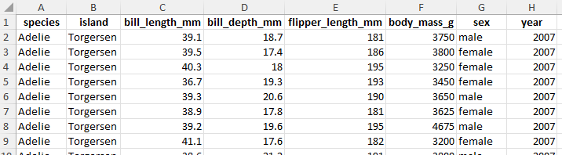
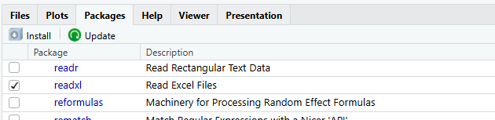
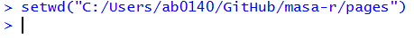
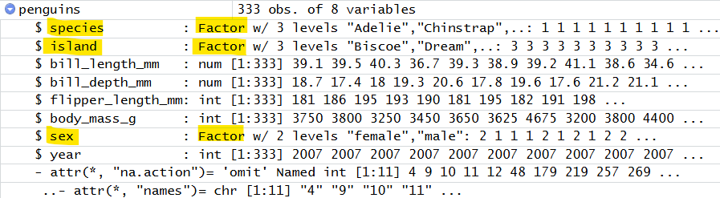
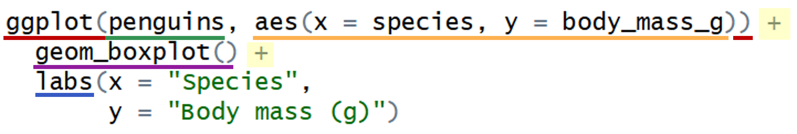

# R workshop 2: Descriptive statistics and graphing in R

In the second workshop, you will learn how to produce descriptive statistics and create graphs in R. The workshop focuses on comparing groups and visualising data using boxplots.

## Learning outcomes

::: {.callout-tip icon="false"}
### []{style="color: #872046;"}  Learning outcomes

By the end of this workshop, you should be able to:

- Explore a data frame to understand its structure, contents and basic characteristics
- Recognise when variables in a data frame should be stored as factors and convert them to factors
- Generate descriptive summaries of data frames using the summary() and describe() functions
- Use statistical functions to calculate descriptive statistics for individual columns of a data frame
- Produce grouped descriptive statistics using the by() function
- Produce a boxplot using the ggplot2 package
:::

## Workshop outline

In workshop 1 we constructed a very small penguins dataset from scratch. In this workshop we'll look at a larger dataset.

This data is from the penguins dataset in R, which contains data on three penguin species (Adelie, Chinstrap, and Gentoo) from the Palmer Archipelago in Antarctica, collected between 2007 and 2009. In this workshop, we'll used a modified version of this dataset.

Often in statistics we want to compare groups of data. We'll used the penguins dataset to start looking at some group comparisons. Specifically, we'll compare body mass between different species of penguins.

::: {.callout-tip icon="false"}
### []{style="color: #872046;"}  Aim

Compare body mass between different species of penguins using:

- Descriptive statistics
- A box plot
:::

**Workshop structure**

- Setup
- Import Excel data
- Explore the data
- Produce descriptive statistics
- Plot the data

## Setup {#setup}

::: {.callout-caution icon="false"}
### []{style="color: #2E6B4E;"}  Task
- Follow the steps below to get set up for this workshop
:::

**Step 1: Open RStudio**

Open RStudio (you do not need to open R separately).


**Step 2: Create a new script**

Create a new script and save it in your dedicated folder for the R work on this module.

**Step 3: Install required packages**

Copy the code below into your *console* and run it. This will install the readxl package, which we'll use for importing Excel data, and the ggplot2 package, which we'll use for plotting. 

```{r}
#| eval: false
install.packages("readxl")
install.packages("ggplot2")
```

If you did not install `Hmisc` in the previous workshop, install it now by copying the code below into your *console* and running it.

```{r}
#| eval: false
install.packages("Hmisc")
```

::: {.callout-note icon="false" collapse="true"}
### []{style="color: #9e9e9e;"}  Packages only need to be installed once
Installing a package downloads it to your computer so that R can use it in future projects. Once installed, you do not need to install it again unless you remove it or update R.

This is why we are running this code in the console rather than including it in our script. Installing a package is a one-time setup task, so it does not need to be repeated every time a script is run.
:::

**Step 4: Load required packages**

Below is the code for *loading* the packages that are needed for this workshop. Copy the code and paste it into the top of your new *script*, then run the code.

```{r}
#| message: false
#| warning: false
#| results: "hide"
library(Hmisc)
library(readxl)
library(ggplot2)
```

::: {.callout-note icon="false" collapse="true"}
### []{style="color: #9e9e9e;"}  Packages need to be loaded in each R session
Loading a package makes its functions available for use in your current R session. Unlike installation, packages must be loaded each time you start R.
:::

::: callout-important
### Write code in your script, not the console

From now on, unless you're testing a small piece of code, write all of your code in the script rather than the console. This makes it easier to save, review, and rerun your work later.
:::

## Importing Excel data

We will now import the penguins.xlsx Excel spreadsheet into R. This is the dataset we will use throughout the workshop. The spreadsheet can be imported directly because it follows a format that R can easily read, with variable names stored as column headings in the first row and the data arranged underneath.

{width="600" style="display:block; margin: 2em auto;"}

Before importing the data, we need to set the working directory. The working directory is the folder on your computer that R is currently using. When you ask R to open a file, it will first look for that file in the working directory, so we need to make sure it is set to the location of the penguins.xlsx spreadsheet.

::: {.callout-caution icon="false"}
### []{style="color: #2E6B4E;"}  Task
- Import the penguins Excel file into R by following the steps below
:::

::: {style="margin-top: 2em;"}
:::

**Step 1: Check that the readxl package is installed and loaded**

Confirm that the `readxl` package has successfully installed and loaded in your session by checking that `readxl` is ticked in the Packages tab of the Output pane (as shown in the screenshot below).

{width="500" style="display:block; margin: 2em auto;"}


**Step 2: Save the Excel file**

Download the penguins.xlsx from SurreyLearn [link] save it in your dedicated folder for the R work on this module. This should be the same location as where your R script is saved.

::: {.callout-important collapse="true"}
### Make sure your script and the penguins.xlsx file are saved in the same folder

The process of importing data is easiest if your script and data are in the same folder.
:::

::: {style="margin-top: 2em;"}
:::

**Step 3: Set your working directory**

To set your working directory: 

- Click on the "Session" tab in the menu bar at the top of RStudio
- Click "Set Working Directory" 
- Click "To Source File Location"

{width="600" style="display:block; margin: 2em auto;"}
This will set the working directory to the folder where your script is saved, which should also be where your Excel file is saved.

::: {.callout-note icon="false" collapse="true"}
### []{style="color: #9e9e9e;"}  An alternative way to set the working directory

You can also set the working directory manually by selecting "Choose Directory...", rather than "To Source File Location". For example, if your Excel file is stored in a different folder from your R script, you should choose the folder containing the Excel file as your working directory.
:::

::: {style="margin-top: 2em;"}
:::

**Step 4: Copy the code for setting the working directory into your script**

After setting the working directory, you should see a line of code similar to the one below appear in the Console. (The `setwd() function` tells R which folder to use as the working directory, and the text inside the brackets is the file path to that folder.)

{width="500" style="display:block; margin: 2em auto;"}

Copy and paste this line of code into your script (not including the `>` symbol). (The file path in your line of code will be different, as it will refer to the specific folder on your computer where your files are saved.)

::: {.callout-note icon="false" collapse="true"}
### []{style="color: #9e9e9e;"}  Why did we do this?

Although we could have written the `setwd()` command ourselves, using the RStudio menus is often quicker and less prone to errors, particularly when working with long file paths. Once the command has been generated, it is a good idea to copy it into your script. In future, you can simply run the command from your script to set the working directory, rather than navigating through the menus again.
:::

::: {style="margin-top: 2em;"}
:::

**Step 5: Import the data using the read_excel() function**

Copy the following line of code into your script and run it to import the data.

```{r}
#| results: hide
penguins <- read_excel("penguins.xlsx")
```

How this command works:

- `read_excel()` is the function used to import data from an Excel file.
- Inside the brackets, we specify the name of the file we want to import, including the file extension (in this case, .xlsx), enclosed in quotation marks.
- `penguins <-` tells R to store the imported data in an object called penguins.

::: {style="margin-top: 2em;"}
:::

**Step 7: Check the data has imported**

You should now see `penguins` in the Environment tab of the environment pane:

{width="500" style="display:block; margin: 2em auto;"}


::: {style="margin-top: 2em;"}
:::

::: {.callout-note icon="false" collapse="true"}
### []{style="color: #9e9e9e;"}  Things to check if the data has been imported successfully

- Make sure the Excel file is closed when you run the code to import the data
- Check that the spelling of the file name inside the `read_excel()` function exactly matches the spelling of the file name
- Check that the file extension is correct (e.g. `.xlsx` rather than `.xls`)
- Make sure the Excel file is saved in your current working directory.
- Check that you have set the working directory to the correct folder (you can run the command `getwd()` to check what the working directory is set to)
- Ensure that you have loaded the `readxl` package 
:::

***Video***

The video below demonstrates how to import a file from Excel, including some things to check if it is not working.

A couple of things to note about the video:

- The video imports a file called "iris" - ours is called "penguins", so whenever the video refers to "iris", replace this with "penguins" in your code
- The video uses [Session > Set Working Directory > *Choose Directory*] to import the data. We have used [Session > Set Working Directory > *To Source File Location*] since this is quicker if your Excel file is saved in the same location as your script, but either method is fine.
- The "previous video" referred to in the video is the video about installing packages, which is included in the workshop 1 materials.

<div style="text-align: center;">
  <iframe
    width="80%"
    style="aspect-ratio: 16 / 9;"
    src="https://www.youtube.com/embed/rJljmh2CEZU"
    title="YouTube video player"
    allowfullscreen>
  </iframe>
</div>

::: {.callout-note icon="false" collapse="true"}
### []{style="color: #9e9e9e;"}  Video timestamps
- 0:00 – Introduction (and recap of installing the readxl package)
- 0:40 – Setting the working directory - how and why
- 2:09 – Checking your current working directory using getwd()
- 2:28 – Importing data (.xls and .xlsx files) using the read_excel function
- 2:59 – Common errors when importing Excel files
- 4:13 – Viewing the imported data
:::

## Exploring a data frame

::: {.callout-tip icon="false"}
### []{style="color: #872046;"}  Learning outcomes

- Explore a data frame to understand its structure, contents and basic characteristics
- Recognise when variables in a data frame should be stored as factors and convert them to factors
- Generate descriptive summaries of data frames using the summary() and describe() functions

:::

It’s a good idea to explore and get to know the data you’re working with before starting any analysis. This helps you spot issues, understand what information is available, and avoid making incorrect assumptions before you begin analysing.

We'll use some simple functions, some of which we saw in workshop 1, to explore the `penguins` dataset.

### Basic data exploration

**View the columns headings**

It is often useful to check the column names in a data frame, particularly when you are becoming familiar with a new dataset or need to confirm a column name while writing code. You can use the `names()` function to display the names of the columns in a data frame in the console:

::: {.panel-tabset group="language"}
## R

```{r}
names(penguins)   
```
:::

**View the first few rows**

To get an idea of what's in your data frame without viewing it all at once, you can use the `head()` function to display the first few rows in the console:

::: {.panel-tabset group="language"}
## R

```{r}
head(penguins)   
```
:::

**View the whole data frame**

We could view the entire data frame in the console by typing its name and running it, but it's often nicer to view it in the Source pane. You can do this either by clicking on the data frame in the Environment pane (which automatically runs `View()`), or by using the `View()` function directly:

::: {.panel-tabset group="language"}
## R

```{r}
#| eval: false
View(penguins)   
```
:::

{width="700" style="display:block; margin: 2em auto;"}

::: {.callout-note icon="false"}
### []{style="color: #9e9e9e;"}  Note
This will open a new tab next to your script. Click on the "x" to close it.
:::

**Examine the structure of the data frame**

The `str()` ("structure") function is useful for quickly examining the structure of a dataset:

::: {.panel-tabset group="language"}
## R

```{r}
str(penguins)
```
:::

The same information can also be viewed by clicking the blue arrow to the left of the data frame name in the Environment pane:

{width="600" style="display:block; margin: 2em auto;"}


We can see that this data frame contains three character variables (`species`, `island`, and `sex`), indicated by `chr`. The remaining variables are numeric, indicated by `num`.

Sometimes, variables need to have their data types adjusted.

For example, if a numeric, integer or character variable in a data frame represents
categorical data with fixed levels, it should be stored as a factor. This applies to `species`, `island`, and `sex`.

### Converting variables to factors

Usually, if we have columns of character or numeric data that contain fixed categories, we want R to instead treat these as *factors*.

Factors are useful because they let R know that the values represent categories (like “male”/“female”, or “Adelie”/“Chinstrap”/“Gentoo”) instead of just text strings.

The code below converts the `sex` column in the `penguins` dataset from a character variable to a factor using the `as.factor()` function:

```{r}
penguins$sex <- as.factor(penguins$sex) 
```

::: {.callout-caution icon="false"}
### []{style="color: #2E6B4E;"}  Task
- Add the above line of code to your script and run it to convert the sex column to a factor
- Write and run similar commands to convert the species and island columns to factors as well

[Answer]

- Rerun `str(penguins)` or use the blue arrow next to the `penguins` object in the Environment pane to check that the variables have been converted to factors:

```{r}
#| echo: false
penguins$species <- as.factor(penguins$species) 
penguins$island <- as.factor(penguins$island)
```


{width="600" style="display:block; margin: 2em auto;"}
:::

### Data frame summaries

Viewing the first few rows of a data frame (or the entire data frame) and using `str()` are useful first steps for understanding a dataset. However, particularly for larger datasets, it can be difficult to quickly understand the overall structure or key properties of the data.

For example, with the gapminder data, we might want to know how many observations there are for each country, have a full list of all the countries included, or generate some basic summary statistics for numeric variables like population and life expectancy.

To get this type of overview, we can use summary functions. The `summary()` function produces a quick summary of each column, with the type of output depending on the variable's data type:

::: {.panel-tabset group="language"}
## R

```{r}
summary(penguins)
```
:::

Another useful function is `describe()` from the Hmisc package. This provides a more detailed summary than `summary()`, and also indicates whether any variables contain missing values:

::: {.panel-tabset group="language"}
## R

```{r}
#| class-output: "scroll-output"
describe(penguins)
```
:::

## Descriptive statistics for individual columns in a data frame

::: {.callout-tip icon="false"}
### []{style="color: #872046;"}  Learning outcome

- Use statistical functions to calculate descriptive statistics for individual columns of a data frame
:::

::: {.callout-tip icon="false"}
### []{style="color: #872046;"}  Aim

Recall that our aim is to compare body mass between different species of penguins.

In this section, we'll first generate some *overall* descriptive statistics for body mass across all penguins in the dataset.
:::

In workshop 1, we used several statistical functions to calculate descriptive statistics for individual columns in a data frame. Remember that a column of a data frame can be thought of as a vector, which means we can apply many of R's statistical functions directly to it.

::: {.panel-tabset .panel-blue group="language"}
## R

**Applying a statistical function to a data frame colum - general template**

```{r}
#| eval = FALSE
___________(__________________$_______________________)
function      data frame name    column to summarise

```
:::

::: {.panel-tabset group="language"}
## R

**Example**

Find the mean of the body_mass_g columns in the penguins data frame (i.e. find the mean body mass of all penguins):

```{r}
mean(penguins$body_mass_g)
```
:::

::: {style="margin-top: 2em;"}
:::

The table below summarises some of the most commonly used functions for calculating descriptive statistics, together with examples of how they can be applied to columns in our `penguins ` data frame.

| Function | Statistic | Example | Result |
|----------|------------|--------|----------|
| `mean()` | Mean (average) | `mean(penguins$body_mass_g)` | Mean body mass |
| `sd()` | Standard deviation | `sd(penguins$body_mass_g)` | Standard deviation of body mass |
| `median()` | Median | `median(penguins$body_mass_g)` | Median body mass |
| `quantile()` | Lower quartile | `quantile(penguins$body_mass_g, 0.25)` | Lower quartile of body mass |
| `quantile()` | Upper quartile | `quantile(penguins$body_mass_g, 0.75)` | Upper quartile of body mass |
| `IQR()` | Interquartile range | `IQR(penguins$body_mass_g)` | Interquartile range of body mass |
| `min()` | Minimum | `min(penguins$body_mass_g)` | Minimum body mass |
| `max()` | Maximum | `max(penguins$body_mass_g)` | Maximum body mass |
| `range()` | Range | `range(penguins$body_mass_g)` | Range of body mass |
| `table()` | Frequency counts | `table(penguins$species)` | Counts of each species |

::: {style="margin-top: 2em;"}
:::

Most of the functions in this table are designed to be applied to numeric vectors, for example things like body mass, flipper length, or bill length in our penguins data. Applying these functions to character or factor variables will usually result in an error.

The exception is `table()`, which is commonly used with categorical variables (factors or character variables) to count the number of observations in each category.

::: {.callout-caution icon="false"}
### []{style="color: #2E6B4E;"}  Task
Apply relevant statistical functions to relevant columns of the penguins data frame to find:

- The median body mass of all penguins
- The mean flipper length of all penguins
- The minimum bill depth of all penguins

[Answers]
:::

## Grouped descriptive statistics

::: {.callout-tip icon="false"}
### []{style="color: #872046;"}  Learning outcome
- Produce grouped descriptive statistics using the by() function
:::

::: {.callout-tip icon="false"}
### []{style="color: #872046;"}  Aim

Recall that our aim is to compare body mass between different species of penguins.

In this section, we'll use grouped descriptive statistics to summarise body mass for each species separately.
:::

In the previous section, we calculated descriptive statistics for an entire variable. For example, we found the median body mass of *all* penguins in the dataset.

The `by()` function allows us to calculate statistics for groups defined by another variable. It works by applying a function to one column after splitting the data according to the categories in a second column.

::: {.panel-tabset .panel-blue group="language"}
## R

**Using the by() function - general template**

```{r}
#| eval = FALSE
by(______________________, ____________________, _______________)
    column to summarise     column to group by    function
```

- In the `column to summarise` blank, enter the variable you want to calculate a statistic for. For example, penguins$body_mass_g.
- In the `column to group by` blank, enter the variable that defines the groups. For example, penguins$species.
- In the `function` blank, enter the summary statistic you want to calculate. For example, mean, median, or sd.
:::

::: {.panel-tabset group="language"}
## R

**Example**

Calculate the median body mass for each species (i.e. calcuate the median body mass *grouped by* species)

```{r}
by(penguins$body_mass_g, penguins$species, median)

```

- We want to calculate a statistic for the body mass variable, so we put `penguins$body_mass_g` in the `column to summarise` position
- We want to calculate the statistic separately for each species, so we put `penguins$species` in the `column to group by` position
- We want to calculate the median, so we put `median` in the `function` position

This tells R to:

- Split the body mass data into groups based on species
- Calculate the median body mass for each species
- Return the results for each species separately

[complete and use sample language as the template]

:::

::: {.callout-caution icon="false"}
### []{style="color: #2E6B4E;"}  Task

- Use the by() function to find the minimum body mass for each species
- Use the by() function to find the maximum body mass for each species

:::

## Creating a boxplot with ggplot2

::: {.callout-tip icon="false"}
### []{style="color: #872046;"}  Learning outcome
- Produce a boxplot using the ggplot2 package
:::

::: {.callout-tip icon="false"}
### []{style="color: #872046;"}  Aim

Recall that our aim is to compare body mass between different species of penguins.

Descriptive statistics are useful for summarising body mass within each species, but visualisations can make comparisons between groups easier. A boxplot displays the median, interquartile range, and overall spread of the data, making it a useful tool for comparing distributions across species.

In this section, we'll use the ggplot2 package to create a boxplot of body mass grouped by species.
:::

### The ggplot2 package

Although base R provides various functions for creating particular plot types, the syntax is inconsistent across functions and it can be difficult to implement more specific or complex customisations.

`ggplot2` is an R package that provides a consistent system for building plots. Rather than having a separate function for each plot type, plots are built up layer by layer using a common syntax.

In this workshop, we'll see how it can be used to produce a boxplot.

**Installing and loading the ggplot2 package**

We installed and loaded `ggplot2` in the [setup] (#setup) stage.

::: {.callout-caution icon="false"}
### []{style="color: #2E6B4E;"}  Task
- Confirm that `ggplot2` has successfully installed and loaded in your session by checking that `ggplot2` is ticked in the Packages tab of the Output pane (as shown in the screenshot below).
:::

{width="700" style="display:block; margin: 2em auto;"}

::: {style="margin-top: 2em;"}
:::

### Code structure and boxplot example

A plot produced with the `ggplot2` package is built up using component functions which are "added" together using the `+` operator.

As an example, the code shown in the screenshot below produces our box plot of body mass by species.

{width="700" style="display:block; margin: 2em auto;"}

Before running this code, let's look at its components, which form the general structure for creating any ggplot2 plot:

- Initialise the plot with the [**ggplot()**]{style="color: #C00000;"} function. Inside the brackets, specify the [**data**]{style="color: #349353;"} and the [**aesthetic mappings**]{style="color: #FDB151;"} (how variables are mapped to visual properties such as x and y axes)\
- Choose a [**geom_xxx()**]{style="color: #901A9D;"} function based on the type of plot you want (here, `geom_boxplot()` produces a boxplot)\
- Customise the plot using additional components - here we add [**labels**]{style="color: #0070C0;"} using the [**labs()**]{style="color: #0070C0;"} function

We can build the boxplot one component at a time.

[TASK?] Click through the tabs below to see how each component contributes to building the boxplot step by step:

::: {style="margin-top: 2em;"}
:::

::: {.panel-tabset}
## Data and axes

The first component tells R which data to use and which variables to put on the axes.

```{r}
ggplot(penguins, aes(x = species, y = body_mass_g))
```

## Add the plot

The second component tells R the plot type that should be used to visually represent the data - in this case, as a boxplot ("`geom_boxplot()`").

```{r}
ggplot(penguins, aes(x = species, y = body_mass_g)) +
  geom_boxplot()
```

## Add labels

Then we have added the "`labs()`" component, which adds labels to the plot - here we have added axes labels.

```{r}
ggplot(penguins, aes(x = species, y = body_mass_g)) +
  geom_boxplot() +
  labs(x = "Species",
       y = "Body mass (g)")
```
:::

::: {style="margin-top: 2em;"}
:::

::: {.callout-caution icon="false"}
### []{style="color: #2E6B4E;"}  Task
- Copy the code from the final tab to your script.
- Run the code to produce the boxplot.
:::

### Template code for a boxplot

Below is...

::: {.panel-tabset .panel-blue}
## Template code: boxplot

```{r}
#| eval: false
ggplot(_________, aes(x = _________, y = ________)) +
  geom_boxplot() +
  labs(x = "_______",
       y = "_______")
```

- Fill in the first blank with the name of the data you want to use for plotting
- Fill in the second blank (after x =) with the name of the variable (column) in the data you want to plot on the x-axis
- Fill in the third blank (after y =) with the name of the variable (column) in the data you want to plot on the y-axis
- Fill in the blanks inside the `labs()` function with the corresponding x and y labels that you want to add to your plot. These should be in quotation marks.

:::

::: {.panel-tabset}
## Example: boxplot

This is our original boxplot code, which produces a boxplot of body mass by species:

```{r}
#| eval: false
ggplot(penguins, aes(x = species, y = body_mass_g)) +
  geom_boxplot() +
  labs(x = "Species",
       y = "Body mass (g)")
```

Now let's suppose we want to produce a boxplot of *flipper length* by species. Then we need to:

- Change the `y` variable to be `flipper_length_mm` instead of `body_mass_g`
- Change the `y` axis label to refer to flipper length

So the code becomes:

```{r}
ggplot(penguins, aes(x = species, y = flipper_length_mm)) +
  geom_boxplot() +
  labs(x = "Species",
       y = "Flipper length (mm)")
```
:::

::: {.callout-caution icon="false"}
### []{style="color: #2E6B4E;"}  Task
Suppose you want to compare bill length for males versus females

- Plot a box plot of bill length split by sex
- What can we say about differences in bill lengths for males and females?

[Hint] - x and y axis
[Answer]

:::

### Extension: additional customisation options

[To be added]


## Summary

::: {.callout-tip icon="false"}
### []{style="color: #872046;"}  Key points

- ...


:::
