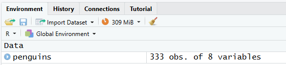
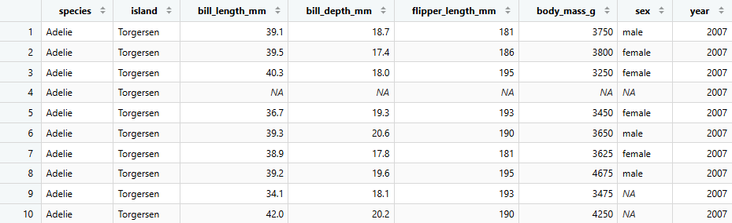
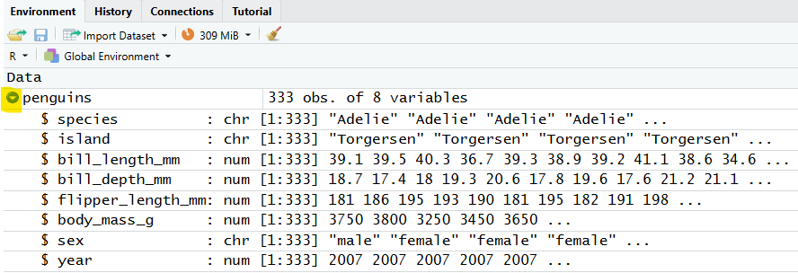
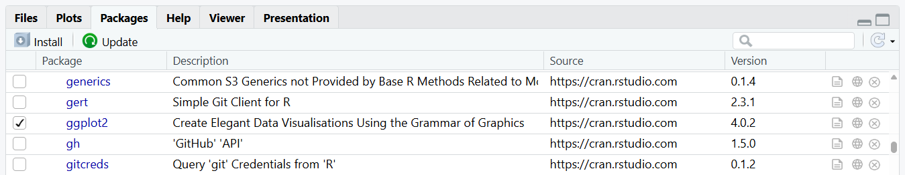
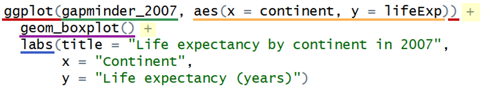

# R workshop 2: Descriptive statistics and graphing in R

## Learning outcomes

::: {.callout-tip icon="false"}
### []{style="color: #872046;"}  Learning outcomes

By the end of this workshop, you should be able to:

- xxxxxxxxxxxxxx
- xxxxxxxxxxxxxx
:::

## Workshop structure

## Setup {#setup}

::: {.callout-caution icon="false"}
### []{style="color: #2E6B4E;"}  Task
- Follow the steps below to get set up for this workshop
:::

1.  Open RStudio (you do not need to open R separately)

2.  Create a new script and save it in your **dedicated folder** for the R work on this module

3.  Below is the code for installing the packages that are needed for this workshop. Copy and paste the code for any packages you have not previously installed into your **console** and run it. (e.g. you will not need to installed `Hmisc` again if you already installed it in workshop 1)

!! explain why we need each of these

::: {.panel-tabset group="language"}
## R

 If you have previously installed any of these packages on your device, you do not need to install them again.

```{r}
#| eval: false
# Install packages
install.packages("Hmisc")
install.packages ("readxl")
install.packages("ggplot2")
```
:::

4.  Below is the code for *loading* the packages that are needed for this workshop. Copy the code and paste it into the top of your new **script**, then run this code.

::: {.panel-tabset group="language"}
## R

```{r}
#| message: false
#| warning: false
#| results: "hide"
# Load packages
library(Hmisc)
library(readxl)
library(ggplot2)
```

 You'll need to load any packages required for your work each time you start a new R session.
:::

::: {style="margin-top: 2em;"}
:::

::: callout-important
### Write code in your script, not the console

From now on, unless you're testing a small piece of code, write all of your code in the script rather than the console. This makes it easier to save, review, and rerun your work later.
:::

## Workshop 2 data: penguins

[call workshop 1 data something different?]

In workshop 1 we built up a very small penguins dataset from scratch.

This data is from the penguins dataset in R, which contains data on three penguin species (Adelie, Chinstrap, and Gentoo) from the Palmer Archipelago in Antarctica, collected between 2007 and 2009.

In this workshop, we'll used a modified version of this dataset.

!!! Add here that we will focus on comparing weights between the three species of penguin (links from ws 1)

## Importing Excel data

We will now import this Excel (.xlsx) file into R.

The working directory is the folder that R is “working in.” When importing data, you need to set the working directory to the folder where your data is saved.

*Data layout**


[screenshot of Excel file]

::: {.callout-caution icon="false"}
### []{style="color: #2E6B4E;"}  Task
- Import the penguins Excel file into R by following the steps below
:::

::: {style="margin-top: 2em;"}
:::

**Step 1: Save the Excel file**

Download the penguins csv file and...... save in dedicated folder....

::: {.callout-important collapse="true"}
### Make sure your script and the penguins.xlsx file are saved in the same folder

The process of importing data is easiest if your script and data are in the same folder.
:::

::: {style="margin-top: 2em;"}
:::

**Step 2: Set your working directory**

To set your working directory: 

- Click on the "Session" tab in the menu bar at the top of RStudio
- Click "Set Working Directory" 
- Click "To Source File Location"

{width="600" style="display:block; margin: 2em auto;"}
This will set the working directory to the folder where your script is saved, which should also be where your Excel file is saved.

You will get something like the below in the console:

[screenshot of wd command]

Copy and paste this into your script (not including the `>` symbol.)
This means...

To check your working directory...

::: {.callout-note icon="false" collapse="true"}
### []{style="color: #9e9e9e;"}  If your Excel file is saved in a different location to your script

:::

::: {style="margin-top: 2em;"}
:::

**Step 3: Import the data using the `read_excel()` function**

```{r}
#| results: hide
penguins <- read_excel("penguins.xlsx")
```

::: {.callout-note icon="false" collapse="true"}
### []{style="color: #9e9e9e;"}  How this command works

:::

::: {style="margin-top: 2em;"}
:::


**Step 4: Check the data has imported**

You should now see `penguins` in the Environment tab of the environment pane:

{width="500" style="display:block; margin: 2em auto;"}

::: {style="margin-top: 2em;"}
:::


Things to check (if it's not working):

- Make sure the Excel file is closed
- Check naming of Excel file

***Video***

The video below demonstrates how to import a file from Excel, including some things to check if it is not working.

A couple of things to note about the video:

- The video imports a file called "iris" - ours is called "penguins", so whenever the video refers to "iris", replace this with "penguins" in your code
- The video uses: Session > Set Working Directory > *Choose Directory* to import the data. Session > Set Working Directory > *To Source File Location* is quicker if your Excel file is saved in the same location asyour script, but either method is fine.
- The "previous video" referred to in the video is the video about installing packages, which...

<div style="text-align: center;">
  <iframe
    width="80%"
    style="aspect-ratio: 16 / 9;"
    src="https://www.youtube.com/embed/rJljmh2CEZU"
    title="YouTube video player"
    allowfullscreen>
  </iframe>
</div>

::: {.callout-note icon="false" collapse="true"}
### []{style="color: #9e9e9e;"}  Video timestamps
- 0:00 – Introduction (and recap of installing the readxl package)
- 0:40 – Setting the working directory - how and why
- 2:09 – Checking your current working directory using getwd()
- 2:28 – Importing data (.xls and .xlsx files) using the read_excel function
- 2:59 – Common errors when importing Excel files
- 4:13 – Viewing the imported data
:::

## Exploring a data frame

::: {.callout-tip icon="false"}
### []{style="color: #872046;"}  Learning outcomes

- Explore a data frame to understand its structure, contents and basic characteristics
- Recognise when variables in a data frame should be stored as factors and convert them to factors
- [Generate descriptive statistics for data frames or columns using the summary() and describe() functions]

:::

It’s a good idea to explore and get to know the data you’re working with before starting any analysis. This helps you spot issues, understand what information is available, and avoid making incorrect assumptions before you begin analysing.

We'll use some simple functions [that we saw last time] to explore the dataset.

**View the columns headings**

It is often useful to check the column names in a data frame, particularly when you are becoming familiar with a new dataset or need to confirm a column name while writing code. You can use the `names()` function to display the names of the columns in a data frame in the console:

::: {.panel-tabset group="language"}
## R

```{r}
names(penguins)   
```
:::

**View the first few rows**

To get an idea of what's in your data frame without viewing it all at once, you can use the `head()` function to display the first few rows in the console:

::: {.panel-tabset group="language"}
## R

```{r}
head(penguins)   
```
:::

**View the whole data frame**

We could view the entire data frame in the console by typing its name and running it, but it's often nicer to view it in the Source pane. You can do this either by clicking on the data frame in the Environment pane (which automatically runs `View()`), or by using the `View()` function directly:

::: {.panel-tabset group="language"}
## R

```{r}
#| eval: false
View(penguins)   
```
:::

{width="700" style="display:block; margin: 2em auto;"}

::: {.callout-note icon="false"}
### []{style="color: #9e9e9e;"}  Note
This will open a new tab next to your script. Click on the "x" to close it.
:::

**Examine the structure of the data frame**

The str() ("structure") function is useful for quickly examining the structure of a dataset:

::: {.panel-tabset .panel-green group="language"}
## R

```{r}
str(penguins)
```
:::

The same information can also be viewed by clicking the blue arrow to the left of the data frame name in the Environment pane:

{width="600" style="display:block; margin: 2em auto;"}


==== will ========

We can see that these data contain two character variables, and two numeric variables. If we wanted to change a character variable to a factor, we could do it like this:

dframe1$gender <- as.factor(dframe1$gender)

You will have noticed that we used the dollar symbol $ to specifically choose the gender column from the dframe1 dataset.

Summary
Then we can use the summary() function, which shows us some basic descriptive statistics or other information from the variables in the dataset.

n====================

** Generating [basic] summaries **

Viewing the first few rows of a data frame (or the entire data frame) and using `str()` are useful first steps for understanding a dataset. However, particularly for larger datasets, it can be difficult to quickly understand the overall structure or key properties of the data.

For example, with the gapminder data, we might want to know how many observations there are for each country, have a full list of all the countries included, or generate some basic summary statistics for numeric variables like population and life expectancy.

To get this type of overview, we can use summary functions. The `summary()` function produces a quick summary of each column, with the type of output depending on the variable's data type:

::: {.panel-tabset .panel-green group="language"}
## R

```{r}
summary(penguins)
```
:::

Another useful function is `describe()` from the Hmisc package. This provides a more detailed summary than `summary()`, and also indicates whether any variables contain missing values:

::: {.panel-tabset group="language"}
## R

```{r}
#| class-output: "scroll-output"
describe(penguins)
```
:::

!! change sex, species and island to factor


## Descriptive statistics for individual columns in a data frame

::: {.callout-tip icon="false"}
### []{style="color: #872046;"}  Learning outcome

- Use statistical functions to calculate descriptive statistics for individual columns of a data frame

:::

In workshop 1 we saw... (descriptives by column)

[Remember that we can think of columns as vectors]

[table from slide, but also describe what each does and what it is for e.g. numeric/character]

[do median body mass - links to below]

::: {.callout-caution icon="false"}
### []{style="color: #2E6B4E;"}  Task
- Find...
:::

## Grouped descriptive statistics

::: {.callout-tip icon="false"}
### []{style="color: #872046;"}  Learning outcome

- Produce grouped descriptive statistics using the by() function
:::


[note I've changed from BMS2083 - so the first arg is specifically a coliumn]
[okay for coursework?]

::: {.panel-tabset .panel-blue group="language"}
## R

**Using the by() function - general template**

```{r}
#| eval = FALSE
by(______________________, ____________________, ___________________)
    column to summarise     column to group by    function to use
```

- In the `object` space.....


[complete and sort out the naming here]

:::

::: {.panel-tabset group="language"}
## R

**Example**

Calculate the median body mass for each species (i.e. calcuate the median body mass *grouped by* species)

```{r}
by(penguins$body_mass_g, penguins$species, median)

```

- We want to xxxx so we put

[complete and use sample language as the template]

:::

::: {.callout-caution icon="false"}
### []{style="color: #2E6B4E;"}  Task
- Find...
:::

## Plotting data with ggplot2

### The ggplot2 package: getting started

[This all needs editing]

**Installing and loading the ggplot2 package**

We installed and loaded `ggplot2` in the [basic setup & packages](Intermediate_R_2_Setup_data_and_workshop_aims.qmd#setup) stage.

To confirm that `ggplot2` has successfully installed and loaded in your session, check that `ggplot2` is ticked in the Packages tab of the Output pane:

{width="700" style="display:block; margin: 2em auto;"}

::: {style="margin-top: 2em;"}
:::

::: {.callout-tip icon="false"}
### []{style="color: #872046;"}  Aims

Recall that our [aims](Intermediate_R_2_Setup_data_and_workshop_aims.qmd#aims) were to:

- Compare life expectancy across continents in 2007
- Examine the relationship between GDP and life expectancy in 2007

In the previous chapter, we produced some descriptive statistics to start to compare life expectancy across continents. The main example in this chapter will focus around a boxplot which help us to *visualise* these differences.

We will also look at a scatter of plot of GDP and life expectancy.
:::


**Overview of general code structure for creating a plot**

A plot produced with the `ggplot2` package is built up using component functions which are "added" together using the `+` operator. This is illustrated in the code below.

{width="700" style="display:block; margin: 2em auto;"}

The code above produces a box plot of life expectancy by continent, and we'll come back to this example throughout this section. It is built from several components, which form the general structure for creating any ggplot2 plot:

- Initialise the plot with [**ggplot()**]{style="color: #C00000;"}, specifying the [**data**]{style="color: #349353;"} and the [**aesthetic mappings**]{style="color: #FDB151;"} (how variables are mapped to visual properties such as x and y axes)\
- Choose a [**geom_xxx()**]{style="color: #901A9D;"} function based on the type of plot you want (here `geom_boxplot()` produces a boxplot)\
- Customise the plot using additional components - here we add [**labels**]{style="color: #0070C0;"} using the [**labs()**]{style="color: #0070C0;"} function

Click through the tabs below to see how each component contributes to building the box plot step by step:

::: {style="margin-top: 2em;"}
:::

::: {.panel-tabset .panel-green}
## Data and axes

The first component tells R which data to use and which variables to put on the axes.

```{r}
ggplot(penguins, aes(x = species, y = body_mass_g))
```

## Add the plot

The second component tells R the plot type that should be used to visually represent the data - in this case, as a boxplot ("`geom_boxplot()`").

```{r}
ggplot(penguins, aes(x = species, y = body_mass_g)) +
  geom_boxplot()
```

## Add labels

Then we have added the "`labs()`" component, which adds labels to the plot - here we have added a title and some axes labels.

```{r}
ggplot(penguins, aes(x = species, y = body_mass_g)) +
  geom_boxplot() +
  labs(title = "Penguin body mass by species",
       x = "Species",
       y = "Body mass (g)")
```
:::

::: {style="margin-top: 2em;"}
:::

In the following sections, we'll examine these components and further customisation options in more detail, using this box plot example to illustrate each one in context.

::: {style="margin-top: 2em;"}
:::

### Producing a boxplot


### Extra customisation section for people who go quickly?


.============================

[[ the exercise for this workshop can be exactly the same just different variables - gender and another measure]]

