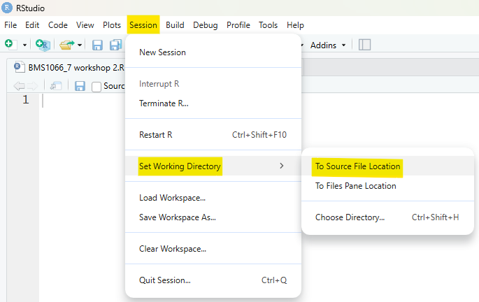
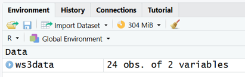
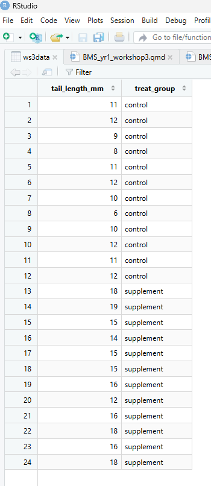
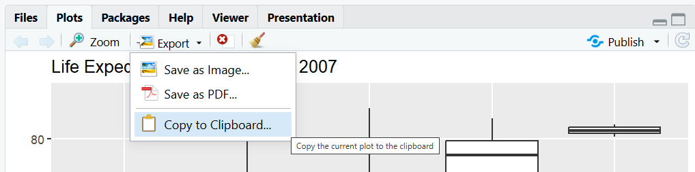
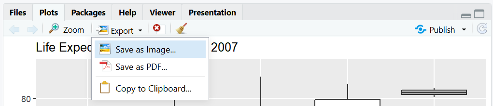
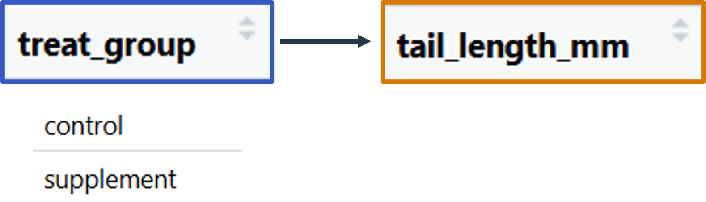
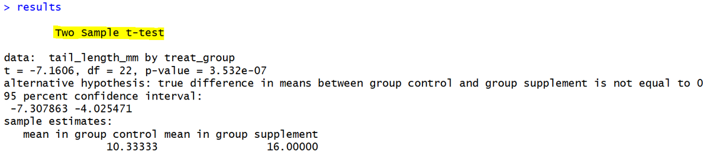

# R workshop 3: Statistical analysis in R

## Learning outcomes

In the third and final workshop, you will use the skills you have developed so far to analyse a new dataset and conduct an independent samples t-test.

::: {.callout-tip icon="false"}
### []{style="color: #872046;"}  Learning outcomes

By the end of this workshop, you should be able to:

- Apply data exploration, grouped descriptive statistics, and boxplots to compare groups in a new dataset
- Copy and save plots created with ggplot2
- Run a t-test to statistically compare two groups of measurements
:::

## Workshop structure

## Setup {#setup}

::: {.callout-caution icon="false"}
### []{style="color: #2E6B4E;"}  Task
- Follow the steps below to get set up for this workshop
:::

1.  Open RStudio (you do not need to open R separately)

2.  Create a new script and save it in your dedicated folder for the R work on this module

3.  Below is the code for installing the packages that are needed for this workshop. Copy and paste the code for any packages you have not previously installed into your **console** and run it.

!! explain why we need each of these

::: {.panel-tabset group="language"}
## R

 If you have previously installed any of these packages on your device (e.g. we installed HMisc is workshop 1), you do not need to install them again.

```{r}
#| eval: false
# Install packages
install.packages ("readxl")
install.packages("ggplot2")
```
:::

4.  Below is the code for *loading* the packages that are needed for this workshop. Copy the code and paste it into the top of your new **script**, then run this code.

::: {.panel-tabset group="language"}
## R

```{r}
#| message: false
#| warning: false
#| results: "hide"
# Load packages
library(readxl)
library(ggplot2)
```

 You'll need to load any packages required for your work each time you start a new R session.
:::

::: {style="margin-top: 2em;"}
:::

::: callout-important
### Write code in your script, not the console

From now on, unless you're testing a small piece of code, write all of your code in the script rather than the console. This makes it easier to save, review, and rerun your work later.
:::

## Importing workshop 3 data

In workshop 2, we learnt how to import data from an Excel file into R.

::: {.callout-caution icon="false"}
### []{style="color: #2E6B4E;"}  Task
- Import the "Workshop 3 data" Excel file into R by following the steps below
:::

1. Save the Workshop 3 Excel file [link] in your dedicated folder for the R work on this module (this should be the same folder that your R script is saved in.)

2. Set your working directory by clicking: Session > Set Working Directory > To Source File Location, as shown below.

{width="600" style="display:block; margin: 2em auto;"}

3. Copy the line of code below into your script and run it. This command imports the data using the `read_excel()` function and assigns it the name "ws3data".

```{r}
#| results: hide
ws3data <- read_excel("Workshop 3 data.xlsx")
```

4. Check that a data frame called "ws3data" now appears in the Environment tab of the environment pane, as shown below.

{width="400" style="display:block; margin: 2em auto;"}

[see workshop 2 for video - link]
[put common errors again]


{width="400" style="display:block; margin: 2em auto;"}

## Workshop aims for analysing the data {#aims}

**THIS NEEDS UPDATING**

The main workshop examples are structured around some loose hypothetical research aims relating to the gapminder data:

::: {.callout-tip icon="false"}
### []{style="color: #872046;"}  Aims

- Investigate whether adding a supplement to hamster pup diet will affect tail growth

[specifically, compare tail growth between the hamsters that were given the standard diet (the control group) and the hamsters that were given the supplement in addition to the standard diet (the treatment group).]

:::

## Further practice: Exploring data, producing grouped descriptives and creating boxplots

::: {.callout-tip icon="false"}
### []{style="color: #872046;"}  Learning outcome

- Apply data exploration, grouped descriptive statistics, and boxplots to compare groups in a new dataset
:::

### Exploring the data

It’s a good idea to explore and get to know the data you’re working with before starting any analysis. 

We saw some useful functions for doing this in workshop 2. [link]

**View the whole data frame**

We could view the entire data frame in the console by typing its name and running it, but it's often nicer to view it in the Source pane. You can do this either by clicking on the data frame in the Environment pane (which automatically runs `View()`), or by using the `View()` function directly:

::: {.panel-tabset group="language"}
## R

```{r}
#| eval: false
View(ws3data)   
```
:::

This is quite a small dataframe, so we can get to know it visually rather than using functions.

**About the data**

A group of scientists are investigating whether adding a supplement to hamster pup diet will affect tail growth.

A control group was given the standard diet, whilst a treatment group was given the supplement in addition to the standard diet.

The tail length was recorded in mm after five months of development.


### Grouped descriptive statistics

Often, we want to obtain descriptive statistics broken down by certain subsets of data i.e. *grouped* descriptive statistics.

We can see that this might be helpful for us here, because we want to compare tail growth between the treatment and the control group.

Recall from Workshop 2 that the `by()` function can be used to find grouped descriptive statistics:

::: {.panel-tabset .panel-blue group="language"}
## R

**Using the by() function - general template**

```{r}
#| eval = FALSE
by(______________________, ____________________, ___________________)
    column to summarise     column to group by    function to use
```

[any extra info from before?]

:::

In our`ws3data`:

- Our `column to summarise` will be `tail_length_mm`, because this is the thing we have measured and want to summarise.
- Our `column to group by` will be `treat_group`, because this column contains the groups that we want to create separate summaries for

Remember that to select a column from a data frame, we need to use the `$` operator, so to select the `tail_length_mm` column we use `ws3data$tail_length_mm`, and to select the `treat_group` column, we use `ws3data$treat_group`.

- The `function to use` is the function corresponding to whatever descriptive statistics or summary you would like to produce. For example, if you want to find the median, use `mean`.

So altogether, to find the mean tail length for each treatment group, we would use the command:

```{r}
by(ws3data$tail_length_mm, ws3data$treat_group, mean)
```

[Q. What does this tell us about the [average] tail length for the two groups? Which is higher? What does this initially suggest about our aim?]

::: {.callout-caution icon="false"}
### []{style="color: #2E6B4E;"}  Task
- Find the median tail length of each group
- Find the standard deviation of the tail length of each group
- Find the minimum tail length in each group
- Find the maximum tail length in each group

[You make need to look back at the functions table]

[Answers]
:::

### Creating a boxplot with ggplot2

In workshop 2 we learnt how to create a boxplot using ggplot2 data.

This is the template code:

::: {.panel-tabset .panel-blue}
## Template code: boxplot

```{r}
#| eval: false
ggplot(_________, aes(x = _________, y = ________)) +
  geom_boxplot() +
  labs(x = "_______",
       y = "_______")
```

- Fill in the first blank with the name of the data you want to use for plotting
- Fill in the second blank (after x =) with the name of the variable (column) in the data you want to plot on the x-axis
- Fill in the third blank (after y =) with the name of the variable (column) in the data you want to plot on the y-axis
- Fill in the blanks inside the `labs()` function with the corresponding x and y labels that you want to add to your plot. These should be in quotation marks.

:::

::: {.callout-caution icon="false"}
### []{style="color: #2E6B4E;"}  Task
- Produce a boxplot to visually compare tail lengths between the two treatment groups.

[Hint]

[Answers]
:::

## Boxplot interpretation

The bar graph produced in the task above should look like this:

```{r}
#| echo: false
ggplot(ws3data, aes(x = treat_group, y = tail_length_mm)) +
  geom_boxplot() +
  labs(x = "Treatment group",
       y = "Tail length(mm)")
```

::: {.callout-caution icon="false"}
### []{style="color: #2E6B4E;"}  Task
What observations can we make from the bar graph regarding the comparison between the groups?

[Answers]
:::

::: callout-important
### Adding a figure title

This graph currently has no title. In practice, you can add a figure legend by copying the graph into Word and adding a figure legend below the graph.

(It is not possible to add a proper figure caption in a standard R script.)
:::


## Copying and saving plots

::: {.callout-tip icon="false"}
### []{style="color: #872046;"}  Learning outcome

- Copy and save plots created with ggplot2
:::

Once you are happy with a plot, you may want to save it to use elsewhere - for example in a report or presentation.

### Copying a plot

The simplest way to copy a plot is to click the **Export** button in the Plots pane in RStudio, then select **Copy to Clipboard**. You can then paste it directly into a Word document or PowerPoint presentation.



### Saving a plot

To save a plot as an image file, you can either:

- Click **Export** in the Plots pane, then select **Save as Image** and choose the file format, size, and destination



- Use `ggsave()` in your code, which saves the most recently generated plot to a file:

```{r}
#| eval: false 
ggsave("my_plot.png", width = 8, height = 5)
```

`ggsave()` automatically detects the file format from the file extension - common options include `.png`, `.pdf`, and `.jpeg`.

## Extension: Further boxplot customisations

### Changing the fill colour of the boxes

**Variable aesthetics**

In ggplot2, `aes` (short for "aesthetics") refers to the visual properties of the plot - things like position (x and y), colour, size, and shape - and how variables in your data are mapped to them.

We have already used `x=` and `y=` inside the `aes()` function to map variables to the axes.

We can also map variables to other properties such as colour.

::: {.panel-tabset .panel-blue}
## Template code: boxplot including fill colour by box

In your existing boxplot code, add the argument `fill = ` as an additional argument inside the `aes()` function:

```{r}
#| eval: false
ggplot(_________, aes(x = _________, y = ________, fill = _________)) +
  geom_boxplot() +
  labs(x = "_______",
       y = "_______")
```

- In the blank after `fill =`, fill in the name of the variable used on the x-axis (i.e. the variable that defines the boxes) 
- e.g. `fill = treatment_group`

:::

**Fixed aesthetics**

So far we have used `geom_boxplot()` with no arguments inside the brackets, but there are lots of additional customisation options available by specifying arguments inside it.

Whereas aesthetics specified inside the `aes()`function map a *variable* to a visual property, aesthetics can be specified inside `geom_boxplot()` to set a visual property to a constant value i.e. the same property for the whole plot.

For example, if we put `fill = "blue"` will colour all of the boxes blue.

::: {.panel-tabset .panel-blue}
## Template code: boxplot including fill colour by box

In your existing boxplot code, add the argument `fill = ` as an argument inside the `geom_boxplot()` function:

```{r}
#| eval: false
ggplot(_________, aes(x = _________, y = ________)) +
  geom_boxplot(fill = _________) +
  labs(x = "_______",
       y = "_______")
```

- In the blank after `fill =`, fill in a colour in quotations


[link to all colour options]

:::

###Themes

There are various theme components that can be added as a separate component to change the overall appearance of the plot (background, gridlines, fonts etc.).

Some common one

::: {.panel-tabset .panel-blue}
## Template code: adding a theme to a boxplot
```{r}
#| eval: false
ggplot(_________, aes(x = _________, y = ________)) +
  geom_boxplot() +
  labs(x = "_______",
       y = "_______") +
  theme_xxx()
```

- Add an additional theme component at the end of your code, replacing `theme_xxx` with the name of the specific theme you want to use.

Some common ones are:

- `theme_minimal()`
- `theme_classic()`
- `theme_bw()`
::: 

::: {.callout-caution icon="false"}
### []{style="color: #2E6B4E;"}  Task
In the previous section you produced a boxplot to compare tail lengths betwen treatment groups. Update your code to. Now:

- Add the argument `fill = treat_group` to the `aes()` function to tell R to colour the boxes according to the treatment group
- Add to a theme to your plot to change the overall look

[Hint]

[Answers]
:::

## Statistical tests in R

::: {.callout-tip icon="false"}
### []{style="color: #872046;"}  Learning outcome

- Run a t-test to statistically compare two groups of measurements
:::

### Analysis of Workshop 3 data

To investigate whether adding a supplement to hamster pup diet will affect tail growth, we are comparing the tail lengths of a group of hamster pups who were given the standard diet (control group), to a different group who received the supplement in additional to the standard diet (treated group).

So far, we have summarised the data using descriptive statistics and visualised the comparison in a boxplot.

To test whether there is a *statistically significant* difference between the groups, we can use an independent t-test, which compares the means of two unrelated groups.
 
### Independent t-test

In statistical testing, the **<span style="color:#D57903;">dependent variable</span>**, (also called the response variable or outcome variable) is the variable that we are trying to explain or predict.

We want to see if the **<span style="color:#D57903;">dependent variable</span>** depends on, or is influenced by, one or more **<span style="color:#365AC4;">independent variables</span>**. 

An independent t-test is used when we have a continuous **<span style="color:#D57903;">dependent variable</span>** (DV), and an **<span style="color:#365AC4;">independent variable</span>** that consists of two independent groups.

For example, in our case, we are exploring:

  Is **<span style="color:#D57903;">tail length</span>** influenced by **<span style="color:#365AC4;">treat group</span>**?
  
Or in other words:

  Is there any difference in **<span style="color:#D57903;">tail length</span>** for the **<span style="color:#365AC4;">control vs. supplement</span>** group?

{width="400" style="display:block; margin: 2em auto;"}
The independent t-test tests for a difference between the group means.

### Assumptions for the independent t-test

Statistical tests such as the t-test have **assumptions** – conditions that the data should meet to ensure that results from the test are valid.

Two key assumptions for the independent t-test are:

- The dependent variable is approximately normally distributed for each group of the independent variable
- The dependent variable has roughly equal variances for each group of the independent variable

In real world analyses, it is important to check these assumptions before performing the t-test.

::: callout-important
### Note

For the purposes of the R work in this module, you do not need to check these assumptions - you can assume that these assumptions are met.
:::

### Carrying out an independent t-test:

An R command to run a t-test follows the below structure:

::: {.panel-tabset .panel-blue}
## Template code: independent t-test

```{r}
#| eval: false
_______________ <- t.test(_____~______, data = ____________, var.equal=TRUE)
 results name              DV     IV            dataframe
```

- `results name` is a name you choose to store the results of the t-test
- `dataframe` is the name of the dataframe containing the data you want to analyse (for example in this workshop, the data is called `ws3data`)
- `DV` is the name of the column in your chosen dataframe containing the dependent variable (the numerical outcome you want to compare between groups)
- `IV` is the name of the column in your chosen dataframe containing the independent variable (the grouping variable, which should have two groups)

:::

You can view the results by.......


::: {.callout-caution icon="false"}
### []{style="color: #2E6B4E;"}  Task
- Using the template code, fill in the appropriate code to carry out an independent t-test to compare whether the mean tail length differs between hamster pups fed the standard diet (control) and those given the supplement.
- View a summary of the results by printing the results object. Recall from Workshop 1 that you can do this by either typing and running the object name, or by using the print() function.
- Add a comment to your code stating the p-value – is the difference statistically significant?

[Answers]
:::

**maybe something more explicit about where to find the p-value in the results. and that this can sometimes be added to a graph.

{width="700" style="display:block; margin: 2em auto;"}


### Optional reading: Syntax for other statistical tests in R

This information is for interest only.

Many statistical tests use a similar syntax to that shown above, with `t.test` replaced by the function for the appropriate test. Some examples are shown below.

::: {.panel-tabset .panel-blue}
## Template code: other statistical tests

```{r}
#| eval: false
# Analysis of variance (ANOVA)

_______________ <- aov(_____~______, data = ____________)
 results name           DV     IV            dataframe
 
# Simple linear regression
 
_______________ <- lm(_____~______, data = ____________)
 results name          DV     IV            dataframe

# Multiple linear regression
 
_______________ <- lm(_____~______ + ______ + ..., data = ____________)
 results name          DV     IV1     IV2                  dataframe
 
```
:::

Additional arguments may be included to adjust or customise the tests as needed.


## Summary

::: {.callout-tip icon="false"}
### []{style="color: #872046;"}  Key points

- ...


:::

.========================================

[Use slides]


.===== work this in (slide 15) - "comparing groups" - Will / Sam's lectures

Comparing groups:Workshop 3 data

A group of scientists are investigating whether adding a supplement to hamster pup diet will **affect tail growth**.

A **control group* was given the standard diet, whilst a **treatment group** was given the supplement in addition to the standard diet.

The tail length was recorded in mm after five months of development.


We can compare the tail lengths in the control group versus the treatment group, to see if the supplement has lead to longer tails…


[[[plotting - now can introduce more general ggplot template??]]]


===============================================================


=======

[[coursework data]]

```{r}
#| eval: FALSE

weight_change <- c(10,15,12,18,13,6,29,21,24,20,28,30,25,21,15,21,23,22)
group <- c(rep("control",9),rep("treated",9)) # note the boxplot stills works if it's not a factor

cw <- data.frame(group,weight_change) 
# note if you apply the factor function here it actually names the variable factor.group!

# This is not by group currently

library(ggplot2)
hist(weight_change)
ggplot(cw, aes(x=weight_change)) + geom_histogram(bins=3)
qqnorm(cw$weight_change)
qqline(cw$weight_change)

ggplot(cw, aes(x = weight_change)) +
  geom_histogram(bins=3) +
  facet_wrap(~ group)

ggplot(cw, aes(x = group, y = weight_change)) +
  geom_boxplot() +
  geom_point()
```

*=======================

[Scroll up in "complete this github table" copilot chat - gave scaffolding for working up from values to data frames ]

An object in R is a piece of information stored in memory.

A variable name is a name that refers to an object.

For example, when we run:

```{r}
x <- 2 + 3
```

R first evaluates the expression `2 + 3`, producing the value `5`. It then stores this value as an object and associates it with the variable name `x`.

After this assignment has been run, we can use `x` elsewhere in our code:

```{r}
x
```

```{r}
x * 10
```

*=======================
