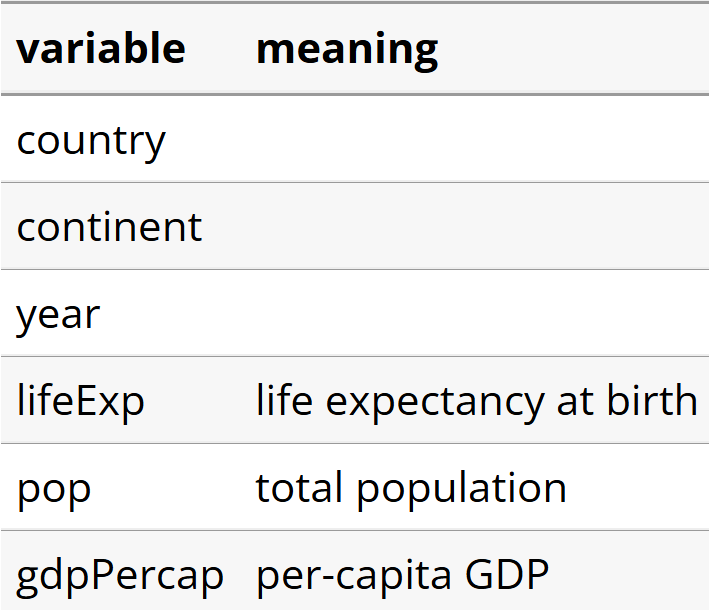
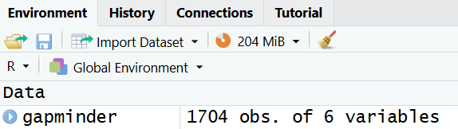
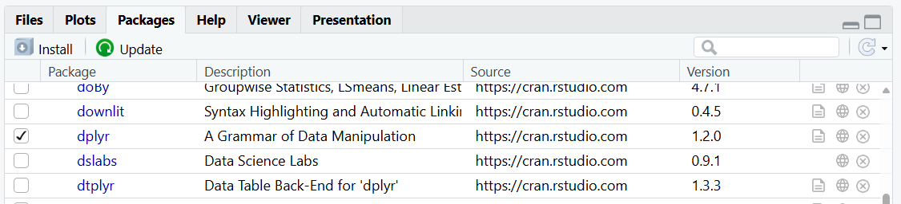
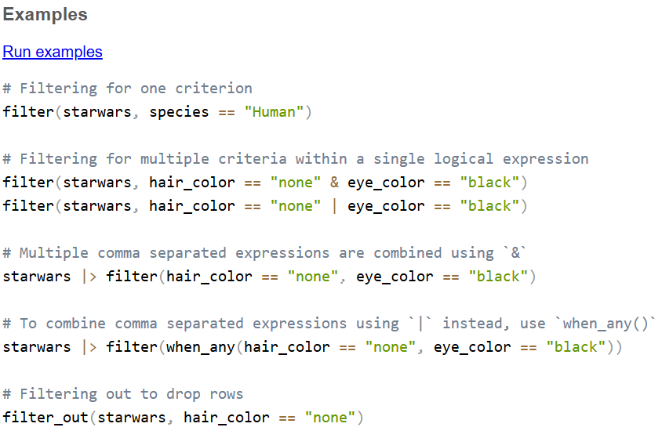
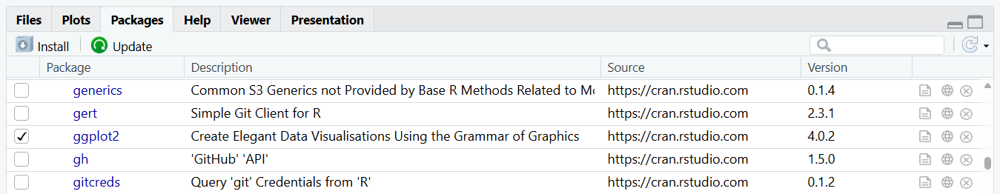
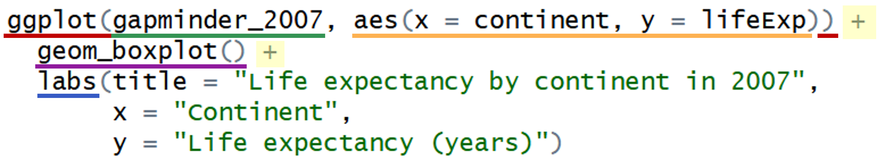
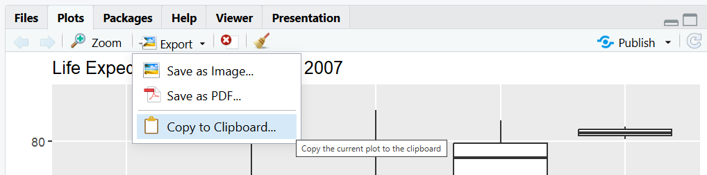
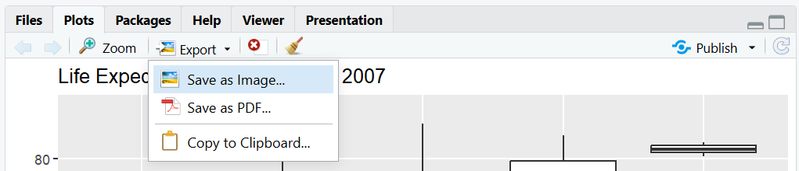

## Overview

This an intermediate course in R, focused on data manipulation and plotting.

Please be aware that this course is in development and the contents of this site are likely to change in the future.

::: {.callout-tip icon="false"}
### []{style="color: #872046;"}  Learning outcomes

By the end of this course, you should be able to:

- [Manipulate data frames]{style="color: #872046;"} by applying functions from the dplyr package (e.g. sorting, filtering, grouping, summarising), either to create summaries or prepare data for further analysis
- [Create and customise plots]{style="color: #872046;"} using the ggplot2 package
:::

## Target audience

This course is designed for anyone who has learned the basics of R and RStudio and is ready to build on those foundations. It is not aimed at a specific discipline, and the examples and exercises are designed to be broadly applicable across a range of subject areas.

## Prerequisites

You should have a basic working knowledge of R and RStudio, up to the level covered in the *Getting Started with R & RStudio* workshop \[link\].

<a href="https://surreylearn.surrey.ac.uk/d2l/le/lessons/215610/topics/3265989" target="_blank" rel="noopener"> These tutorial videos</a> also cover the pre-requisite material.

## Workshop code & templates

The material in this course lines up with the *Intermediate R & RStudio* workshop delivered by MASA.

Code and examples taken directly from the workshop are shown in green panels like the one below, so you can easily match what you see here to the live workshop materials.

The materials also include additional syntax, examples, and explanations to complement the workshop, and can be used as an extension or self‑study resource.

::: {.panel-tabset .panel-green group="language"}
## R

Workshop code and examples are shown in green panels like this one
:::

**Template code**

Sometimes code is shown in blue panels like the one below. This code cannot be directly copied and run in R, but shows the structure of using a particular function. There are blanks spaces with information on what to fill in there.

::: {.panel-tabset .panel-blue group="language"}
## R

Template code is shown in blue panels like this one
:::

## Exercises

Exercises in these materials are labelled according to their level of difficulty:

:::::::::::::::::::::::::::::::::::::::::::::::::::::::::::::::::::::::::::::::::::::::::::::::::::::::::::::::::::::::::::::::::::::::::::::::::::::::::: dplyr-table
| Level | Description |
|---------------------|---------------------------------------------------|
|    | Level 1 exercises are similar to the workshop examples. |
|    | Level 2 exercises extend the workshop examples, for example by using a different function. |
|    | Level 3 exercises go beyond the workshop examples, for example by combining multiple ideas or extending the syntax covered. |

::::::::::::::::::::::::::::::::::::::::::::::::::::::::::::::::::::::::::::::::::::::::::::::::::::::::::::::::::::::::::::::::::::::::::::::::::::::::: {#levels-table}
# 2 Setup, data and workshop aims

## 2.1 R & RStudio

Make sure you have downloaded and installed both R and RStudio.

**Windows**

Download and install these using default options:

- <a href="https://cran.r-project.org/bin/windows/base/release.html" target="_blank" rel="noopener">R</a>
- <a href="https://docs.posit.co/ide/user/#rstudio-ide-oss-downloads" target="_blank" rel="noopener">RStudio</a>

**Mac OS**

Download and install these using default options:

- <a href="https://cran.r-project.org/bin/macosx/" target="_blank" rel="noopener">R</a>
- <a href="https://docs.posit.co/ide/user/#rstudio-ide-oss-downloads" target="_blank" rel="noopener">RStudio</a>

## 2.2 Basic setup & packages {#setup}

Follow the steps below to get set up for working in RStudio for this course:

1.  Open RStudio (you do not need to open R separately)

2.  Create a new script and save it in a location you can easily find later

3.  To install all of the packages used in this course, run the following code in your **console**:

::: {.panel-tabset .panel-green group="language"}
## R

```{r}
#| eval: false
install.packages("gapminder")
install.packages("dplyr")
install.packages("ggplot2")
install.packages("Hmisc")
```

 If you have previously installed any of these packages on your device, you do not need to install them again.
:::

4.  To *load* the required packages, copy and run the following code in your **script**:

::: {.panel-tabset .panel-green group="language"}
## R

```{r}
#| message: false
#| warning: false
#| results: "hide"
# Load packages
library(gapminder)
library(dplyr)
library(ggplot2)
library(Hmisc)
```

 You'll need to load any packages required for your work each time you start a new R session.
:::

::: {style="margin-top: 2em;"}
:::

::: callout-important
### Write code in your script, not the console

From now on, unless you're testing a small piece of code, write all of your code in the script rather than the console. This makes it easier to save, review, and rerun your work later.
:::

## 2.3 Data

The dataset used in these materials is the `gapminder` data frame, contained within the `gapminder` package in R. It is an excerpt of the full <a href = "https://www.gapminder.org/data/" target="_blank" rel="noopener">Gapminder data</a>.

::: {.callout-note icon="false" collapse="true"}
### []{style="color: #9e9e9e;"}  Importing your own data

For these materials we are using the gapminder data that is directly available in R. When working with your own data, you will usually import it from Excel. This is covered in our *Getting Started with R & RStudio* materials \[link\].
:::

The `gapminder` data frame contains country-level data on life expectancy, population, and GDP per capita across multiple years. The data frame includes six variables:

{width="281" style="display:block; margin: 2em auto;"}

*Life expectancy at birth* is the average number of years a newborn infant is expected to live if current mortality rates and death patterns remain constant throughout their lifetime.

*Per-capita GDP* (Gross domestic product) is given in units of <a href = "https://en.wikipedia.org/wiki/International_dollar" target="_blank" rel="noopener">international dollars</a>, "a hypothetical unit of currency that has the same purchasing power parity that the U.S. dollar had in the United States at a given point in time" – in this case, 2005. Essentially, it is a measure of a country’s economic output per person, adjusted to allow fair comparison across countries.

Although the `gapminder` dataset is already available within the `gapminder` package, we run the following command to create a copy of it...

::: {.panel-tabset .panel-green group="language"}
## R

```{r}
# Assign the gapminder data to an object called gapminder
#  that can be seen in the Environment

gapminder <- gapminder
```
:::

...that will then be visible in the Environment pane:

{width="350" style="display:block; margin: 2em auto;"}

We could view the entire data frame in the console by typing its name and running it, but it’s often nicer to view it in the Source pane. You can do this either by clicking on the data frame in the Environment pane (which automatically runs `View()`), or by using the `View()` function directly:

::: {.panel-tabset .panel-green group="language"}
## R

```{r}
#| eval: false
View(gapminder)   
```
:::

{width="529" style="display:block; margin: 2em auto;"}

We can see that we have life expectancy, population and GDP data for multiple countries within multiple continents, for a selection of years.

## 2.4 Workshop aims for analysing the gapminder data {#aims}

The main workshop examples are structured around some loose hypothetical research aims relating to the gapminder data:

::: {.callout-tip icon="false"}
### []{style="color: #872046;"}  Aims

- Compare life expectancy across continents in 2007
- Examine the relationship between population and GDP in 2007
:::

These aims provide a common thread for the main examples, while other examples and exercises demonstrate how the functions and code introduced in this workshop can be applied to different aspects of the gapminder dataset.

# 3 Getting to know your data

It's a good idea to explore and get to know the data you're working with before starting any analysis. This helps you spot issues, understand what information is available, and avoid making incorrect assumptions before you begin analysing.

Useful things to explore might include:

- How many variables (columns) are in the data?
- How many records (rows) are in the data?
- What does each variable represent?
- Is each variable stored using the correct data type (e.g. numeric, categorical, text, or date)?
- Are there any missing values?
- Are there any obvious errors or unusual values?
- What is the range of values for key variables?
- What do simple summary statistics (e.g., counts, percentages, means, and medians) tell you about the data?
- How are the variables distributed?
- Are there any duplicate records?
- Which variables might be useful for answering your research questions?

The following sections demonstrate some useful functions for exploring both your original data frame and any new data frames you create as you work through your analysis.

::: callout-important
If you want to run any of the functions in this section on a different data frame, replace `gapminder` with the name of the data frame.
:::

### 3.1 Data properties

Below are some reminders of useful functions for exploring the properties of your data, demonstrated using the `gapminder` dataset.

**View the type of object**

The `class()` function displays the kind of object (data structure you are working with.)

::: {.panel-tabset group="language"}
## R

```{r}
class(gapminder)   
```
:::

The output here tells us that gapminder is a data frame, which is R's standard structure for storing tabular data (i.e. data organised into rows and columns). More specifically, the gapminder data is stored as a tibble.

::: {.callout-note icon="false" collapse="true"}
### []{style="color: #9e9e9e;"}  tibble vs. data frame - what's the difference?

A tibble is a modern type of data frame with some additional features, such as printing more cleanly in the console. Throughout these materials, we'll use the general term "data frame".
:::

**View the columns headings**

It is often useful to check the column names in a data frame, particularly when you are becoming familiar with a new dataset or need to confirm a column name while writing code. You can use the `names()` function to display the names of the columns in a data frame in the console:

::: {.panel-tabset group="language"}
## R

```{r}
names(gapminder)   
```
:::

**View the first few rows**

To get an idea of what’s in your data frame without viewing it all at once, you can use the `head()` function to display the first few rows in the console:

::: {.panel-tabset group="language"}
## R

```{r}
head(gapminder)   
```
:::

**View the whole data frame**

We could view the entire data frame in the console by typing its name and running it, but it’s often nicer to view it in the Source pane. You can do this either by clicking on the data frame in the Environment pane (which automatically runs `View()`), or by using the `View()` function directly:

::: {.panel-tabset group="language"}
## R

```{r}
#| eval: false
View(gapminder)   
```
:::

{width="529" style="display:block; margin: 2em auto;"}

**Examine the structure of the data frame**

The str() ("structure") function is useful for quickly examining the structure of a dataset:

::: {.panel-tabset .panel-green group="language"}
## R

```{r}
str(gapminder)
```
:::

The same information can also be viewed by clicking the blue arrow to the left of the data frame name in the Environment pane:

{width="600" style="display:block; margin: 2em auto;"}

The output from the `str()` function shows us:

- The number of observations (rows) in the dataset - 1704
- The number of variables (columns) in the dataset - 6
- The names of the variables
- The data type of each variable (e.g. num, int, chr, Factor)
- A preview of the values in each variable, including how many categories there are in factor variables (e.g. we can see that there are 142 countries)
- For factors, the number and names of the levels

When reviewing output for your own data, consider:

- Is the number of rows and columns as you would expect?
- Do you understand what the key variables represent? If not, investigate further before proceeding.
- Are the data types assigned by R appropriate for the data they contain?
- Are there any variables that may need to be converted to a different data type before analysis?
- Do the example values shown for each variable look sensible?
- Are there any variables that seem particularly useful for answering your research question?

### 3.2 Generating basic summaries

Viewing the first few rows of a data frame (or the entire data frame) and using `str()` are useful first steps for understanding a dataset. However, particularly for larger datasets, it can be difficult to quickly understand the overall structure or key properties of the data.

For example, with the gapminder data, we might want to know how many observations there are for each country, have a full list of all the countries included, or generate some basic summary statistics for numeric variables like population and life expectancy.

To get this type of overview, we can use summary functions. The `summary()` function produces a quick summary of each column, with the type of output depending on the variable’s data type:

::: {.panel-tabset .panel-green group="language"}
## R

```{r}
summary(gapminder)
```
:::

Another useful function is `describe()` from the Hmisc package. This provides a more detailed summary than `summary()`, and also indicates whether any variables contain missing values:

::: {.panel-tabset group="language"}
## R

```{r}
#| class-output: "scroll-output"
describe(gapminder)
```
:::

A more direct way to check for missing data is using `colSums()`. Running the command below shows how many missing values each column has. Again, we can see there are no missing values in this dataset.

::: {.panel-tabset group="language"}
## R

```{r}
colSums(is.na(gapminder))
```
:::

The `table()` function is helpful for summarising categorical variables by counting how many observations fall into each category:

```{r}
#| class-output: "scroll-output"
table(gapminder$country)
```

The `unique()` function returns all distinct values in a particular column:

```{r}
#| class-output: "scroll-output"
unique(gapminder$country)
```

### 3.3 Adjusting data types

Sometimes, variables need to have their data types adjusted.

For example, if a numeric, integer or character variable in a data frame represents categorical data with fixed levels, it should be stored as a factor.

This isn't an issue for our gapminder data frame, since all the variables are stored correctly, but below is a demonstration for how a character variable representing categorical data can be converted into a factor.

::: {.panel-tabset group="language"}
## R

```{r}
# Simple gapminder-style data frame
gapminder_simple <- data.frame(
  country = c("France", "France", "Germany", "Germany", "Italy", "Italy"),
  year = c(2007, 2008, 2007, 2008, 2007, 2008),
  lifeExp = c(80.7, 81.0, 79.4, 79.8, 81.2, 81.5)
)

# Check structure
str(gapminder_simple)
```
:::

The output from `str(gapminder_simple)` shows that country is stored as a character variable (`chr`), even though it represents categorical data.

Use the `as.factor()` function to convert it into a factor:

::: {.panel-tabset group="language"}
## R

```{r}
# Convert country to a factor
gapminder_simple$country <- as.factor(gapminder_simple$country)

# Check structure
str(gapminder_simple)
```
:::

Now `country` is a factor (`Factor`), meaning R recognises it as a categorical variable with fixed levels (the countries in the dataset).

It is important to ensure categorical variables are stored as factors because this allows R to correctly treat them as groups in analyses and visualisations, rather than as plain text values.

Similarly, if a numeric or integer variables represent categories (for example, 0 and 1 indicating no and yes), they should also be converted to factors so that R treats them as categorical rather than continuous data.

### 3.4 Handling missing values

Missing values are not an issue in the gapminder data (there aren't any!), but they are very common in real life datasets. Because of this, it is useful to know how to identify and handle them in your own data.

For illustration, we will use the `palmerpenguins` dataset from R, which contains some missing values.

::: {.panel-tabset group="language"}
## R

```{r}
#| eval: false
# Install and the palmerpenguins package
install.packages("palmerpenguins")
```
:::

::: {.panel-tabset group="language"}
## R

```{r}
#| message: false
#| warning: false
#| results: "hide"
# Load the palmerpenguins package
library(palmerpenguins)
```
:::

::: {.panel-tabset group="language"}
## R

```{r}
#| message: false
#| warning: false
#| results: "hide"
# Load the datasest
penguins <- penguins
```
:::

A quick way to check how many missing values are in each variable is to use `colSums()` combined with `is.na()`:

::: {.panel-tabset group="language"}
## R

```{r}
colSums(is.na(penguins))
```
:::

We can see that all columns except for `species` and `island` have missing data.

To view the actual rows that contain missing values, you can use `complete.cases()`:

::: {.panel-tabset group="language"}
## R

```{r}
penguins[!complete.cases(penguins), ]
```
:::

If you are working with a data frame, this will display the full rows where any values are missing:

::: {.panel-tabset group="language"}
## R

```{r}
penguins_df <- data.frame(penguins)
penguins_df[!complete.cases(penguins_df), ]
```
:::

Sometimes if we try to summarise a column with missing data, we get the result `NA`:

::: {.panel-tabset group="language"}
## R

```{r}
mean(penguins$body_mass_g)
```
:::

This happens because the calculation cannot be completed when missing values are present. In this case, we can use the argument `na.rm = TRUE` to remove missing values before calculating the summary:

::: {.panel-tabset group="language"}
## R

```{r}
mean(penguins$body_mass_g, na.rm = TRUE)
```
:::

This is only one possible approach to handling missing data and may not always be appropriate, depending on how much data is missing and why the values are missing in the first place.

In terms of the `dplyr` and `ggplot` content covered in these materials, if you are applying the various functions to other data which contains missing values, it is important to be aware that they will not always be handled in the same way automatically. Some functions will ignore missing values, some will remove them during calculations or plotting, and others will return `NA` unless you explicitly tell R how to deal with them (for example using `na.rm = TRUE` or filtering them out beforehand).

It is therefore important to be aware of any missing values in your data so that you can decide how best to handle them and interpret your results appropriately.

## 3.5 Summary

::: {.callout-tip icon="false"}
### []{style="color: #872046;"}  Key points

- Get to know your data before starting analysis!
:::

# 4 Data manipulation with dplyr

## 4.1 The dplyr package: getting started

Often when working with data in R, you may need to reformat or 'manipulate' your data to get it in the form you need for your analysis. For example, you might need to filter out certain observations, select only a subset of variables, reorder or transform columns, or create summary statistics.

`dplyr` is an R package that helps with these tasks by providing functions for common data manipulation tasks, such as filtering rows, selecting specific columns, sorting, modifying or removing columns, and summarising data.

This kind of data manipulation is also *possible* - and in some cases is simpler - in base R, but dplyr offers more capability with consistent syntax, making it possible to carry out a wide range of data manipulation tasks in a consistent way.

### 4.1.1 Installing and loading the dplyr package

We installed and loaded `dplyr` in the [basic setup & packages](#setup) stage.

To confirm that `dplyr` has successfully installed and loaded in your session, check that `dplyr` is ticked in the Packages tab of the Output pane:

{width="700" style="display:block; margin: 2em auto;"}

### 4.1.2 Overview of functions available in dplyr

`dplyr` offers a range of useful functions, each designed to perform a different data manipulation task. These functions are often referred to as "verbs" because they "do things" to data.

The table below gives an overview of a range of `dplyr` functions, grouped into categories according to their roles. We will explore a few of these further in this course.

::: {#dplyroa-table}
| Category | dplyr function | Description |
|------------------------|------------------------|------------------------|
| Row operations | `filter(...)` | Filters rows (choose rows based on column values). |
|  | `slice(...)` | Chooses rows based on location. |
|  | `distinct(...)` | Removes duplicate rows. |
| Row ordering | `arrange(...)` | Sorts the data (changes the order of the rows). |
|  | `desc(...)` | Indicates descending order when arranging rows – typically used inside `arrange()`. |
| Column operations | `select(...)` | Selects columns to be included in the data. |
|  | `rename(...)` | Changes the names of columns. |
|  | `mutate(...)` | Creates new columns. |
| Summarisation | `group_by(...)` | Groups the data by the values of one or more columns. |
|  | `summarise(...)` | Aggregates data using summary functions (e.g. `mean()`), reducing it to one row overall or one row per group when used with `group_by()`. |
| Joins | `left_join(...)` | Joins two data frames, keeping all rows from the left data frame and matching rows from the right data frame (unmatched rows on the right become NA). |
|  | `right_join(...)` | Joins two data frames, keeping all rows from the right data frame and matching rows from the left data frame (unmatched rows on the left become NA). |
|  | `inner_join(...)` | Joins two data frames, keeping only rows where the join keys match in both data frames. |
|  | `full_join(...)` | Joins two data frames, keeping all rows from both data frames and filling in NA where there is no match on either side. |
| Other functions | `across(...)` | Applies one or more functions to selected columns (often inside `summarise()` or `mutate()`), letting you transform or summarise many columns in one go. |
|  | `coalesce(...)` | Returns the first non-missing (NA-free) value from a set of vectors or columns, element by element, effectively "filling in" missing values from left to right. |
|  | `if_else(...)` | Evaluates a logical test and returns one value where the test is true and another where it is false. |
|  | `case_when(...)` | Evaluates multiple conditions in order and returns a value for the first condition that is true, allowing you to recode or create variables with many conditional rules. |
:::

::: {.callout-note icon="false" collapse="true"}
### []{style="color: #9e9e9e;"}  Where can I find examples of how to use all of these functions?

We'll explore some of these functions in more detail in the following sections, but for a more extensive list of `dplyr` functions and how to use them, the following website is very helpful:

- dplyr Package Reference: <https://dplyr.tidyverse.org/reference/index.html>

The R help pages can also be helpful for help using a function:

- Type `help()` with the name of the function in the brackets into the console (e.g. `help(mutate)`) to open the corresponding R help page. The examples at the bottom of the help page are often particularly useful for understanding how the function works.

For a complete list of `dplyr` functions, you can check official `dplyr` documentation directly:

- CRAN Package Page: <https://cran.r-project.org/web/packages/dplyr/>
- Reference manual (html version): <https://cran.r-project.org/web/packages/dplyr/refman/dplyr.html>
- Reference manual (pdf version): <https://cran.r-project.org/web/packages/dplyr/dplyr.pdf>
:::

### 4.1.3 Using dplyr functions: general syntax and the pipe operator

Most of the dplyr functions in the table above can be used by following the same basic code pattern:

::: {.panel-tabset .panel-blue group="language"}
## R

**Using a dplyr function - general template**

```{r}
#| eval = FALSE
_________ <- ________ |> ______________________(________________, _________________ .....)
new data      data        dplyr function name    first argument    second argument   etc.
```

- Start with the name of the data you want to manipulate (add this in the blank space labelled `data`)
- Add the pipe operator, `|>`, which passes the data to the next step (more on this below)
- Type the name of the dplyr function you want to use in the blank space labelled `dplyr function name`
- In the brackets, add the relevant arguments for the function - this might be a single argument, or multiple arguments separated by commas
- Usually you want to “save” you data once you have manipulated it into the right format. In the `new data` space, enter the name you want to give to the new data frame that is created.

If you *don't* want to save the new data frame - you just want to output the results to the console - remove the assignment part from the start of the command:

```{r}
#| eval = FALSE
________ |> ______________________(________________, _________________ .....)
 data        dplyr function name    first argument    second argument   etc.
```
:::

**Examples**

We'll look at the syntax for specific dplyr functions in more detail in the the following sections, but below is an example to demonstrate the general sysntax given above:

```{r}
#| eval: false

# Select the country and population columns from the gapminder data

gapminder |> select(country, pop)

# Select the country and population columns from the gapminder data and
# give this new data frame the name "gapminder2"

gapminder2 <- gapminder |> select(country, pop)

```

**The pipe operator: \|\>**

The pipe operator, `|>`, is used to pass the result of one step directly into the next step; the results of one step is "piped" into the next step.

An easier way to think about it is to read `|>` as 'then'.

For example:

```{r}
#| eval: false
gapminder |> select(country, pop)
```

This code is telling R to: take the gapminder data, *then* select the country and pop columns from it

```{r}
#| eval: false
gapminder |> filter(country == "United Kingdom", year > 2000)
```

This code is telling R to: take the gapminder data, *then* filter it for records where the country is United Kingdom and the year is greater than 2000

In the following sections we'll go over the specific syntax for writing these types of commands in more detail.

::: {.callout-note icon="false" collapse="true"}
### []{style="color: #9e9e9e;"}  Using dplyr functions without \|\>

Although dplyr functions are often used with the pipe operator, this is not required. Every dplyr function can also be called directly by supplying the dataset as the first argument.

For example, these two commands produce the same result:

```{r}
#| eval: false
gapminder |> select(country)
```

```{r}
#| eval: false
select(gapminder,country)
```

When using a dplyr function without `|>`, the dataset is supplied as the first argument inside the function call.

These two pieces of code are of similar complexity, and either is completely valid. However, the real benefit of using the pipe operator comes when combining multiple dplyr functions together: allows you to write a sequence of data manipulation steps from left to right, creating clean and readable code that avoids nested function calls or the need to save intermediate objects (more on this later).

For consistency, we'll use the pipe operator syntax throughout these materials.
:::

::: {.callout-note icon="false" collapse="true"}
### []{style="color: #9e9e9e;"}  \|\> versus %\>%

If you've worked with dplyr before, you may have seen a different pipe operator: `%>%`

The `%>%` operator is a pipe operator provided by the `magrittr` package.

In R 4.1.0, a native pipe operator, `|>`, was added to base R. It serves the same general purpose as `%>%` and is now widely used as an alternative that does not require an additional package.

Essentially, you can use either!
:::

::: {.callout-note icon="false" collapse="true"}
### []{style="color: #9e9e9e;"}  Why are we not using \$ to select columns from the data frame (e.g. gapminder\$country)?

When using dplyr functions, you can usually refer to columns by name without specifying the data frame they belong to. For example:

`gapminder |> filter(country == "United Kingdom")`

rather than

`gapminder |> filter(gapminder$country == "United Kingdom")`

This works because the dataset has already been specified at the start of the command. Within a dplyr function, column names are assumed to come from that dataset, so there is no need to repeat the data frame name.
:::

## 4.2 Row operations

Row operations allow you to keep, remove, reorder, or otherwise manipulate rows in a dataset based on their values or position. Some examples of commonly used row operations are shown below.

::: dplyr-table
| dplyr function | Description |
|-------------------|-----------------------------------------------------|
| filter(...) slice(...) distinct(...) | Filters rows (choose rows based on column values). Chooses rows based on location. Removes duplicate rows. |
:::

### 4.2.1 Filtering: filter()

The `filter(...)` function allows you to select a subset of rows in a data frame. For example, you might want to keep only observations from a particular year, country, or group.

To do this, you write a **filter condition** that tests each row and returns either TRUE or FALSE. Only rows where the condition is TRUE are kept. The table below shows some common operators used to create filter conditions, along with their meanings and examples.

::: {#dplyr-filter}
| Operator | Operator meaning | Example filter condition | Result: Keeps rows where... |
|----------------|----------------|-----------------|-----------------------|
| `==` | equal to | `country == "France"` | The `country` column is equal to `"France"` |
| `!=` | not equal to | `year != 2007` | The `year` column is not equal to `2007` |
| `>` | greater than | `pop > 500000` | `pop` (population) is greater than `500,000` |
| `<` | less than | `pop < 500000` | `pop` (population) is less than `500,000` |
| `>=` | greater than or equal to | `lifeExp >= 80` | `lifeExp` (life expectancy) is greater than or equal to `80` |
| `<=` | less than or equal to | `lifeExp <= 80` | `lifeExp` (life expectancy) is less than or equal to `80` |
| `&` | and | `year == 2007 & continent == "Europe"` | Both conditions are true (the year is `2007` *and* the continent is `"Europe"`) |
| `|` | or | `country == "France" | country == "Germany"` | At least one condition is true (the country is `"France"` *or* `"Germany"`) |
:::

::: {style="margin-bottom: 1.5rem;"}
:::

::: {.callout-note icon="false" collapse="true"}
### []{style="color: #9e9e9e;"}  Use `==` instead of `=` for filtering for equality

Notice from the table above that when filtering for values that are equal to something, you must use `==` rather than `=` in the filter condition.

This is because `filter()` requires a logical condition. The `==` operator *tests* for equality and returns TRUE or FALSE, whereas `=` is used for assignment.
:::

::: {.callout-note icon="false" collapse="true"}
### []{style="color: #9e9e9e;"}  Using the `&` and `|` operators

The `&` (and) and `|` (or) operators allow you to combine multiple conditions inside a single logical expression.

For example, the following code keeps only observations from Europe **and** from the year 2007:

``` r
gapminder |> filter(continent == "Europe" & year == 2007)
```

When using `filter()`, however, you do **not** need to use `&` if each condition is supplied as a separate argument. The following code produces exactly the same result:

``` r
gapminder |> filter(continent == "Europe", year == 2007)
```

Many people prefer the second approach because it is slightly easier to read.

The `|` (or) operator is still required when you want to keep rows that satisfy **either** of two conditions. For example, the following code keeps observations from **either** France **or** Germany:

``` r
gapminder |> filter(country == "France" | country == "Germany")
```
:::

The filter condition is passed as an argument to `filter(...)`, creating a complete filter statement that selects the rows you want to keep. The template code below illustrates the general structure of a full `filter()` statement:

::: {.panel-tabset .panel-blue group="language"}
## R

**filter() - template code**

```{r}
#| eval: false
___________ <- ________ |> filter(______________________, ______________________ ...)
 new data       data               filter condition one    filter condition two    
```

- In the `data` space, fill in the name of the existing data frame that you want to filter.
- In the `filter condition` spaces, enter the condition(s) that rows must meet to be kept. You can use a single condition or multiple conditions separated by commas.
- In the `new data` space, fill in the name you want to give to the filtered data.
:::

::: {style="margin-bottom: 1.5rem;"}
:::

::: {.callout-tip icon="false"}
### []{style="color: #872046;"}  Aims

Recall that our [aims](#aims) involve exploring data from 2007.

To address these aims, we first need to create a dataset containing only data from 2007. The example below creates this dataset, which we'll then use for the following analyses.
:::

::: {style="margin-bottom: 1.5rem;"}
:::

::: {.panel-tabset .panel-green group="language"}
## R

**filter() - example**

This code filters the gapminder data to keep only the 2007 records and saves the filtered data as a new data frame called "gapminder_2007":

```{r}
#| results: "hide"
gapminder_2007 <- gapminder |> filter(year==2007) 
```

- `gapminder` is the name of the data frame we want to filter
- `filter` is the function we want to apply to the data
- `|>` is the pipe operator and effectively means 'then' (i.e. we are asking R to select the gapminder data and *then* filter it)
- `year==2007` is the filter condition (i.e. we are asking R to look for rows in the data where the year column is equal to 2007)
- `gapminder_2007 <-` assigns the result (i.e. the filtered dataset) to a new variable called gapminder_2007
:::

::: {.panel-tabset group="language"}
## R

**filter() - further examples**

```{r}
#| results: "hide"
# Filter the gapminder data for records where the country is UK
#   and the year is greater than 2000
# Name the new dataset gm_UK_post2000 
gm_UK_post2000 <- gapminder |> filter(country == "United Kingdom", year > 2000) 

# Filter the gapminder data for records where population (pop) is less than 100,000
# Don't save this filtered data, just print to the console
gapminder |> filter(pop < 100000)

```
:::

::: {.callout-note icon="false" collapse="true"}
### []{style="color: #9e9e9e;"}  Remember to use quotations for character values

Remember to use quotes (`""` or `''`) when referring to character values (e.g. `country == "France"`) but no quotes when referring a numeric value.
:::

::: {style="margin-bottom: 1.5rem;"}
:::

::: {.callout-note icon="false" collapse="true"}
### []{style="color: #9e9e9e;"}  Further examples

You can use the `help()` function to open the R help page for a particular function e.g.:

```{r}
#| eval: false
help(filter)    
```

Towards the bottom of the help page there will be lots of examples of using that function:

{width="600" style="display:block; margin: 2em auto;"} \*\*\[Note these don't all use \|\>\]
:::

::: {style="margin-bottom: 1.5rem;"}
:::

::::: {.callout-note icon="false" collapse="true"}
### []{style="color: #9e9e9e;"}  Checking that filtering has worked

It's always good to check that your filtering has worked as expected before moving on to further analysis.

You can use `View()` to inspect the filtered dataset in full, `table()` to check that only the expected values remain in the variable(s) used for filtering, or `head()` to display the first few rows in the Console.

::: {.panel-tabset group="language"}
## R

```{r}
#| eval: false
View(gapminder_2007)
```

```{r}
table(gapminder_2007$year) 
```
:::

::: {.panel-tabset group="language"}
## R

```{r}
head(gapminder_2007) 
```
:::
:::::

## 4.3 Row ordering

Row ordering allows you to arrange the rows in a dataset based on the values of one or more variables, either in ascending or descending order. Some examples of commonly used row ordering operations are shown below.

::: dplyr-table
| dplyr function | Description |
|-------------------|-----------------------------------------------------|
| `arrange(...)` | Sorts the data (changes the order of the rows). |
| `desc(...)` | Indicates descending order when arranging rows (typically used inside `arrange()`). |
:::

### 4.3.1 arrange() and descend()

The `arrange()` function is for sorting data in ascending order by default. `desc()` can be combined with arrange() to sort in descending order instead.

::: {.panel-tabset group="language"}
## R

**Row ordering (sorting) - examples**

```{r}
#| results: "hide"
# Sort the 2007 data by ascending (increasing) population

gapminder_2007 |> arrange(pop)

# Sort the the gapminder data by ascending year, then descending population
# Name this new dataset "gm_pop_desc"

gm_pop_desc <- gapminder |> arrange(year, desc(pop))

```
:::

## 4.4 Column operations

Column operations allow you to select, rename, create, or otherwise manipulate the columns in a dataset. Some examples of commonly used column operations are shown below.

::::::::::::::::::::::::::::::::::::::::::::::::::::::::::::::::::::::::::::::::::::::::::::::::: dplyr-table
| dplyr function | Description                                 |
|----------------|---------------------------------------------|
| `select(...)`  | Selects columns to be included in the data. |
| `rename(...)`  | Changes the names of columns.               |
| `mutate(...)`  | Creates new columns.                        |

### 4.4.1 Selecting columns: select()

The `select()` function allows you to select specific columns from a data frame. This might be helpful if you have a dataset with a large number of columns and you want to carry out an analysis using only a subset of them, helping to simplify your data and focus on the variables of interest.

The template code below illustrates the structure of a `select()` statement:

::: {.panel-tabset .panel-blue group="language"}
## R

**select() - template code**

```{r}
#| eval: false
_________ <- _______ |> select(_____________, ____________, ______________...)
new data     data               column one     column two    column three  
```

- In the `data` space, fill in the name of the existing data frame you want to select columns from
- In the `column` spaces (`column one`,`column two` etc.), fill in the names of the column you want to include in your new dataset. You can specify a single column or multiple columns separated by commas.
- In the `new data` space, enter the name you want to give to the new data frame that is created.
:::

::: {style="margin-bottom: 1.5rem;"}
:::

::: {.callout-tip icon="false"}
### []{style="color: #872046;"}  Aims

Recall that our [aims](#aims) involve exploring data from 2007.

Earlier we created a data frame called `gapminder_2007` which contains only the 2007 data. Since all values in the `year` column are now the same (2007), this column no longer provides any useful information, so we could remove it.
:::

::: {style="margin-bottom: 1.5rem;"}
:::

::: {.panel-tabset .panel-green group="language"}
## R

**select() - example**

This code selects the `country`, `continent`, `lifeExp`, `pop` and `gdpPercap` columns from the `gapminder_2007` data frame (i.e. all variables except `year`)

```{r}
#| results: "hide"
gapminder_2007_clean <- gapminder_2007 |> select(country, continent,
                                                 lifeExp, pop, gdpPercap) 
```

- `gapminder_2007` is the name of the data frame we want to select columns from
- `select` is the function we want to apply to the data
- `|>` is the pipe operator and effectively means 'then' (i.e. we are asking R to select the gapminder data and *then* select columns from it)
- `country`, `continent` etc. are the columns we want to select
- `gapminder_2007_clean <-` assigns the result (i.e. the new data frame containing only the specified columns) to a new variable called `gapminder_2007_clean`

You can use `select()` with a minus sign to *drop* columns, so the code below has the same result:

```{r}
#| results: "hide"
gapminder_2007_clean2 <- gapminder_2007 |> select(-year) 
```
:::

::: {.callout-note icon="false" collapse="true"}
### []{style="color: #9e9e9e;"}  You can use `select()` with a minus sign to *drop* columns

You can also use `select()` with a minus sign (`-`) to **drop** columns instead of keeping them. This is useful when you want to remove just a few columns while keeping all the others.
:::

### 4.4.2 Renaming columns: rename()

The `rename()` function allows you to change the names of columns in a data frame. This can be useful when column names are unclear, inconsistent, or not suitable for analysis, helping you make your dataset easier to understand and work with by giving variables more meaningful or standardised names.

The template code below illustrates the structure of a rename() statement:

::: {.panel-tabset .panel-blue group="language"}
## R

**rename() - template code**

Rename a single column:

```{r}
#| eval: false
___________ <- _________ |> rename(_________________ = _____________________)
 new data       data                new column name     current column name 

```

- In the `data` space, fill in the name of the existing data frame you want to work with.
- In the `current column name` space, enter the name of the column that you want to update
- In the `new column name` space, enter the new name you want to give the column
- In the `new data` space, enter the name you want to give to the updated data frame. Use the same name to update the existing data frame, or a new name to create a separate copy containing the changes.

Rename multiple columns:

```{r}
#| eval: false                            
_________ <- ________ |> rename(_______________________ = __________________________,
 new data     data               new column name one       current column name one
                                _______________________ = __________________________,
                                 new column name two       current column name two 
                                _______________________ = __________________________...)
                                 new column name three     current column name three
```
:::

::: {.panel-tabset group="language"}
## R

**Renaming columns - examples**

```{r}
#| results: "hide"
# In the gapminder data, rename the "pop" column as "population"
# Name the new dataset gm_rename1

gm_rename1 <- gapminder |> rename (population = pop)

# In the gapminder data, rename the "pop" column as "population"
#   and the "lifeExp" column as "life_expectancy"
# Name the new dataset gm_rename2

gm_rename2 <- gapminder |> rename (population = pop, life_expectancy = lifeExp)

```
:::

### 4.4.3 Creating new columns from existing ones: mutuate()

The `mutate()` function allows you to create new columns or modify existing columns in a data frame. This can be useful for transforming data, calculating new variables (such as ratios or totals), or changing variable types, for example converting a variable into a factor for categorical analysis.

The template code below illustrates the structure of a mutate() statement:

::: {.panel-tabset .panel-blue group="language"}
## R

**mutate() - template code**

Create or modify a single column:

```{r}
#| eval: false
___________ <- _________ |> mutate(_________________ = ________________)
 new data       data                result-column       expression 

```

- In the `data` space, fill in the name of the existing data frame you want to work with.
- In the `expression` space, enter the calculation or transformation you want to apply.
- In the `result-column` space, enter the name of the column where you want the result of the expression to be stored. Use a new name to create a new column, or use the name of an existing column to replace its current values.
- In the `new data` space, enter the name you want to give to the updated data frame. Use the same name to update the existing data frame, or a new name to create a separate copy containing the changes.

Create or modify multiple columns:

```{r}
#| eval: false                            
_________ <- ________ |> mutate(_____________________ = __________________,
 new data     data               result-column one       expression one 
                                _____________________ = __________________,
                                 result-column two       expression two 
                                _____________________ = __________________...)
                                 result-column three     expression three
```
:::

::: {.panel-tabset group="language"}
## R

**mutate() - example**

Example: Suppose we want to express the population (`pop`) in the original `gapminder` dataset in millions. The code below does this by creating a new variable, `pop_mil`, which is obtained by dividing the `pop` column by 1,000,000.

```{r}
#| results: "hide"
gapminder_mil <- gapminder |> mutate(pop_mil = pop/1000000) 
```

- `gapminder` is the name of the data frame we want to mutate
- `mutate` is the function we want to apply to the data
- `|>` is the pipe operator and effectively means 'then' (i.e. we are asking R to take the gapminder data and *then* mutate it)
- `pop/1000000` is the expression used to create the new column: it divides the `pop` variable by 1,000,000 to convert it into millions
- `pop_mil` is the name we are giving to the new column which contains the results of the above expression
- `gapminder_mil <-` assigns the result (i.e. the data frame including the new `pop_mil` column) to a new variable called `gapminder_mil`. In practice, you might instead overwrite the original data using `gapminder <-` i.e. update the existing data frame rather than create a new one.
:::

::: {.panel-tabset group="language"}
## R

**mutate() - further examples**

Use a single `mutate()` command to create a new data frame from `gapminder` called `gapminder_plus` which includes the following:

- A new `total_GDP` column: this is a new column containing total GDP, created by multiplying `gdpPercap` by `pop`\
- An updated `lifeExp` column: this a modified version of the original `lifeExp` column, updated so that values are rounded down to the nearest integer ("floored")

```{r}
#| results: "hide"
gapminder <- gapminder |> mutate(total_GDP = gdpPercap * pop,
                                 lifeExp = floor(lifeExp)) 
```
:::

::: {.callout-important collapse="true"}
### Be careful with data frame-naming and column-naming

When using `mutate()`, you can either create a new data frame or overwrite an existing one by assigning the result back to the same name.

If you use the same data frame name on the left-hand side (e.g. `gapminder <- gapminder |> ...`), you will overwrite the original data frame with the modified version.

Similarly, if you use an existing column name inside `mutate()`, you will overwrite that column.

Only use the same data frame or column name if you intentionally want to replace the existing object. Otherwise, use a new name to keep the original data.
:::

::: {.callout-note icon="false" collapse="true"}
### []{style="color: #9e9e9e;"}  Base R alternative for mutate()

Particularly when you want to add or update a column in an existing data frame (i.e. keep the same data frame name), base R can sometimes be simpler.

For example, the following two pieces of code produce the same result: a new column called `pop_mil` is created in the gapminder data, giving population in millions.

**Using dplyr**

```{r}
#| results: "hide"
gapminder <- gapminder |> mutate(pop_mil = pop/1000000) 
```

**Using base R**

```{r}
#| results: "hide"
gapminder$pop_mil <- gapminder$pop/1000000 
```
:::

## 4.5 Summarisation {#summarisation}

In practice, you'll often want to calculate summary statistics to describe your data or to create summaries that can be used in later analyses.

In dplyr, this is typically done using `group_by()` and `summarise`, shown in the table below:

::: geomxxx-table
| dplyr function | Description |
|-------------------|-----------------------------------------------------|
| `group_by(...)` | Groups the data by the values of one or more columns. |
| `summarise(...)` | Aggregates data using summary functions (e.g. `mean()`), reducing it to one row overall or one row per group when used with `group_by()`. |
:::

However, we'll start by recapping the base R functions used to calculate individual summary statistics (such as mean, median, and standard deviation).

We will then see how these functions can be combined with `summarise()` to create multiple summaries at once, before introducing `group_by()` for grouping data, and finally combining both of these functions to produce summaries for different groups within the data.

### 4.5.1 Producing summary statistics without dplyr

A summary statistic is a single value that describes something about a set of data. Examples of summary statistics include the mean, median, and standard deviation.

In R, summary statistic functions are applied to a vector of data (e.g. a column within a data frame) by placing the vector inside the brackets of the function. Some common summary statistic functions are given in the table below.

::: dplyr-table
| Summary function | Description |
|-----------------------|-------------------------------------------------|
| `n()` | Counts the number of rows. Takes no arguments. \| |
| `mean(...)` | Calculates the arithmetic mean (average). |
| `median(...)` | Calculates the median (middle value). |
| `sd(...)` | Calculates the standard deviation. |
| `var(...)` | Calculates the variance. |
| `min(...)` | Returns the smallest value. |
| `max(...)` | Returns the largest value. |
| `range(...)` | Returns the smallest and largest values. |
| `IQR(...)` | Calculates the interquartile range. |
| `quantile(...)` | Returns the requested quantiles (including quartiles). |
| `summary(...)` | Returns several summary statistics at once (e.g. minimum, quartiles, median, mean, and maximum for numeric data). |
:::

We know that we can apply these functions to a column in a data frame by using the `$` operator to point to a particular column, e.g.

::: {.panel-tabset group="language"}
## R

```{r}
#| results: "hide"
median(gapminder_2007$lifeExp)    # median life expectancy (in 2007)
```
:::

Rather than calculating a single statistic, some functions return a predefined set of summary statistics for a column or an entire data frame:

::: dplyr-table
| Summary function | Description |
|-----------------|-------------------------------------------------------|
| `summary()` | Returns summary statistics for each variable. For numeric variables, this includes the minimum, first quartile, median, mean, third quartile, and maximum. For factors, it returns frequency counts for each level. |
| `describe(...)` | From the `Hmisc` package. Provides a more detailed summary than `summary()`, including information on missing values and additional percentiles for numeric variables. |
:::

However, if you want to generate multiple summary statistics while retaining control over which statistics are calculated, dplyr provides a flexible approach.

### 4.5.2 Producing summary statistics with summarise()

The `summarise()` function within dplyr allows us to compute summary statistics directly from a data frame without needing to use the `$` operator. Instead, we refer to column names directly. It creates new data frame containing the calculated summary statistics, with a column for each summary statistic requested.

We still use the appropriate base R summary functions (such as`mean()` or `median()`) to specify the statistic we want to calculate, but these functions are used inside `summarise()`, which applies them to the selected columns and returns the results as a new data frame.

The general syntax is shown below:

::: {.panel-tabset .panel-blue group="language"}
## R

**summarise() - template code**

```{r}
#| eval: false
___________ <- _______ |> summarise(_______________ = __________________(__________), ...)
 new data       data                 summary name      summary function   column
```

- In the `new data` space, enter the name of the new data frame that will store the summary output data frame.
- In the `data space`, enter the name of the data frame you want to summarise.
- In the `summary name` space, choose a name for the new column that will store the summary statistic.
- In the `summary function` space, enter the summary function you want to use (e.g. mean(), median(), min() etc.)
- In the `column` space, enter the name of the column in your data frame that you want to summarise.
:::

So to find the median life expectancy of all countries in 2007, we could apply the `summarise()` function to the `gapminder_2007` data as follows:

::: {.panel-tabset group="language"}
## R

**summarise() - example**

```{r}
gm_med_life_2007 <- gapminder_2007 |> summarise(median_lifeExp = median(lifeExp))
```

- `gm_med_life_2007` is the name of the new data frame that will store the summary output
- `gapminder_2007` is the data frame we are summarising (the 2007 gapminder data)
- Inside the `summarise()` function:
  - `median(lifeExp)` tells R to apply the median function to the `lifeExp` column (i.e. find the median life expectancy across all countries)...
  - ... and `median_lifeExp =` tells R to put it in a column call "median_lifeExp"

This is what the resulting data frame looks like:

```{r}
gm_med_life_2007
```
:::

You're probably thinking that this code seems more complicated than just using `median(gapminder_2007$lifeExp)` - and you'd be right!

However, one of the main benefits of using `summarise()` is that it makes it easy to calculate multiple summary statistics in a single piece of code. For example, if you also wanted the minimum and maximum life expectancy, you could run:

::: {.panel-tabset group="language"}
## R

**summarise() - example with more than one summary statistic**

```{r}
gm_life_stats_2007 <- gapminder_2007 |> summarise(median_lifeExp = median(lifeExp),
                                                  min_lifeExp = min(lifeExp),
                                                  max_lifeExp = max(lifeExp))

```

The resulting data frame has a column for each summary statistic:

```{r}
gm_life_stats_2007
```
:::

Another advantage of using `summarise()` is that having the results automatically stored in a data frame makes them easy to view, use, and combine with other data.

However, the *real* benefit of using `summarise()` rather than base R is the ability to combine it with the `group_by()` function, which allows us to calculate summary statistics for different groups within the data.

### 4.5.3 Grouping data using group_by()

The `group_by()` function groups data by the unique values of one or more columns, without visibly changing the data. The general syntax for this is given below:

::: {.panel-tabset .panel-blue group="language"}
## R

**group_by() - template code**

```{r}
#| eval: false
___________ <- ________ |> group_by(________________)
 new data       data                 groups column    
```

- In the `new data` space, fill in the name you want to give to the grouped data.
- In the `data` space, fill in the name of the existing data frame that you want group.
- In the `groups column` space, enter the column that defines the groups. To group by multiple variables, you can include more than one column separated by commas (e.g. continent, year).
:::

We don’t include an example here because `group_by()` is rarely used on its own - it is usually combined with other functions to apply them separately to each group in the data. One of the most common of these is `summarise()`, which allows us to calculate summary statistics for each group.

### 4.5.4 Combining group_by() and summarise() to produce grouped summary statistics

We can combine `group_by()` and `summarise()` to calculate summary statistics for different groups within a data frame.

We do this by adding both functions into the same piece of code, separated by the pipe operator (`|>`). Remember that `|>` can be read as "then", so we write the code as below to tell R to: select the data, *then* group it, *then* summarise it.

::: {.panel-tabset .panel-blue group="language"}
## R

**group_by() and summarise() - template code**

```{r}
#| eval: false 
#| results: "hide"

___________ <- ________ |> group_by(________________) |>
 new data       data                 groups column  
                           summarise(_______________ = __________________(__________),...)
                                      summary name      summary function   column
```

- In the `data` space, fill in the name of the existing data frame that you want create summaries from.
- In the `groups column` space, enter the name of the variable that you want to group the data by.
- In the `summary function` space, enter the name of the summary function you want to use e.g. `mean`, `median` etc..
- In the `column` space, enter the name of the column you want to summarise
- In the `new data` space, fill in the name you want to give to the summary data.
:::

::: {style="margin-bottom: 1.5rem;"}
:::

::: {.callout-tip icon="false"}
### []{style="color: #872046;"}  Aims

Recall that one of our [aims](#aims) was to compare life expectancy across continents in 2007.

In the following example, we'll use `group_by()` and `summarise()` together to calculate summary statistics for each continent, to start to compare life expectancy between them.
:::

::: {style="margin-bottom: 1.5rem;"}
:::

::: {.panel-tabset .panel-green group="language"}
## R

**group_by() and summarise() - example**

The following code produces summaries of the median, minimum and maximum life expectancy, separately for each continent.

```{r}
#| results: "hide"
continent_summary_2007 <-       # assign the resulting summary data frame to a name
  gapminder_2007 |>                            # take the gapminder_2007 data, then...
  group_by(continent) |>                       # ...group it by continent, then...
  summarise(median_lifeExp = median(lifeExp),  # ...summarise it
            min_lifeExp = min(lifeExp),
            max_lifeExp = max(lifeExp))

```

- `gapminder_2007` is the name of the data frame we want to create summaries from
- `group_by` is the first dplyr function we apply to the data, and we are grouping by `continent`
- `summarise` is the next dplyr function we apply to the data. Within this function:
  - `median_lifeExp = median(lifeExp)` creates a column called median_lifeExp which contains median life expectancy
  - `min_lifeExp = min(lifeExp)` creates a column called min_lifeExp which contains minimum life expectancy
  - `max_lifeExp = max(lifeExp)` creates a column called max_lifeExp which contains maximun life expectancy
- `continent_summary_2007 <-` assigns the result (i.e. new data frame containing the summaries we have asked for) to a new variable called continent_summary_2007

The resulting data frame has a column for each statistic and a row for each group (in this case each continent):

```{r}
continent_summary_2007
```
:::

::: {.callout-tip icon="false"}
### []{style="color: #872046;"}  Aims

Recall that one of our [aims](#aims) was to compare life expectancy across continents in 2007.

```{r}
continent_summary_2007
```

From the summary output, we can see for example that the median life expectancy was highest in Oceania (80.7 years) and lowest in Africa (52.9 years)
:::

## 4.6 Combining multiple dplyr functions in a single command

We saw in the previous section that `group_by()` and `summarise()` are often used together, and that this is done by *chaining* them with the pipe operator (`|>`) i.e. placing them one after the other, separated by the pipe operator.

Remember that we can read `|>` as "then", so in the code below (taken from the previous section) we are telling R to: take the `gapminder_2007` data, *then* group it by continent, *then* summarise it:

::: {.panel-tabset .panel-green group="language"}
## R

```{r}
#| results: "hide"
continent_summary_2007 <-           # assign the resulting summary data frame to a name
  gapminder_2007 |>                            # take the gapminder_2007 data, then...
  group_by(continent) |>                       # ...group it by continent, then...
  summarise(median_lifeExp = median(lifeExp),  # ...summarise it
            min_lifeExp = min(lifeExp),
            max_lifeExp = max(lifeExp))

```
:::

You can do the same for `dplyr` functions in general - you can chain as many functions together as you need, passing the result of each step into the next, allowing you to build up complex data manipulations in a single, readable pipeline.

This is why in these materials we have always used the `|>` syntax even for single functions - it is consistent with how pipelines are written when chaining multiple functions together, making it easier to add extra steps later without restructuring the code.

::: {.callout-tip icon="false"}
### []{style="color: #872046;"}  Aims

Since our [aims](#aims) involve exploring data from 2007, we previously we filtered the original `gapminder` data for 2007 data using `filter()`, then removed the `year` column using `select`. The example below shows how we could have done this using a single pipeline.
:::

::: {.panel-tabset .panel-green group="language"}
## R

**Combining dplyr functions - example**

Previously we filtered the original `gapminder` data for 2007 data using `filter()`, then removed the `year` column using `select`. Each step was done separately by saving the result as a new object before passing it into the next function:

```{r}
#| results: "hide"
# (Previous code from earlier in the materials)

# Step 1: Filter the gapminder data and assign it the name "gapminder_2007"

gapminder_2007 <- gapminder |> filter(year==2007)

# Step 2: Use select() to drop the year variable from gapminder_2007 and
#         assign it the new name "gapminder_2007_clean2"

gapminder_2007_clean2 <- gapminder_2007 |> select(-year)   
```

In the above code, we first assigned the filtered dataset to "gapminder_2007", and then created a second object, "gapminder_2007_clean2", after removing the year variable. Although this step-by-step approach is useful for learning, it is often unnecessary in practice when the intermediate object will not be used again.

A more efficient and readable way to write this code would be to chain these functions into a single pipeline using `|>`. Rather than saving intermediate objects at each step, the output of each function is passed directly into the next:

```{r}
#| results: "hide"
gapminder_2007_clean3 <- gapminder |> filter(year==2007) |> select(-year)
```

We could also adjust the formatting, writing each function on its own line for readability:

```{r}
gapminder_2007_clean3 <- gapminder |> 
  filter(year==2007) |>                    # Step 1
  select(-year)                            # Step 2
```

So we giving R the new name for our resulting data frame (gapminder_2007_clean3), and telling R to: take the gapminder data, *then* filter it, *then* select (or drop) the appropriate columns.
:::

::: {.panel-tabset group="language"}
## R

**Combining dplyr functions - further examples**

Find the country in each continent with the highest population in 1952:

```{r}
#| results: "hide"
gapminder |>                      # take the gapminder data
  filter(year==1952) |>           # filter for 1952 records
  group_by(continent) |>          # group by continent
  summarise(max_pop = max(pop))   # take the maximum population 

```

Find the top 5 highest life expectancies across all years. Present country, year and life expectancy.:

```{r}
#| results: "hide"
gapminder |>
  arrange(desc(lifeExp)) |>       # arrange by descending life expectancy
  slice(1:5) |>                   # take the first 5 rows
  select(country, year, lifeExp)  # select the country, year and lifeExp columns
```
:::

::: {.callout-important collapse="true"}
### Order matters!

When using `dplyr`, the order of functions in a pipeline is crucial because each step acts on the output of the previous one.

For example, you must `filter()` the data before summarising if you only want to analyse a subset (such as a single year). Similarly, you need to `group_by()` before using `summarise()` if you want results calculated separately for each group.

Changing the order can lead to very different results - or even errors - so it is important to think carefully about the sequence of operations when building a pipeline.
:::

## 4.7 Exercises

### 4.7.1 Post-1970

:::: {.callout-note icon="false"}
### []{style="color: #9e9e9e;"} Exercise 1

LEVEL:   

Filter the `gapminder` data to produce a new data frame called `gapminder_post_1970` which only contains data from after 1970.

::: {.callout-tip icon="false" collapse="true"}
### []{style="color: #872046;"} Answer

```{r}
#| results: "hide"
gapminder_post_1970 <- gapminder |> filter(year>1970)
```
:::
::::

### 4.7.2 UK

:::: {.callout-note icon="false"}
### []{style="color: #9e9e9e;"} Exercise 2

LEVEL:   

Filter the `gapminder` data to produce a new data frame called `gapminder_UK` which only contains data from the United Kingdom.

::: {.callout-tip icon="false" collapse="true"}
### []{style="color: #872046;"} Answer

```{r}
#| results: "hide"
gapminder_UK <- gapminder |> filter(country=="United Kingdom")
```
:::
::::

### 4.7.3 Europe post-1990

:::: {.callout-note icon="false"}
### []{style="color: #9e9e9e;"} Exercise 3

LEVEL:   

You want to analyse data from Europe after 1990. Create a data frame containing only this subset of data, and remove the continent column.

::: {.callout-tip icon="false" collapse="true"}
### []{style="color: #872046;"} Answer

```{r}
#| results: "hide"

# Option 1: filter for Europe, then drop the continent column

europe_post1990 <- gapminder |>
  filter(continent == "Europe", year > 1990) |>
  select(-continent)

# Option 2: filter for Europe, then explicitly choose which columns to keep (everything except continent)

europe_post1990 <- gapminder |>
  filter(continent == "Europe", year > 1990) |>
  select(country, year, pop, lifeExp, gdpPercap)
```
:::
::::

### 4.7.4 2007 data with population in millions

::::: {.callout-note icon="false"}
### []{style="color: #9e9e9e;"} Exercise 4

LEVEL:   

The `pop` variable in the gapminder dataset is measured as the number of people. For many analyses, and especially for plotting, it is more convenient to express population in millions. For example, a population of 5,000,000 would be represented as `5` rather than `5000000`.

Create a data frame that contains only the 2007 data and includes a new column giving population in millions.

::: {.callout-tip icon="false" collapse="true"}
### []{style="color: #872046;"} HINT

Have a look at the `mutate()` section of these materials.
:::

::: {.callout-tip icon="false" collapse="true"}
### []{style="color: #872046;"} Answer

There is more than one way to do this. One approach is to use a single pipeline that combines the `filter()` and `mutate()` functions.

```{r}
#| results: "hide"
gm_2007_popmil <-
  gapminder |>
  filter(year==2007) |>
  mutate(pop_mil = pop/1000000)
```
:::
:::::

### 4.7.5 France and Germany

::::: {.callout-note icon="false"}
### []{style="color: #9e9e9e;"} Exercise 5

LEVEL:   

Filter the `gapminder` data to create a new data frame called `france_germany` which contains only data from France and Germany, group it by country, and sort it by ascending year.

::: {.callout-tip icon="false" collapse="true"}
### []{style="color: #872046;"} HINT

You'll need to use the following functions: `filter()`, `group_by()`, `arrange()`
:::

::: {.callout-tip icon="false" collapse="true"}
### []{style="color: #872046;"} Answer

```{r}
#| results: "hide"
france_germany <- gapminder |>
  filter(country == "France" | country == "Germany") |>
  group_by(country) |>
  arrange(year)
```

Alternatively, for the filter condition, you can use the `%in%` operator and the `c()` function to specify multiple values to match:

```{r}
#| results: "hide"
france_germany <- gapminder |>
  filter(country %in% c("France", "Germany")) |>
  group_by(country) |>
  arrange(year)
```

This approach is often more concise and readable than combining several conditions with `|`.
:::
:::::

### 4.7.6 1957 vs. 2007 comparison

:::: {.callout-note icon="false"}
### []{style="color: #9e9e9e;"} Exercise 6

LEVEL:   

Filter the gapminder data for the years 1957 and 2007, then calculate the median life expectancy and median GDP per capita for each continent, for each year, and print the results to the console.

::: {.callout-tip icon="false" collapse="true"}
### []{style="color: #872046;"} Answer

```{r}
gapminder |>
  filter(year %in% c(1957, 2007)) |>
  group_by(continent, year) |>            # group by continent AND year
  summarise(
    median_lifeExp = median(lifeExp),
    median_gdpPercap = median(gdpPercap)
  )
```
:::
::::

## 4.8 Summary

::: {.callout-tip icon="false"}
### []{style="color: #872046;"}  Key points

- The dplyr package offers a range of functions that can be used to get your data into the form needed for analysis, or to create summaries of the data.
- You can chain multiple functions into a single pipeline using the pipe operator `|>`, interpreting each `|>` as “then”.
- For some functions, there are simpler base R alternatives, but dplyr is often more readable, especially for multi-step data manipulation and grouped operations.
- The order of functions in a pipeline matters, since each step is applied to the result of the previous step.
- Most dplyr functions return a modified data frame - think carefully about whether you want to store the result under a new name or overwrite the existing object.
:::

# 5 Plotting with ggplot2

Base R provides various functions for creating particular plot types, for example, `plot()` for scatter plots, `hist()` for histograms and `boxplot()` for boxplots. It is perfectly fine to use these functions, particularly for quick exploratory visualisations, but the syntax is inconsistent across functions and it can be difficult to implement more specific or complex customisations.

`ggplot2` is an R package that provides a unified, consistent system for building graphics. Rather than having a separate function for each plot type, plots are built up layer by layer using a common syntax.

## 5.1 The ggplot2 package: getting started

### 5.1.1 Installing and loading the ggplot2 package

We installed and loaded `ggplot2` in the [basic setup & packages](#setup) stage.

To confirm that `ggplot2` has successfully installed and loaded in your session, check that `ggplot2` is ticked in the Packages tab of the Output pane:

{width="700" style="display:block; margin: 2em auto;"}

### 5.1.2 Overview of general code structure for creating a plot

A plot produced with the `ggplot2` package is built up using component functions which are "added" together using the `+` operator. This is illustrated in the code below.

{width="700" style="display:block; margin: 2em auto;"}

The code above produces a box plot. However, the same structure applies to any ggplot2 plot - it is built up from several components, connected using `+`:

- Initialise the plot with [**ggplot()**]{style="color: #C00000;"}, specifying the [**data**]{style="color: #349353;"} and the [**aesthetic mappings**]{style="color: #FDB151;"} (how variables map to visual properties such as x and y axes)\
- Choose a [**geom_xxx()**]{style="color: #901A9D;"} function based on the type of plot you want (here `geom_boxplot()` produces a boxplot)\
- Customise the plot using additional components - here we add [**labels**]{style="color: #0070C0;"} using the [**labs()**]{style="color: #0070C0;"} function

Click through the tabs below to see how each component builds up the boxplot step by step:

::: {style="margin-top: 2em;"}
:::

::: {.panel-tabset .panel-green}
## Data and axes

The first component tells R which data to use and which variables to put on the axes.

```{r}
ggplot(gapminder_2007, aes(x = continent, y = lifeExp))
```

## Add the plot

The second component tells R the plot type that should be used to visually represent the data - in this case, as a boxplot ("`geom_boxplot()`"). Without it, `ggplot()` would only know the data and axes, but have no instructions on what to draw.

```{r}
ggplot(gapminder_2007, aes(x = continent, y = lifeExp)) +
  geom_boxplot()
```

## Add labels

Then we have added the "`labs()`" component, which adds labels to the plot - here we have added a title and some axes labels.

```{r}
ggplot(gapminder_2007, aes(x = continent, y = lifeExp)) +
  geom_boxplot() +
  labs(title = "Life expectancy by continent in 2007",
       x = "Continent",
       y = "Life expectancy (years)")
```
:::

::: {style="margin-top: 2em;"}
:::

In the following sections we'll look at these components in more detail, returning to this boxplot example to see...

::: {style="margin-top: 2em;"}
:::

::: {.callout-tip icon="false"}
### []{style="color: #872046;"}  Link to workshop aims

Recall that one of our [aims](#aims) was to explore how life expectancy differed across continents in 2007. In the `dplyr` [summarisation](#summarisation) section, we used descriptive statistics to being answering this question (using `group_by()` and `summarise()`). This boxplot now allows us to visualise this information, making it easier to compare distributions across continents.
:::

::: {style="margin-top: 2em;"}
:::

::: {.callout-note icon="false" collapse="true"}
### []{style="color: #9e9e9e;"}  Interpreting this boxplot

Note that the medians shown in each boxplot above are not the median life expectancies of the overall populations of each continent. Since the data contains one observation per country, the median represents the median across countries within each continent - countries with larger populations are not weighted any differently to smaller ones.

If presenting this plot formally, it would be worth including a footnote to make this clear.
:::

::: {.callout-note icon="false" collapse="true"}
### []{style="color: #9e9e9e;"}  Where to put the "+"

When building up a ggplot2 plot, the `+` must be placed at the end of a line, not the beginning. For example:

```{r}
#| eval: false
# This works
ggplot(gapminder_2007, aes(x = continent, y = lifeExp)) +
  geom_boxplot()

# This does not work
ggplot(gapminder_2007, aes(x = continent, y = lifeExp))
  + geom_boxplot()
```

It is also good practice to add a new line after each `+` rather than writing the entire plot on one line - this makes the code much easier to read and follow.

RStudio will automatically indent the next line for you, so you don't need to worry about doing this manually.
:::

## 5.2 Building a plot: components and customisation

Now let's explore the different components in more detail and how to use them to build the plot you want.

### 5.2.1 Produce the base plot: data, axes and plot type

The first component - `ggplot()` together with the `aes()` function nested within it - initialises (sets up) the plot. The first argument within `ggplot()` is the name of the data you want to use. The second argument is the `aes()` function (aes is short for aesthetics), which is used to specify which variables to plot on the x- and y-axis. The `aes()` function can also be used to map other visual properties to variables - this is covered in the next section.

The second component is the `geom_xxx()` function, which specifies the type of plot to create. "Geom" is short for geometry and refers to the geometric objects (e.g. points, bars, or lines) used to represent the data. `xxx` is replaced with the name of the geometry you want to use. Some of the most commonly used geom functions are shown below:

::: {#geomxxx-table}
| Function | Plot type |
|---------------------|---------------------------------------------------|
| `geom_point()` | scatter plot |
| `geom_line()` | line chart |
| `geom_bar()` | bar chart (default bar heights are counts) |
| `geom_col()` | bar chart (bar heights are values in the data) |
| `geom_histogram()` | histogram |
| `geom_boxplot()` | box plot |
| `geom_smooth()` | smooth trend line (often used with `geom_point()`) |
| `geom_jitter()` | scatter plot with points slightly spread out to avoid overlap (often used with `geom_boxplot()`) |
:::

::: {style="margin-bottom: 1.5rem;"}
:::

Altogether, your first two components should follow the below structure:

::: {.panel-tabset .panel-blue group="language"}
## R

**Base plot - template code**

```{r}
#| eval: false
ggplot(________, aes(x = _______, y = ________)) + 
  geom_xxx()
```

- The first argument is the data: fill in the first blank with the name of the data you want to use for plotting
- Fill in the second blank (after x =) with the name of the variable you want to plot on the x-axis
- Fill in the third blank (after y =) with the name of the variable you want to plot on the y-axis
- Replace `xxx` with the name of the plot type you want to use - see options in table below
:::

::: {.panel-tabset .panel-green group="language"}
## R

**Base plot - example**

The code below creates a boxplot, defined as follows:

- The plot uses the `gapminder_2007` data (our version of the gapminder data which is filtered for only 2007 records)
- `continent` is on the x axis (i.e. the different continents define the boxes)
- `lifeExp` (life expectancy) is on the y axis
- `geom_boxplot()` tells R to produce a boxplot

```{r}
ggplot(gapminder_2007, aes(x = continent, y = lifeExp)) +
  geom_boxplot()
```
:::

::: {.callout-note icon="false" collapse="true"}
### []{style="color: #9e9e9e;"}  Some plots do not require the `y=` argument

Some plot types only require the `x=` argument. For example, histograms and bar charts of counts map a single variable to the x‑axis, and ggplot2 automatically computes the frequencies for the y-axis).

**Example**

```{r}
# Bar plot showing the number of records (i.e. countries) in each continent in 2007

ggplot(gapminder_2007, aes(x = continent)) +
  geom_bar()
```
:::

::: {style="margin-bottom: 1.5rem;"}
:::

::: {.callout-important collapse="true"}
### Multiple geom_xxx() components are possible

While the examples above use a single `geom_xxx()` function, it is possible to add multiple geom layers to a single plot by adding them with `+`.

Each additional `geom_xxx()` will be drawn on top of the previous one, allowing you to combine different plot types.

For example, you could add `geom_point()` on top of `geom_boxplot()` to show the individual data points alongside the boxplot summary.
:::

::: {style="margin-bottom: 1.5rem;"}
:::

::: {.callout-note icon="false" collapse="true"}
### []{style="color: #9e9e9e;"}  Which plot type should I use?

The plot type you choose depends on the type of variables you are working with.

For example:

- A histogram (`geom_histogram()`) is used for visualising the distribution of a single continuous variable
- A scatter plot (`geom_scatter`) is used for looking at the relationship between two continuous variables
- A box plot (`geom_boxplot()`) is used for comparing the distribution of a continuous variable across groups
:::

::: {style="margin-bottom: 1.5rem;"}
:::

### 5.2.2 Set variable aesthetics within aes()

In ggplot2, `aes` (short for "aesthetics") refers to the visual properties of the plot - things like position (x and y), colour, size, and shape - and how variables in your data are mapped to them.

We have already used `x=` and `y=` within the `aes()` function to map variables to the axes. The table below summarises this and some other commonly used aesthetics:

::: {}
| Aesthetic argument | Description |
|-------------------|-----------------------------------------------------|
| `x=` | Specifies which variable (column) to map to the x-axis |
| `y=` | Specifies which variable (column) to map to the y-axis |
| `colour=` | Assign different colours based on the specified variable (for points, lines or borders, depending on plot type) |
| `fill=` | Assign different fill colours based on the specified variable |
| `size=` | Assign different sizes (e.g. sizes of points in a scatter plot) based on the specified variable |
| `shape=` | Assign different shapes to points in a scatter plot based on the specified variable e.g. points in scatter plot |
| `linetype=` | Assign different line types (solid, dashed, dotted, etc.) based on the specified variable |
:::

::: {.callout-note icon="false" collapse="true"}
### []{style="color: #9e9e9e;"}  Plot type determines available aesthetics

Not all aesthetics apply to all plot types. For example, linetype is only relevant for line-based plots (e.g. `geom_line()`), and fill only applies to plots with filled areas (e.g. `geom_bar()` and `geom_boxplot()`).
:::

To map variables to these other visual properties, add additional arguments inside the `aes()` function in the form `aesthetic = column name`:

::: {.panel-tabset .panel-blue group="language"}
## R

**Adding a variable aesthetic - template code**

Adding a variable aesthetic to our boxplot code:

```{r}
#| eval: false
ggplot(gapminder_2007, aes(x = continent, y = lifeExp, ___________ = _____________)) +
                                                        aesthetic     column name
  geom_boxplot()
```

General template including a variable aesthetic:

```{r}
#| eval: false
ggplot(________, aes(x = _______, y = ________, ___________ = _____________)) + 
                                                 aesthetic     column name
  geom_xxx()
```

- Fill in the `aesthetic` blank with the name of the aesthetic you want to map a variable to (e.g. colour or shape - see table above for examples)
- Fill in the `column name` blank with the name of the column (variable) in your dataset that you want to map to this aesthetic
:::

**Adding a variable aesthetic - examples**

\[In tabs Below are base plot(s) we've see previously, scroll to see how code and plot changes to add a variable aesthetic\]

:::: {style="overflow-y: auto; max-height: 800px;"}
::: panel-tabset
## Box plot: fill

**Base plot**

As seen previously, the code below creates a boxplot (`geom_boxplot`) using the 2007 data (`gapminder_2007`), with continent (`continent`) on the x axis and life expectancy (`lifeExp`) on the y axis:

```{r}
ggplot(gapminder_2007, aes(x = continent, y = lifeExp)) +
  geom_boxplot()
```

**Adding a variable aesthetic**

Adding `fill = continent` inside the `aes()` function maps the continent variable to the fill aesthetic, meaning the fill colour of the boxes changes according to the continent. (This works since `continent` is also the variable defining the different boxes.)

R also adds a legend for us - we may not want this since the continents are already defined on the x-axis. We'll see later how this can be removed.

```{r}
ggplot(gapminder_2007, aes(x = continent, y = lifeExp, fill = continent)) +
  geom_boxplot()
```

## Scatter plot: colour

**Base plot**

The code below creates a scatter plot (`geom_point`) using the 2007 data (`gapminder_2007`), with population (`pop`) on the x axis and GDP per capita (`gdpPercap`) on the y axis:

```{r}
ggplot(gapminder_2007, aes(x = pop, y = gdpPercap)) +
  geom_point()
```

**Adding a variable aesthetic**

Adding `colour = continent` inside the `aes()` function maps the continent variable to the colour aesthetic, meaning the points in the scatter plot are coloured according to their continent.

R also adds a legend for us, to show which colour corresponds to which continent.

```{r}
ggplot(gapminder_2007, aes(x = pop, y = gdpPercap, colour = continent)) +
  geom_point()
```
:::
::::

### 5.2.3 Set fixed aesthetics within geom_xxx()

So far we have used `geom_xxx()` with no arguments inside the brackets, but there are lots of additional customisation options available by specifying arguments within it.

We saw in the previous section that aesthetics specified within the `aes()`function map a *variable* to a visual property. Within the `geom_xxx()`, we can instead set *fixed* aesthetics, where a visual property is set to a constant value for that layer - for example, making all of the boxes filled in blue.

Below are some commonly used fixed aesthetics. Some are available across many different plot types whilst others are more specific:

::: {}
| Aesthetic argument | Description | Example | Valid values | Plot types |
|-------------|-------------|-------------|-------------------|-------------|
| `colour=` | Controls the colour of points, lines, or borders | `colour = "blue"` | <a href="https://sape.inf.usi.ch/quick-reference/ggplot2/colour" target="_blank" rel="noopener"> colour guide </a> | point, line, bar, boxplot |
| `fill=` | Controls the fill colour of areas | `fill = "red"` | <a href="https://sape.inf.usi.ch/quick-reference/ggplot2/colour" target="_blank" rel="noopener"> colour guide </a> | bar, histogram, boxplot |
| `size=` | Controls the size of points or lines | `size = 3` | <a href="https://sape.inf.usi.ch/quick-reference/ggplot2/size" target="_blank" rel="noopener"> size guide </a> | scatter, line |
| `shape=` | Changes the shape of points | `shape = 2` | <a href="https://sape.inf.usi.ch/quick-reference/ggplot2/shape" target="_blank" rel="noopener"> shape guide </a> | scatter |
| `linetype=` | Alters the line style (solid, dashed etc.) | `linetype = "dashed"` | <a href="https://sape.inf.usi.ch/quick-reference/ggplot2/linetype" target="_blank" rel="noopener"> line type guide </a> | line, boxplot |
| `alpha=` | Alters the transparency (0 = invisible, 1 = opaque) | `alpha = 0.7` | Numeric value from 0 to 1 (default = 1) | most plot types |
| `show.legend=` | Show or hide the legend (`TRUE` or `FALSE`) | `show.legend = FALSE` | TRUE or FALSE (default = TRUE) | most plot types |
| `bins=` | Number of bins | `bins = 30` |  | histogram |
| `binwidth=` | Width of each bin | `binwidth = 5` |  | histogram |
| `width=` | Width of bars | `width = 0.5` |  | bar |
| `outlier.colour=` | Colour of outlier points | `outlier.colour = "red"` | <a href="https://sape.inf.usi.ch/quick-reference/ggplot2/colour" target="_blank" rel="noopener"> colour guide </a> | boxplot |
| `se=` | Show/hide confidence interval ribbon (TRUE or FALSE - default is TRUE) | `se = FALSE` |  | smooth |
| `method=` | Smoothing method | `method = "lm"` |  | smooth |
:::

::: {style="margin-bottom: 1.5rem;"}
:::

To set fixed aesthetics, add additional arguments inside the `geom_xxx` function(s) in the form `aesthetic = value`:

::: {.panel-tabset .panel-blue group="language"}
## R

**Adding a fixed aesthetic - template code**

Adding a fixed aesthetic to our boxplot code:

```{r}
#| eval: false
ggplot(gapminder_2007, aes(x = continent, y = lifeExp)) +
  geom_boxplot(___________ = _____________)
                aesthetic      value
```

General template including a fixed aesthetic:

```{r}
#| eval: false
ggplot(________, aes(x = _______, y = ________) + 
  geom_xxx(___________ = _____________)
            aesthetic      value
```

- Fill in the `aesthetic` blank with the name of the aesthetic you want to map a variable to (e.g. colour or size - see table above for examples)
- Fill in the `value` blank with the "value" you want to apply for that aesthetic (e.g. "blue" for colour or 5 for size - see table above for examples)
:::

**Adding a fixed aesthetic - examples**

\[In tabs Below are base plot(s) we've see previously, scroll to see how code and plot changes to add a fixed aesthetic\]

:::: {style="overflow-y: auto; max-height: 800px;"}
::: panel-tabset
## Box plot: fill

**Base plot**

As seen previously, the code below creates a boxplot (`geom_boxplot`) using the 2007 data (`gapminder_2007`), with continent (`continent`) on the x axis and life expectancy (`lifeExp`) on the y axis:

```{r}
ggplot(gapminder_2007, aes(x = continent, y = lifeExp)) +
  geom_boxplot()
```

**Adding a fixed aesthetic**

Adding `fill = "blue"` inside the `geom_boxplot()` function fills all boxes blue:

```{r}
ggplot(gapminder_2007, aes(x = continent, y = lifeExp)) +
  geom_boxplot(fill = "blue")
```

## Scatter plot: size & transparency

**Base plot plus colours by continent**

The code below creates a scatter plot (`geom_point`) using the 2007 data (`gapminder_2007`), with population (`pop`) on the x axis and GDP per capita (`gdpPercap`) on the y axis.

Adding `colour = continent` inside the `aes()` function maps the continent variable to the colour aesthetic, meaning the points in the scatter plot are coloured according to their continent.

```{r}
ggplot(gapminder_2007, aes(x = pop, y = gdpPercap, colour = continent)) +
  geom_point()
```

**Adding variable aesthetics**

We have added two fixed aesthetics inside the `geom_point` function:

- `size = 3` makes all of the points in the scatter plot size 3 (the default size is 1.5)
- `alpha = 0.6` makes all of the points a bit transparent (the default is 1, i.e. no transparency) - this makes it easier to see the points when they overlap

```{r}
ggplot(gapminder_2007, aes(x = pop, y = gdpPercap, colour = continent)) +
  geom_point(size = 3, alpha = 0.7)
```
:::
::::

### 5.2.4 Add labels using labs()

Adding the `labs()` function as a component in your plot allows you to add or customise labels such as the title, axis labels, and legend title.

Below are some commonly used arguments within `labs()`:

::: {}
| Label argument | Description | Example |
|------------------|-------------------------------------|------------------|
| `title=` | Main title of the plot | `title = "GDP per capita by continent"` |
| `subtitle=` | Subtitle displayed below the title | `subtitle = "Data from 2007"` |
| `x=` | x-axis label | `x = "Population"` |
| `y=` | y-axis label | `y = "GDP per capita"` |
| `caption=` | Caption displayed below the plot | `caption = "Source: Gapminder"` |
| `colour=` | Renames the legend title when a variable has been mapped to the `colour=` aesthetic | `colour = "Continent"` |
| `fill=` | Renames the legend title when a variable has been mapped to the `fill=` aesthetic | `fill = "Continent"` |
:::

::: {style="margin-bottom: 1.5rem;"}
:::

::: {.callout-important collapse="true"}
### There is no option for a proper figure caption

If you are producing a report or academic paper, you may want to add a proper figure caption (e.g. "Figure 1. GDP per capita vs population in 2007."). This is not possible within `labs()` or in a standard R script - figure captions would need to be added manually to you your report once the plot has been copied in.
:::

::: {.panel-tabset .panel-blue group="language"}
## R

**Adding labels - template code**

Adding labels to our boxplot code:

```{r}
#| eval: false
ggplot(gapminder_2007, aes(x = continent, y = lifeExp)) +
  geom_boxplot(___________ = _____________) +
  labs(x = "_______",
       y = "_______")
```

General template including labels:

```{r}
#| eval: false
ggplot(________, aes(x = _______, y = ________)) + 
  geom_xxx() +
  labs(x = "_______",
       y = "_______")
```

- Add the `labs()` function component using `+` as above.
- Fill in the blanks within the `labs()` function with the corresponding x and y labels that you want to add to your plot. These should be in quotation marks.
- If required, you can add more labels too, such as a title, subtitle, or legend title (refer to the table above for more label argument options).

 At a minimum, it is good practice to always label your x and y axes. Beyond that, include any other arguments from the table above that are relevant for your plot.
:::

::: {style="margin-bottom: 1.5rem;"}
:::

**Adding labels - examples**

\[In tabs Below are base plot(s) we've see previously, scroll to see how code and plot changes to add labels\]

:::: {style="overflow-y: auto; max-height: 800px;"}
::: panel-tabset
## Box plot: axis labels & title

**Base plot**

```{r}
ggplot(gapminder_2007, aes(x = continent, y = lifeExp)) +
  geom_boxplot()
```

**Adding labels**

The `labs()` component added below adds a title and updates the x- and y-axis labels:

```{r}
ggplot(gapminder_2007, aes(x = continent, y = lifeExp)) +
  geom_boxplot() +
  labs(title = "Life expectancy by continent in 2007",
       x = "Continent",
       y = "Life expectancy (years)")
```

## Scatter plot: axis labels, title, subtitle & legend title

**Base plot plus variable and fixed aesthetics**

```{r}
ggplot(gapminder_2007, aes(x = pop, y = gdpPercap, colour = continent)) +
  geom_point(size = 3, alpha = 0.7)
```

**Adding labels**

Here we add axis labels, a title, a subtitle, and rename the legend title using `colour=`:

```{r}
ggplot(gapminder_2007, aes(x = pop, y = gdpPercap, colour = continent)) +
  geom_point(size = 3, alpha = 0.7) +
  labs(title = "GDP per capita vs population",
       subtitle = "Data from 2007",
       x = "Population",
       y = "GDP per capita",
       colour = "Continent")
```
:::
::::

### 5.2.5 Add additional components for further customisation

Beyond fixed aesthetics and labels, there are additional components that can be added to a `ggplot2` plot to further customise its appearance. These are added in the same way as `labs()` — using the `+` operator to add a new layer.

Below are some commonly used additional components:

::: {}
| Component | Description | Example |
|------------------|-------------------------------------|------------------|
| `theme_xxx()` | Changes the overall appearance of the plot (background, gridlines, fonts etc.) | `theme_minimal()`, `theme_classic()`, `theme_bw()` |
| `xlim()` / `ylim()` | Sets the limits of the x or y axis | `xlim(0, 100)`, `ylim(0, 50)` |
| `scale_x_continuous()` / `scale_y_continuous()` | Customises a continuous axis (breaks, labels, limits) | `scale_x_continuous(breaks = seq(0, 100, 10))` |
| `scale_x_log10()` / `scale_y_log10()` | Transforms an axis to a log10 scale | `scale_x_log10()` |
| `scale_colour_manual()` | Manually specifies the colours used for a `colour=` aesthetic - only applicable when a variable has been mapped to `colour=` inside `aes()` | `scale_colour_manual(values = c("red", "blue", "green"))` |
| `scale_fill_manual()` | Manually specifies the colours used for a `fill=` aesthetic - only applicable when a variable has been mapped to `fill=` inside `aes()` | `scale_fill_manual(values = c("red", "blue", "green"))` |
| `facet_wrap()` | Splits the plot into separate panels by a variable | `facet_wrap(~ continent)` |
| `facet_grid()` | Splits the plot into a grid of panels by two variables | `facet_grid(year ~ continent)` |
| `coord_flip()` | Flips the x and y axes | `coord_flip()` |
:::

## 5.3 Full examples

In this section are some additional examples to demonstrate how all the components and arguments we have looked at can come together to produce a fully customised plot.

**Example: boxplot of life expectancy by continent in 2007**

First, let's return to our boxplot of life expectancy across continents in 2007. The first tab below has the code we were introduced to at the start of the ggplot2 section and have seen throughout the examples. Select the second tab to see some additional customisation.

::: {.panel-tabset .panel-green}
## Boxplot with labels

- The `ggplot()` function asks R to create a new plot
  - The first argument is the name of the dataset we want to use for the plot - here, we have used the `gapminder_2007` data
  - The next argument is the `aes()` function
    - Within the `aes()` function, `x = continent` maps continent to the x-axis and `y = lifeExp` maps life expectancy to the y-axis.
- Adding the component "`geom_boxplot()`" tells R to produce a boxplot.
- Adding the "`labs()`" component adds labels to the plot.

```{r}
ggplot(gapminder_2007, aes(x = continent, y = lifeExp)) +
  geom_boxplot() +
  labs(title = "Life expectancy by continent in 2007",
       x = "Continent",
       y = "Life expectancy (years)")
```

## Additional customisation

- `fill = continent` maps the fill colour to continent, so each box is coloured differently
  - `scale_fill_manual()` specifies the exact colours to use
- `alpha = 0.7` makes all boxes slightly transparent
- `outlier.colour = "red"` highlights any outliers in red
- `show.legend = FALSE` removes the legend - the legend would show the colours used for each continent, which is redundant since the x-axis already labels them
- `theme_classic()` applies a clean, minimal theme with no background grid

```{r}
ggplot(gapminder_2007, aes(x = continent, y = lifeExp, fill = continent)) +
  geom_boxplot(alpha = 0.7, outlier.colour = "red", show.legend = FALSE) +
  scale_fill_manual(values = c("coral", "steelblue", "seagreen", "goldenrod", "mediumpurple")) +
  labs(title = "Life expectancy by continent in 2007",
       x = "Continent",
       y = "Life expectancy (years)") +
  theme_classic()
```
:::

::: {style="margin-bottom: 1.5rem;"}
:::

**More examples**

::: panel-tabset
## Scatter plot

- `colour = "steelblue"` colours all points steel blue
- `size = 2` makes the points slightly larger (default is 1.5)
- `alpha = 0.7` makes the points slightly transparent, helping to reveal overlapping points
- `theme_minimal()` applies a clean theme with a minimal background

```{r}
ggplot(gapminder_2007, aes(x = pop, y = gdpPercap)) +
  geom_point(colour = "steelblue", size = 2, alpha = 0.7) +
  labs(title = "Relationship between population and GDP per capita in 2007",
       x = "Population (log scale)",
       y = "GDP per capita") +
  theme_minimal()
```

## Scatter plot with trend line

- Two `geom_` components are layered on top of one another using `+`:
  - `geom_point()` plots the individual country observations
  - `geom_smooth(method = "lm", se = FALSE)` adds a linear trend line through the points, with the confidence interval ribbon hidden
- `colour =` is applied within each geom\_ component separately - "steelblue" for the points and "coral" for the trend line
- `theme_minimal()` applies a clean theme with a minimal background
- `scale_x_log10()` transforms the x-axis to a log10 scale (the underlying data is unchanged) - this is helpful here because GDP per capita is right-skewed, with a small number of very high values stretching the axis, making the log scale easier to read

```{r}
ggplot(gapminder_2007, aes(x = gdpPercap, y = lifeExp)) +
  geom_point(colour = "steelblue", alpha = 0.6) +
  geom_smooth(method = "lm", se = FALSE, colour = "coral") +
  scale_x_log10() +
  labs(title = "Relationship between GDP per capita and life expectancy in 2007",
       x = "GDP per capita (log scale)",
       y = "Life expectancy (years)") +
  theme_minimal()
```

## Histogram

- `fill = "steelblue"` sets the fill colour of all bars to steel blue
- `colour = "white"` adds a white border around each bar, making them easier to distinguish
- `bins = 20` sets the number of bins to 20
- `theme_classic()` applies a clean theme with no background grid

```{r}
ggplot(gapminder_2007, aes(x = lifeExp)) +
  geom_histogram(fill = "steelblue", colour = "white", bins = 20) +
  labs(title = "Distribution of life expectancy in 2007",
       x = "Life expectancy (years)",
       y = "Frequency") +
  theme_classic()
```
:::

## 5.4 Copying and saving your plots

Once you are happy with your plot, you may want to save it to use elsewhere - for example in a report or presentation.

### 5.4.1 Copying your plot

The simplest way to copy a plot is to click the **Export** button in the Plots pane in RStudio, then select **Copy to Clipboard**. You can then paste it directly into a Word document or PowerPoint presentation.



### 5.4.2 Saving your plot

To save a plot as an image file, you can either:

- Click **Export** in the Plots pane, then select **Save as Image** and choose the file format, size, and destination



- Use `ggsave()` in your code, which saves the most recently generated plot to a file:

```{r}
#| eval: false 
ggsave("my_plot.png", width = 8, height = 5)
```

`ggsave()` automatically detects the file format from the file extension - common options include `.png`, `.pdf`, and `.jpeg`.

## 5.5 Exercises

### 5.5.1 Population by continent in 2007

:::: {.callout-note icon="false"}
### []{style="color: #9e9e9e;"} Exercise 2

LEVEL:   

Suppose we now want to compare the populations, rather than life expectancies across the contients in 2007.

Produce a boxplot to visualise this:

- Use the `gapminder_2007` data
- Put the `continent` variable on the x axis and the `pop` (population) variable on the y axis
- Add `geom_boxplot()` to specify it should be a boxplot
- Use the `labs()` component to add a suitable title and axes labels

::: {.callout-tip icon="false" collapse="true"}
### []{style="color: #872046;"} Answer

```{r}
ggplot(gapminder_2007, aes(x = continent, y = pop)) +
  geom_boxplot() +
  labs(title = "Population by continent in 2007",
       x = "Continent",
       y = "Population")
```
:::
::::

### 5.5.2 UK population over time

::::: {.callout-note icon="false"}
### []{style="color: #9e9e9e;"} Exercise 1

LEVEL:   

\[make a column with population in millions? / other extensions???? e.g. colour, scale\]

Suppose you want to plot the UK population over time.

In a previous exercise, we created a data frame containing only UK data. Run the following command if you have not already created it:

```{r}
gapminder_uk <- gapminder |> filter(country == "United Kingdom")
```

Now produce a plot of UK population over time:

- Use the `gapminder_uk` data
- Put the `year` variable on the x axis and the `pop` (population) variable on the y axis
- Add `geom_line()` to specify it should be a line graph
- Add `geom_point()` to display the individual data points - this is useful here because the data does not include every year
- Use the `labs()` component to add a suitable title and axes labels

::: {.callout-tip icon="false" collapse="true"}
### []{style="color: #872046;"} Answer

```{r}
ggplot(gapminder_uk, aes(x = year, y = pop)) +
  geom_line() +
  geom_point() +
  labs(title = "UK population over time",
       x = "Year",
       y = "Population")
```
:::

**Extension**

Once you have the basic plot above working, have a go at adding the following customisations:

- Make the line red
- Make the points blue
- Make the points square
- Make the theme `theme_minimal()` \_ Use `scale_x_continuous()` and `scale_y_continuous()` to control the axes limits and scales

::: {.callout-tip icon="false" collapse="true"}
### []{style="color: #872046;"} Answer

```{r}
ggplot(gapminder_uk, aes(x = year, y = pop)) +
  geom_line(colour = "red") +
  geom_point(colour = "blue", shape = 15) +
  labs(title = "UK population over time",
       x = "Year",
       y = "Population") +
  theme_minimal() + 
  scale_x_continuous(limits = c(1952, 2007), breaks = seq(1952, 2007, by = 5)) +
  scale_y_continuous(limits = c(50000000, 70000000))
```
:::
:::::

### 5.5.3 xxxxx

:::: {.callout-note icon="false"}
### []{style="color: #9e9e9e;"} Exercise 3

LEVEL:   

::: {.callout-tip icon="false" collapse="true"}
### []{style="color: #872046;"} Answer

```{r}
#| results: "hide"
```
:::
::::

## 5.6 Summary

::: {.callout-tip icon="false"}
### []{style="color: #872046;"}  Key points

- Plots are built up in layers by combining components using `+`:
  - The first component is `ggplot()`, which specifies the data and maps variables to aesthetics using `aes()` - importantly, it determines which variables go on the axes.
  - One or more `geom_` components are added to define the type of plot (e.g. points, lines, bars).
  - Additional components can be added to improve or customise the plot, for example `labs()` is used to add labels (e.g. axis labels).
- Aesthetics are mapped in different places:
  - Variable (data-driven) aesthetics are specified inside `aes()`.
  - Fixed aesthetics (those that do not change with the data) are specified inside the `geom_xxx()` function(s).
:::

## Glossary

| Term | Definition | Details/example |
|-----------------|-------------------------------|------------------------|
| argument | A value you give to a function inside its brackets to tell it what data to use or how to run. | In `max(gapminder$pop)`, `gapminder$pop` is the argument which is being given to the `max()` function. |
| assignment operator | A symbol (`<-`) that is used to assign a value or object to a name. | `x <- 5` assigns the value 5 to a variable called x |
| base R | The default set of functions and datasets that come with R without installing extra packages. | `mean()`, `plot()`, `data.frame()` are all functions that are available in base R |
| component (in ggplot2) | A component of a ggplot object that controls some aspect of how the plot is displayed or behaves. Components are combined using the `+` operator. | Essential components are `ggplot()` and `geom_xxx` |
| data frame | A type of object in R that is a table-like structure made of rows and columns, where each column can hold different types of data. | `gapminder` is a data frame |
| function | A reusable piece of code that performs a specific task. The function is called using its name, followed by brackets where arguments (inputs) are provided to control how the function behaves or what data it uses. | The `mean()` function calculates a mean; the `filter()` function from the `dplyr` package filters data |
| object | A data structure in R e.g. a data frame, vector, or function output |  |
| operator | A symbol that performs an operation (action) on values or objects. | `+` is the addition operator; `|>` is the pipe operator |
| package | A collection of functions, data, and documentation that extends R’s capabilities. | `dplyr` is a package containing data manipulation functions; `ggplot2` is a package for creating data visualisations. |
| pipe operator | A symbol used to pass the output of one function into the next. | `|>` means “then” |
| R session | The time you are currently using R. | If you close R and open it again later, you start a new session. |
| scalar | A single value (a vector of length 1). | `x <- 5` creates a scalar named `x` |
| session | see R session |  |
| syntax | The rules for how you must write R code so it works properly. | It is similar to grammar in a language. For example, in R you must use the correct brackets and commas when writing functions, otherwise the code will not run. |
| tibble | A modern version of a data frame. | A tibble is very similar to a data frame but has some extra useful features, such as printing more cleanly in the console. |
| variable | A name used to store and refer to a value or column in a dataset. | `lifeExp` is a variable in `gapminder` |
| vector | A type of object that contains an ordered sequence of values of the same type (numeric, character, or logical). | `c(1, 3, 2)` is a numeric vector |
:::::::::::::::::::::::::::::::::::::::::::::::::::::::::::::::::::::::::::::::::::::::::::::::::
:::::::::::::::::::::::::::::::::::::::::::::::::::::::::::::::::::::::::::::::::::::::::::::::::::::::::::::::::::::::::::::::::::::::::::::::::::::::::
::::::::::::::::::::::::::::::::::::::::::::::::::::::::::::::::::::::::::::::::::::::::::::::::::::::::::::::::::::::::::::::::::::::::::::::::::::::::::