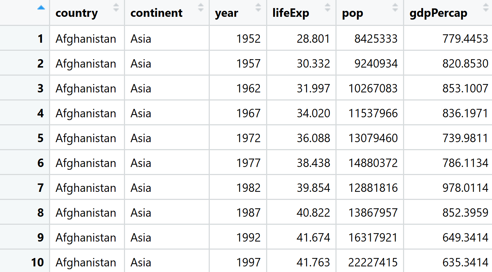
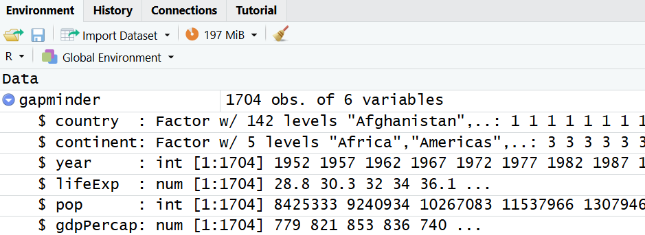



# Getting to know your data

It's a good idea to explore and get to know the data you're working with before starting any analysis. This helps you spot issues, understand what information is available, and avoid making incorrect assumptions before you begin analysing.

Useful things to explore might include:

- How many variables (columns) are in the data?
- How many records (rows) are in the data?
- What does each variable represent?
- Is each variable stored using the correct data type (e.g. numeric, categorical, text, or date)?
- Are there any missing values?
- Are there any obvious errors or unusual values?
- What is the range of values for key variables?
- What do simple summary statistics (e.g., counts, percentages, means, and medians) tell you about the data?
- How are the variables distributed?
- Are there any duplicate records?
- Which variables might be useful for answering your research questions?

The following sections demonstrate some useful functions for exploring both your original data frame and any new data frames you create as you work through your analysis.

::: callout-important
If you want to run any of the functions in this section on a different data frame, replace `gapminder` with the name of the data frame.
:::

### Data properties

Below are some reminders of useful functions for exploring the properties of your data, demonstrated using the `gapminder` dataset.

**View the type of object**

The `class()` function displays the kind of object (data structure you are working with.)

::: {.panel-tabset group="language"}
## R

```{r}
class(gapminder)   
```
:::

The output here tells us that gapminder is a data frame, which is R's standard structure for storing tabular data (i.e. data organised into rows and columns). More specifically, the gapminder data is stored as a tibble.

::: {.callout-note icon="false" collapse="true"}
### []{style="color: #9e9e9e;"}  tibble vs. data frame - what's the difference?

A tibble is a modern type of data frame with some additional features, such as printing more cleanly in the console. Throughout these materials, we'll use the general term "data frame".
:::

**View the columns headings**

It is often useful to check the column names in a data frame, particularly when you are becoming familiar with a new dataset or need to confirm a column name while writing code. You can use the `names()` function to display the names of the columns in a data frame in the console:

::: {.panel-tabset group="language"}
## R

```{r}
names(gapminder)   
```
:::

**View the first few rows**

To get an idea of what’s in your data frame without viewing it all at once, you can use the `head()` function to display the first few rows in the console:

::: {.panel-tabset group="language"}
## R

```{r}
head(gapminder)   
```
:::

**View the whole data frame**

We could view the entire data frame in the console by typing its name and running it, but it’s often nicer to view it in the Source pane. You can do this either by clicking on the data frame in the Environment pane (which automatically runs `View()`), or by using the `View()` function directly:

::: {.panel-tabset group="language"}
## R

```{r}
#| eval: false
View(gapminder)   
```
:::

{width="529" style="display:block; margin: 2em auto;"}

**Examine the structure of the data frame**

The str() ("structure") function is useful for quickly examining the structure of a dataset:

::: {.panel-tabset .panel-green group="language"}
## R

```{r}
str(gapminder)
```
:::

The same information can also be viewed by clicking the blue arrow to the left of the data frame name in the Environment pane:

{width="600" style="display:block; margin: 2em auto;"}

The output from the `str()` function shows us:

- The number of observations (rows) in the dataset - 1704
- The number of variables (columns) in the dataset - 6
- The names of the variables
- The data type of each variable (e.g. num, int, chr, Factor)
- A preview of the values in each variable, including how many categories there are in factor variables (e.g. we can see that there are 142 countries)
- For factors, the number and names of the levels

When reviewing output for your own data, consider:

- Is the number of rows and columns as you would expect?
- Do you understand what the key variables represent? If not, investigate further before proceeding.
- Are the data types assigned by R appropriate for the data they contain?
- Are there any variables that may need to be converted to a different data type before analysis?
- Do the example values shown for each variable look sensible?
- Are there any variables that seem particularly useful for answering your research question?

### Generating basic summaries

Viewing the first few rows of a data frame (or the entire data frame) and using `str()` are useful first steps for understanding a dataset. However, particularly for larger datasets, it can be difficult to quickly understand the overall structure or key properties of the data.

For example, with the gapminder data, we might want to know how many observations there are for each country, have a full list of all the countries included, or generate some basic summary statistics for numeric variables like population and life expectancy.

To get this type of overview, we can use summary functions. The `summary()` function produces a quick summary of each column, with the type of output depending on the variable’s data type:

::: {.panel-tabset .panel-green group="language"}
## R

```{r}
summary(gapminder)
```
:::

Another useful function is `describe()` from the Hmisc package. This provides a more detailed summary than `summary()`, and also indicates whether any variables contain missing values:

::: {.panel-tabset group="language"}
## R

```{r}
#| class-output: "scroll-output"
describe(gapminder)
```
:::

A more direct way to check for missing data is using `colSums()`. Running the command below shows how many missing values each column has. Again, we can see there are no missing values in this dataset.

::: {.panel-tabset group="language"}
## R

```{r}
colSums(is.na(gapminder))
```
:::

The `table()` function is helpful for summarising categorical variables by counting how many observations fall into each category:

```{r}
#| class-output: "scroll-output"
table(gapminder$country)
```

The `unique()` function returns all distinct values in a particular column:

```{r}
#| class-output: "scroll-output"
unique(gapminder$country)
```

### Adjusting data types

Sometimes, variables need to have their data types adjusted.

For example, if a numeric, integer or character variable in a data frame represents categorical data with fixed levels, it should be stored as a factor.

This isn't an issue for our gapminder data frame, since all the variables are stored correctly, but below is a demonstration for how a character variable representing categorical data can be converted into a factor.

::: {.panel-tabset group="language"}
## R

```{r}
# Simple gapminder-style data frame
gapminder_simple <- data.frame(
  country = c("France", "France", "Germany", "Germany", "Italy", "Italy"),
  year = c(2007, 2008, 2007, 2008, 2007, 2008),
  lifeExp = c(80.7, 81.0, 79.4, 79.8, 81.2, 81.5)
)

# Check structure
str(gapminder_simple)
```
:::

The output from `str(gapminder_simple)` shows that country is stored as a character variable (`chr`), even though it represents categorical data.

Use the `as.factor()` function to convert it into a factor:

::: {.panel-tabset group="language"}
## R

```{r}
# Convert country to a factor
gapminder_simple$country <- as.factor(gapminder_simple$country)

# Check structure
str(gapminder_simple)
```
:::

Now `country` is a factor (`Factor`), meaning R recognises it as a categorical variable with fixed levels (the countries in the dataset).

It is important to ensure categorical variables are stored as factors because this allows R to correctly treat them as groups in analyses and visualisations, rather than as plain text values.

Similarly, if a numeric or integer variables represent categories (for example, 0 and 1 indicating no and yes), they should also be converted to factors so that R treats them as categorical rather than continuous data.

### Handling missing values

Missing values are not an issue in the gapminder data (there aren't any!), but they are very common in real life datasets. Because of this, it is useful to know how to identify and handle them in your own data.

For illustration, we will use the `palmerpenguins` dataset from R, which contains some missing values.

::: {.panel-tabset group="language"}
## R

```{r}
#| eval: false
# Install and the palmerpenguins package
install.packages("palmerpenguins")
```
:::

::: {.panel-tabset group="language"}
## R

```{r}
#| message: false
#| warning: false
#| results: "hide"
# Load the palmerpenguins package
library(palmerpenguins)
```
:::

::: {.panel-tabset group="language"}
## R

```{r}
#| message: false
#| warning: false
#| results: "hide"
# Load the datasest
penguins <- penguins
```
:::

A quick way to check how many missing values are in each variable is to use `colSums()` combined with `is.na()`:

::: {.panel-tabset group="language"}
## R

```{r}
colSums(is.na(penguins))
```
:::

We can see that all columns except for `species` and `island` have missing data.

To view the actual rows that contain missing values, you can use `complete.cases()`:

::: {.panel-tabset group="language"}
## R

```{r}
penguins[!complete.cases(penguins), ]
```
:::

If you are working with a data frame, this will display the full rows where any values are missing:

::: {.panel-tabset group="language"}
## R

```{r}
penguins_df <- data.frame(penguins)
penguins_df[!complete.cases(penguins_df), ]
```
:::

Sometimes if we try to summarise a column with missing data, we get the result `NA`:

::: {.panel-tabset group="language"}
## R

```{r}
mean(penguins$body_mass_g)
```
:::

This happens because the calculation cannot be completed when missing values are present. In this case, we can use the argument `na.rm = TRUE` to remove missing values before calculating the summary:

::: {.panel-tabset group="language"}
## R

```{r}
mean(penguins$body_mass_g, na.rm = TRUE)
```
:::

This is only one possible approach to handling missing data and may not always be appropriate, depending on how much data is missing and why the values are missing in the first place.

In terms of the `dplyr` and `ggplot` content covered in these materials, if you are applying the various functions to other data which contains missing values, it is important to be aware that they will not always be handled in the same way automatically. Some functions will ignore missing values, some will remove them during calculations or plotting, and others will return `NA` unless you explicitly tell R how to deal with them (for example using `na.rm = TRUE` or filtering them out beforehand).

It is therefore important to be aware of any missing values in your data so that you can decide how best to handle them and interpret your results appropriately.

## Summary

::: {.callout-tip icon="false"}
### []{style="color: #872046;"}  Key points

- Get to know your data before starting analysis!
:::

